**UCAIug**

**CIM Modeling Guide**

**Version 1.0**

**25-November-2019**

**UCA International Users Group**

> **RIGHT TO DISTRIBUTE AND CREDIT NOTICE**
>
> This material was created by the UCA International Users Group CIM Model Managers and is available for public use and distribution. Please include credit in the following manner, “UCAIug CIM Modeling Guide, Version 1.0, © November 2019. All rights reserved by the UCA International Users Group”.

DISCLAIMER OF WARRANTIES AND LIMITATION OF LIABILITIES

> THIS DOCUMENT is a work product of THE UCA International Users Group. it was prepared by the CIM Model Managers and approved by the UCA International Users Group leadership. NEITHER the CIM Model Managers, the UCA International Users Group leadership, the cim users group, NOR ANY PERSON ACTING ON BEHALF OF ANY OF THEM:
>
> \(A\) MAKES ANY WARRANTY OR REPRESENTATION WHATSOEVER, EXPRESS OR IMPLIED, (I) WITH RESPECT TO THE USE OF ANY INFORMATION, APPARATUS, METHOD, PROCESS, OR SIMILAR ITEM DISCLOSED IN THIS DOCUMENT, INCLUDING MERCHANTABILITY AND FITNESS FOR A PARTICULAR PURPOSE, OR (II) THAT SUCH USE DOES NOT INFRINGE ON OR INTERFERE WITH PRIVATELY OWNED RIGHTS, INCLUDING ANY PARTY'S INTELLECTUAL PROPERTY, OR (III) THAT THIS DOCUMENT IS SUITABLE TO ANY PARTICULAR USER'S CIRCUMSTANCE; OR
>
> \(B\) ASSUMES RESPONSIBILITY FOR ANY DAMAGES OR OTHER LIABILITY WHATSOEVER (INCLUDING ANY CONSEQUENTIAL DAMAGES, EVEN IF the UCA International Users Group OR ANY UCA International Users Group REPRESENTATIVE HAS BEEN ADVISED OF THE POSSIBILITY OF SUCH DAMAGES) RESULTING FROM YOUR SELECTION OR USE OF THIS DOCUMENT OR ANY INFORMATION, APPARATUS, METHOD, PROCESS, OR SIMILAR ITEM DISCLOSED IN THIS DOCUMENT.
>
> \(C\) Reference herein to any specific commercial process, or service by its trade name, trademark, manufacturer, or otherwise, does not necessarily constitute or imply its endorsement, recommendation, or favoring by the UCA International Users Group.

THIRD PARTY INTELLECTUAL PROPERTY

> The Cim standards are a set of International Electrotechnical Committee (IEC) standards and are the Intellectual Property of the IEC. the UCA International Users Group has a liaison d relationship with the iec that provides access rights to the cim standards for software development. the common information model (CIM) is Open Source and is rendered in the Unified Modeling Language.

# Acknowledgements

In preparing this specification, the UCAIug recognizes the special contributions of the following CIM Subcommittee and their organizations.

- Becky Iverson Siemens

- Eric G. Stephan Pacific Northwest National Laboratory

- Henry B. Dotson, III Mandla Solutions, Inc.

- Kendall Demaree Ahlstrom

- Kurt Hunter Siemens

- Margaret Goodrich Project Consultants, LLC

- Martin Milller ABB

- Tatjana Kostic ABB

##  

# *Abstract*

> *This document specifies the rules and recommendations on how to use the UML to create and maintain a standardized Common Information Model (CIM) of the electric grid and other related business domains. Such models are called Domain Models. The primary goal of this document is to facilitate communication and understanding among people working with the CIM domain models. The primary goal of the rules is to specify the structure and modeling constraints applied to the CIM. The primary goal of the recommendations is to provide guidelines on how to extend the CIM as more of the model is elaborated by working groups within the International Electrotechnical Commission (IEC) and by the CIM user community. The intent of the recommendations is to facilitate the incorporation of new model elements into the CIM.*

**  
**

# Foreword

Exchanging power systems data between utility companies is always problematic when proprietary formats are used. In the past a company would traditionally use a single software system, whether it is a custom in-house solution, or purchased from a large software company, and there would be a single proprietary data standard and format used. With the deregulation of the power industry and the emergence of smarter grids, there is now a greater need to be able to share such power system data between companies and systems.

The increase in choice provided by the number of power system software vendors and the different software packages and architectures available add to the challenge of data exchange. These issues point to a requirement for a single, open standard for describing power system data and to aid the interoperability between software packages and exchange of information both within one company and between companies.

The Common Information Model (CIM) is an open standard for representing power system components originally developed by the Electric Power Research Institute (EPRI) in North America. The CIM provides the basis of a series of standards developed under the auspices of the International Electrotechnical Commission (IEC). The CIM standard was started as part of the Control Centre Application Programming Interface (CCAPI) project at EPRI with the aim of defining a common definition for the components in power systems for use the Energy Management System (EMS) Application Programming Interface (API). The EMS API is now maintained by IEC Technical Committee 57 Working Group 13 as IEC 61970-301. The format has been adopted by the major EMS vendors to allow the exchange of data between their applications, independent of their internal software architecture or operating platform.[^1]

# About the

The UCA International Users Group (UCAIug) is a not-for-profit corporation focused on assisting users and vendors in the deployment of standards for real-time applications for several industries with related requirements. The UCAIug does not write standards, however it works closely with those bodies that have primary responsibility for the completion of standards (notably IEC TC 57: *Power Systems Management and Associated Information Exchange*).

The UCAIug as well as its member groups (the CIM Users Group (CIMug), Open Smart Grid, and IEC61850) draws its membership from utility user and supplier companies. The mission of the UCAIug is to enable integration through the deployment of open standards by providing a forum in which the various stakeholders in the energy and utility industry can work cooperatively together as members of a common organization to:

- Influence, select, and/or endorse open and public standards appropriate to the energy and utility market based upon the needs of the membership.

- Specify, develop and/or accredit product/system-testing programs that facilitate the field interoperability of products and systems based upon these standards.

- Implement educational and promotional activities that increase awareness and deployment of these standards in the energy and utility industry.

- Influence and promote the adoption of standards and technologies specific to the ever-increasing Smart Grid initiatives worldwide.

This document is a work product produced by the CIM Subcommittee with the intent to help accomplish the UCAIug mission.

**Table of Contents**

[Acknowledgements](#acknowledgements)

[*Abstract*](#abstract)

[Foreword](#foreword)

[About the UCA International Users Group](#about-the)

[1 Introduction](#introduction)

[1.1 Document Overview](#document-overview)

[1.1.1 Document Purpose](#document-purpose)

[1.1.2 Document Scope](#document-scope)

[1.1.3 What this Document Does Not Cover](#what-this-document-does-not-cover)

[1.1.4 Who this Document Is For](#who-this-document-is-for)

[1.2 How this Document Is Organized](#how-this-document-is-organized)

[1.3 Symbols, Figures, and Style Conventions](#symbols-figures-and-style-conventions)

[1.4 Document Control](#document-control)

[2 References](#references)

[2.1 Normative References](#normative-references)

[2.2 Informative References](#informative-references)

[3 Definitions](#definitions)

[4 CIM Overview](#cim-overview)

[4.1 CIM UML Scope](#cim-uml-scope)

[4.2 CIM Management Business Context](#cim-management-business-context)

[4.3 CIM Management Functions](#cim-management-functions)

[4.3.1 Model Change Management](#model-change-management)

[4.3.2 Model Change Validation](#model-change-validation)

[4.3.3 Model Change Implementation](#model-change-implementation)

[4.3.4 Configuration Management](#configuration-management)

[4.3.5 Model Distribution](#model-distribution)

[4.3.6 Continuous Process Improvement](#continuous-process-improvement)

[4.3.7 CIM Management Function Mappings](#cim-management-function-mappings)

[4.4 CIM Management Processes](#cim-management-processes)

[4.4.1 CIM Management Process Mappings](#cim-management-process-mappings)

[4.5 CIM Management Process Integration with the IEC Standards Process](#cim-management-process-integration-with-the-iec-standards-process)

[4.5.1 IEC Standards Development Process](#iec-standards-development-process)

[4.5.2 Process Integration Points](#process-integration-points)

[5 CIM UML Modeling Rules and Recommendations](#cim-uml-modeling-rules-and-recommendations)

[5.1 Overview](#overview)

[5.1.1 UML Concepts Used in the CIM](#uml-concepts-used-in-the-cim)

[5.1.2 UML Static Structure Concepts](#uml-static-structure-concepts)

[5.1.3 UML Model Organization Concepts](#uml-model-organization-concepts)

[5.2 Model Structure Rules](#model-structure-rules)

[5.2.1 UML Metamodel Rules](#uml-metamodel-rules)

[5.2.2 Package Structure Rules ](#package-structure-rules)

[5.2.3 Package Dependency Rules ](#package-dependency-rules)

[5.2.4 Package Assembly Rules](#package-assembly-rules)

[5.3 Package Rules](#package-rules)

[5.3.1 Package Naming Rules](#package-naming-rules)

[5.3.2 Package Specification Rules](#package-specification-rules)

[5.4 Class Rules](#class-rules)

[5.5 Attribute Rules](#attribute-rules)

[5.6 Association Rules](#association-rules)

[5.7 Enumeration Rules](#enumeration-rules)

[5.8 Diagram Rules](#diagram-rules)

[5.9 Element Description Rules](#element-description-rules)

[5.10 Inheritance Rules](#inheritance-rules)

[5.11 Stereotype Rules](#stereotype-rules)

[5.11.1 General Stereotype Rules](#general-and-deprecated-stereotype-rules)

[5.11.2 Package Stereotype Rules](#package-stereotype-rules)

[5.11.3 Class Stereotype Rules](#class-stereotype-rules)

[5.12 Namespace Rules](#namespace-rules)

[5.13 Documentation Rules](#documentation-rules)

[6 CIM UML Extension Rules and Recommendations](#cim-uml-extension-rules-and-recommendations)

[6.1 Overview](#overview-1)

[6.1.1 Application of CIM UML Extension Rules and Recommendations](#application-of-cim-uml-extension-rules-and-recommendations)

[6.2 General Extension Rules](#general-extension-rules)

[6.3 Package Extension Rules](#package-extension-rules)

[6.4 Class Extension Rules](#class-extension-rules)

[6.5 Attribute Extension Rules](#attribute-extension-rules)

[6.6 Association Extension Rules](#association-extension-rules)

[6.7 Enumeration Extension Rules](#enumeration-extension-rules)

[7 CIM UML Transformation Rules and Recommendations](#cim-uml-transformation-rules-and-recommendations)

[7.1 Overview](#overview-2)

[7.2 General Transformation Rules and Recommendations](#general-transformation-rules-and-recommendations)

[7.3 Package Transformation Rules and Recommendations](#package-transformation-rules-and-recommendations)

[7.4 Class Transformation Rules and Recommendations](#class-transformation-rules-and-recommendations)

[7.5 Attribute Transformation Rules and Recommendations](#attribute-transformation-rules-and-recommendations)

[7.6 Association Transformation Rules and Recommendations](#association-transformation-rules-and-recommendations)

[8 CIM UML Version Control Rules](#cim-uml-version-control-rules)

[8.1 Overview](#overview-3)

[8.1.1 The Scope of a Version](#the-scope-of-a-version)

[8.1.2 Versioning and Compatibility](#versioning-and-compatibility)

[8.1.3 Version Identifiers](#version-identifiers)

[8.1.4 Versioning Strategies](#versioning-strategies)

[8.2 Version Control Strategy](#version-control-strategy)

[8.2.1 Version Scope](#version-scope)

[8.2.2 Version Compatibility](#version-compatibility)

[8.2.3 Version Identification](#version-identification)

[9 Artifacts Under CIM Management](#artifacts-under-cim-management)

[9.1 Overview](#overview-4)

[9.1.1 Draft Standards Artifacts](#draft-standards-artifacts)

[9.2 CIM Artifacts](#cim-artifacts)

[9.3 Model Documents](#model-documents)

[9.4 CIM Profiles](#cim-profiles)

[9.5 CIM Schemas](#cim-schemas)

[9.5.1 Background](#background)

[9.5.2 RDF Schemas](#rdf-schemas)

[9.5.3 XML Schemas](#xml-schemas)

[9.5.4 Hybrid Schemas](#hybrid-schemas)

[9.6 CIM Management Documents and Records](#cim-management-documents-and-records)

[9.6.1 CIM Management Documents](#cim-management-documents)

[9.6.2 CIM Records](#cim-records)

[9.7 Tool Customizations](#tool-customizations)

[10 CIM Management Tools](#cim-management-tools)

[10.1 Sparx Enterprise Architect](#sparx-enterprise-architect)

[10.2 jCleanCIM](#jcleancim)

[10.3 CIMug Website](#cimug-website)

# List of Figures

[Figure 4‑1. UCA International Users Group Organization Chart](#_Ref529901341)

[Figure 4‑2. CIM Management Functions-to-UCA CIM Responsibilities Mapping](#_Ref1988984)

[Figure 4‑3. CIM Management Processes](#_Ref22556726)

[Figure 4‑4. Model Development Process Flow](#_Ref2079526)

[Figure 4‑5. Change Management Process](#_Ref1985784)

[Figure 4‑6. Document generation from CIM UML](#_Ref22563694)

[Figure 4‑7. Artifacts Distribution Process Flow](#_Ref2158379)

[Figure 4‑8. Continuous Process Improvement Process Flow](#_Ref1995527)

[Figure 4‑9. CIM Management Process-to-CIM Management Functions Mapping](#_Ref1994217)

[Figure 4‑10. IEC International Standard Development Process](#_Ref22425787)

[Figure 5‑1 - TC57CIM Package Structure](#_Ref8597346)

[Figure 5‑2. TC57CIM Top-Level Package Dependencies](#_Ref532235977)

[Figure 6‑1. Example of two associations between two classes](#_Ref22115672)

[Figure 6‑2. Example of self-association](#_Ref22115886)

[Figure 6‑3. Allowed duplication of association end names](#_Ref22115402)

# List of Tables

[Table 4‑1. IEC TC57 CIM Working Group Mission Statements](#_Ref21669616)

[Table 4‑2. CIM Management Processes](#_Ref22556968)

[Table 4‑3. Role-to-CIM Management Process Mapping](#_Toc25586011)

[Table 4‑4. Description of IEC Standard Development Stages.](#_Ref22426512)

[Table 4‑5. CIM Management Processes-to-IEC Standard Development Stage Mappings](#_Ref22569302)

[Table 8‑1. Compatibility Types](#_Ref22373775)

[Table 8‑2. A general comparison of the three versioning strategies.](#_Ref22387240)

[Table 9‑1. CIM Artifacts Under CIM Management](#_Ref22120330)

[Table 9‑2. Model Documents Under CIM Management](#_Ref22125995)

[Table 9‑3. CIM Profiles Under CIM Management](#_Ref25434542)

[Table 9‑4. RDF Schemas Under CIM Management](#_Ref25431641)

[Table 9‑5. XML Schemas Under CIM Management](#_Ref25431767)

[Table 9‑6. Hybrid Schemas Under CIM Management](#_Ref25432000)

[Table 9‑7. CIM Management Documents](#_Ref25435542)

[Table 9‑8. CIM Records](#_Ref25435667)

[Table 9‑9. Tool Customizations](#_Ref25435838)

# Introduction

## Document Overview

The CIM has been growing and more groups are extending it with new functionality. Currently the following IEC TC57 working groups are working with the CIM:

- WG13

- WG14

- WG16

  Initially only WG13 and WG14 were working with the CIM. Each group worked with a local copy of the UML model file and the two copies were synchronised as needed. With three working groups the synchronisation process becomes more complex. This document describes how to manage CIM across multiple working groups and provides best practices for applications wanting to extend the CIM.

### Document Purpose

The purpose of this document is to provide guidance to individuals working with the CIM UML on how to modify the CIM in accordance with the CIM modeling rules and CIM change management. The rules and process are maintained and enforced by the CIM model managers.

The goals of this document are to: 1) facilitate communication and understanding among individuals working with CIM domain models; and 2) streamline the incorporation of new content into the CIM UML.

### Document Scope

The scope of this document includes providing:

1)  A description of the items under CIM Management;

2)  A description of the CIM Management processes;

3)  Rules and recommendations for CIM UML modeling

4)  Rules and recommendations for CIM UML extension;

5)  Rules and recommendations for transforming CIM UML into a canonical model in preparation to create CIM Profiles;

6)  A description of the process for submitting CIM UML extensions, UML used in the user-defined profiles for incorporation into the CIM UML and the IEC CIM standards, respectively;

7)  A description of the UML tool (Sparx EA) used for CIM Management.

### What this Document Does Not Cover

*This Document Does Not Cover All UML Concepts*

The CIM UML uses a subset of the UML concepts. This document only covers the UML concepts relevant to the CIM UML.

*This Document Does Not Cover How the CIM UML Rules Evolved*

The CIM UML rules have evolved over time and it is not the intent of this document to discuss the history of their evolution. The intent of this document is to specify the CIM UML rules in clear unambiguous language. It is the goal of this document to communicate the rules in such a way that the rationale for each rule is self-evident. The exception is the discussion of CIM UML version control in section 8.

*This Document Does Not Cover How Each Working Group Develops Additional CIM UML Content*

The methodologies and practices used by each IEC working group to develop additional CIM UML content is not in the purview of CIM Management. The output of the working groups do trigger some of the CIM Management processes, and these triggers are identified in this document.

*This Document Does Not Cover Detailed Tool Procedures Used To Accomplish CIM Management Tasks*

The detailed tool procedures used to accomplish CIM Management tasks are not in the purview of CIM modeling. This document does identify what tool is used to accomplish each CIM Management process activity. This document does provide the step by step procedures for exporting and importing the CIM model in XMI format. CIM Management tasks are discussed in the CIM Management Process and Procedures document.

*This Document Does Not Cover Tools Used To Create CIM Profiles*

The tools used to create CIM Profiles are not in the purview of CIM Management. This document does provide rules and recommendations for transforming the CIM UML (a semantic information model) into a canoncial data model that can then be used as input to a tool to create CIM Profiles.

### Who this Document Is For

This document has the following intended audience:

**Target Audience**

- CIM Model Managers in order to have documented rules and recommendations for CIM UML modeling, and extensions,

- IEC Working Group leads who need to understand how their CIM UML development processes relate to and interact with CIM Management processes;

- IEC Working Group members who need to know CIM UML modeling rules and recommendations in order to properly incorporate additional information into the CIM UML;

- IEC CIM users who need to know how to create their own CIM compliant Enterprise Information Model which contains their user defined CIM UML extensions that can be readily submitted for addition to the base CIM UML;

- IEC CIM users who need to know how to create their own CIM profiles that can be readily submitted for addition to the IEC CIM standards;

- Utility companies who need to know the process for submitting their user-defined CIM UML extensions and CIM profiles for addition to the CIM UML and the IEC CIM standard documents, respectively;

**Secondary Audience**

- Utility companies interested in learning more about the CIM UML;

- Vendors interested in developing CIM compliant products;

- Researchers interested in learning about the CIM UML and conducting CIM UML research.

## How this Document Is Organized

This document begins with Sections 1, 2, and 3 providing introductory content, references, and definitions, respectively.

Section 4 is an overview of CIM Management. This section provides the business context for CIM Management within the UCAIug organizational structure (the “Where” of CIM Management), and the roles and responsibilities (the “Who” and “What”) of CIM Management. The section also provides an overview of the CIM Management processes (the “How” of CIM Management) performed by CIM model managers, and how the CIM Management processes integrate with the IEC standards development process.

Section 5 specifies CIM UML modeling rules and recommendations. This section covers rules and recommendations for the model structure, packages, classes, attributes, associations, enumerations, inheritance, diagrams, element descriptions, stereotypes, namespaces, and documentation (the “How To” of CIM UML development within the working groups).

Section 6 specifies CIM extension rules and recommendations. This section contains general extension rules and covers rules and recommendations for package extension, class extension, attribute extension, association extension, and enumeration extension (the “How To” of CIM extension).

Section 7 specifies CIM UML transformation rules. This section contains general schema profiling rules and rules for RDFS and XSD profiling.

Section 8 describes CIM UML version control. This section provides an overview of version control and the CIM UML version control strategy.

Section 9 identifies and describes the artifacts under CIM Management. This includes CIM UML artifacts, CIM Profiles, draft standards, CIM Management process artifacts, and CIM Management tool customizations.

Section 10 discusses the tools used for CIM UML model management. Tools include Enterprise Architect, jCleanCIM, and the CIMug Website.

## Symbols, Figures, and Style Conventions

**Conventions**

This document uses the following conventions.

- Rules and recommendations are similar to requirements. As such, this document uses the terms defined in RFC 2119 of the Internet Engineering Task Force (IETF) in the specification of the rules and recommendations.

- Specifically, the terms “Shall”, “Must”, “Shall not”, “Must not”, and “May” are used to specify rules, and the terms “Should” and “Should not” are used to provide recommendations.

- All rules and recommendations have a unique identifier that is formatted as: “RuleXXX”. The distinction between rules and recommendations is based on the use of the RFC 2119 terms in the descriptive text.

**Symbol Legend**

This document contains a series of diagrams that are referred to as figures. The primary symbols used throughout all figures are individually described in the following symbol legend:

UML Notation

The Unified Modeling Language is used

**Text Formats**

1.  **Bold text** is used to identify a term that can be found in the glossary. The term will be in bold text the first time it is used in the document. All subsequent uses of the term will be in normal text.

2.  Square brackets (\[ \]) are used as delimiters for referenced works cited in this document.

## Document Control

This document will be reviewed periodically by the CIM Model Managers and updated as needed. Lessons learned will be captured with each CIM UML update and used to improve this document. If the document is written in an older format, the document should be revised into the latest CIM Users Group template format.

This document contains a revision history log. When changes occur, the version number will be updated to the next increment and the date, author making the change, and change description will be recorded in the revision history log of the document.

# References

## Normative References

The following IEC documents, and the other identified references herein contain information which, through reference in this text, constitute normative provisions of this document. At the time of publication, the editions indicated were valid. All IEC documents, and other normative references are subject to revision. All users of this document are therefore encouraged to investigate the possibility of applying the most recent edition of the references listed below.

| **Document ID** | **Document Description**                                                                     |
|-----------------|----------------------------------------------------------------------------------------------|
| IEC61968-2      | IEC61968 Part 2: Glossary                                                                    |
| IEC62357-1      | TC 57 Architecture Part 1: Reference Architecture for Power System Information Exchange      |
| IETF001         | Internet Engineering Task Force Request for Comments 2119 (RFC2119). March 1997.             |
| TC57-Glossary   | IEC TC57 Glossary                                                                            |
| UML-2.5.1       | Unified Modeling Language Specification Version 2.5.1. Object Management Group December 2017 |

## Informative References

The following documents referenced herein contain information which is not binding and does not constitute provisions of this document. The information referenced in this text is informative and supportive information intended to enhance the comprehension of this document.

| **Document ID** | **Document Description**                                                   |
|-----------------|----------------------------------------------------------------------------|
| CIM_Primer      | Common Information Model Primer, Third Edition, EPRI 3002006001, June 2015 |
| ERL001          | Web Service Contract Design and Versioning for SOA, Prentice Hall, 2009    |
| IEC61968-1      | IEC61968 Part 1: Interface Reference Model                                 |
| UML001          | The Unified Modeling Language Reference Manual, Addison-Wesley, 1999       |

# Definitions

For the purposes of this document the following definitions apply:

<table>
<colgroup>
<col style="width: 23%" />
<col style="width: 76%" />
</colgroup>
<thead>
<tr class="header">
<th><strong>Artifact Distribution (AD)</strong></th>
<th>The function of distributing artifacts under CIM management to CIMug repositories and subscribers of those artifacts performed by CIM Model Managers.</th>
</tr>
</thead>
<tbody>
<tr class="odd">
<td><strong>Artifact Distribution Process</strong></td>
<td>The process used to ensure comprehensive distribution of artifacts under CIM management to CIMug repositories and other subscribers of those artifacts.</td>
</tr>
<tr class="even">
<td><strong>Backwards Compatibility</strong></td>
<td>The capability of a new version of the CIM UML to continue to support CIM Profiles designed to work with the old version of the CIM UML.</td>
</tr>
<tr class="odd">
<td><strong>Canonical Data Model</strong></td>
<td>See “Contextual Data Model”</td>
</tr>
<tr class="even">
<td><strong>CIM Model Manager</strong></td>
<td>An individual that has overall responsibility for an IEC CIM Working Group’s artifacts under CIM management. A CIM Model Manager is a member of both the CIMug and an IEC Working Group</td>
</tr>
<tr class="odd">
<td><strong>CIM Profile</strong></td>
<td>A subset of the full CIM UML that is derived to define data exchanges required between systems.</td>
</tr>
<tr class="even">
<td><strong>CIM Users Group (CIMug)</strong></td>
<td>A subgroup of the UCA International Users Group established to provide a forum in which users, consultants, and suppliers can cooperate and leverage the IEC CIM international standards to advance interoperability between utility enterprise systems.</td>
</tr>
<tr class="odd">
<td><strong>Committee Draft (CD)</strong></td>
<td>The first working draft of an IEC standard that is available for circulation to the members of the IEC TC57.</td>
</tr>
<tr class="even">
<td><strong>Committee Draft for Vote (CDV)</strong></td>
<td>The draft of an IEC standard that has incorporated changes to the CD after addressing comments received from national committees about the CD.</td>
</tr>
<tr class="odd">
<td><strong>Common Information Model (CIM, CIM UML)</strong></td>
<td>An open source semantic information model expressed in the Unified Modeling Language (CIM UML) representing real-world electric utility objects and information entities, and the relationships between them (sometimes called a “domain model”). The CIM UML also represents the properties of the concepts as UML class attributes.</td>
</tr>
<tr class="even">
<td><strong>Compatible Change</strong></td>
<td>When the changes incorporated in a new version of the CIM UML do not negatively affect existing CIM Profiles, then the change itself is considered a <em>compatible change</em>.</td>
</tr>
<tr class="odd">
<td><strong>Conceptual Data Model</strong></td>
<td>See “Semantic Information Model”</td>
</tr>
<tr class="even">
<td><strong>Configuration Management (CM)</strong></td>
<td>The function of managing changes to the CIM UML and other work products performed by CIM Model Managers.</td>
</tr>
<tr class="odd">
<td><strong>Configuration Management Plan (CMP)</strong></td>
<td>A plan developed to define, document, control, implement, account for, and audit changes to the various CIM configuration items. The CMP provides information on the requirements and procedures necessary for CM activities and establishes the methodology for configuration identification and control of released and changes to configuration items. The CMP also describes the process for maintaining status accounting and verifying the completeness and correctness of configuration items throughout the CIM UML development life cycle.</td>
</tr>
<tr class="even">
<td><strong>Contextual Data Model</strong></td>
<td>A subset of CIM elements constrained for a specific business context for use in a data exchange between systems.</td>
</tr>
<tr class="odd">
<td><strong>Continuous Process Improvement (CPI)</strong></td>
<td>The ongoing process of improving the CIM management process through incremental and breakthrough improvements. The goal of CPI is to improve the quality of the CIM UML or the efficiency of the CIM management process.</td>
</tr>
<tr class="even">
<td><strong>DER</strong></td>
<td>Distributed Energy Resource</td>
</tr>
<tr class="odd">
<td><strong>DERMS</strong></td>
<td>Distributed Energy Resource Management System</td>
</tr>
<tr class="even">
<td><strong>Document Generation (DG)</strong></td>
<td>The function performed by CIM Model Managers in which CIM UML based draft IEC standards are auto generated using jCleanCIM and a document template.</td>
</tr>
<tr class="odd">
<td><strong>eap</strong></td>
<td>The filename extension given to a Sparx Enterprise Architect project file stored in a proprietary file format in a computer file system.</td>
</tr>
<tr class="even">
<td><strong>eapx</strong></td>
<td>The filename extension given to a Sparx Enterprise Architect project file stored as an XML document in a computer file system.</td>
</tr>
<tr class="odd">
<td><strong>Electric Power Research Institute (EPRI)</strong></td>
<td>An independent, nonprofit organization for public interest energy and environmental research. EPRI conducts research, development, and demonstration projects for the benefit of the public in the United States and internationally. EPRI focuses on electricity generation, delivery, and use in collaboration with the electricity sector, its stakeholders and others to enhance the quality of life by making electric power safe, reliable, affordable, and environmentally responsible.</td>
</tr>
<tr class="even">
<td><strong>Energy Management System (EMS)</strong></td>
<td>A software application used by operators of electric utility grids to monitor, control, and optimize the performance of a transmission network.</td>
</tr>
<tr class="odd">
<td><strong>eXtensible Markup Language (XML)</strong></td>
<td>A universal format for structured documents and data. XML documents are used to exchange structured data between utility systems.</td>
</tr>
<tr class="even">
<td><strong>Final Draft International Standard (FDIS)</strong></td>
<td>The draft of an IEC standard that has incorporated changes to the CDV after addressing comments received from national committees about the CDV. The FDIS documents the completed version of the new standard to be circulated for approval by the national committees.</td>
</tr>
<tr class="odd">
<td><strong>Forwards Compatibility</strong></td>
<td>The capability of a new version of the CIM UML to support a range of future CIM Profiles. The extent of forwards compatibility is defined by the number of new use case interactions that can be supported with the new CIM UML.</td>
</tr>
<tr class="even">
<td><strong>Governance</strong></td>
<td>The organizational structure, processes and policies by which the CIM UML is developed, deployed, and maintained. CIM model managers are responsible for governance of the CIM UML.</td>
</tr>
<tr class="odd">
<td><strong>Incompatible Changes</strong></td>
<td>Changes to the CIM UML that results in the new CIM UML no longer being compatible with existing CIM Profiles.</td>
</tr>
<tr class="even">
<td><strong>International Electrotechnical Commission (IEC)</strong></td>
<td>
A global organization that publishes consensus-based International Standards and manages conformity assessment systems for electric and electronic products, systems and services, collectively known as electrotechnology.

The IEC’s role is to facilitate the complicated process of reaching agreement (consensus) among the many experts from countries all over the world who volunteer to prepare the rules, specifications and terminology that allow manufacturers to build devices that work together, safely and as expected.
</td>
</tr>
<tr class="odd">
<td><strong>International Standard (IS)</strong></td>
<td>The published version of an IEC international standard.</td>
</tr>
<tr class="even">
<td><strong>IETF</strong></td>
<td>Internet Engineering Task Force. The Internet Engineering Task Force is an open standards organization, which develops and promotes voluntary Internet standards, in particular the standards that comprise the Internet protocol suite.</td>
</tr>
<tr class="odd">
<td><strong>jCleanCIM</strong></td>
<td>A java application that is used to auto generate draft model standards from the CIM UML.</td>
</tr>
<tr class="even">
<td><strong>Model Change Implementation (MCI)</strong></td>
<td>The function of making changes to an existing CIM UML baseline to create a new CIM UML baseline performed by CIM Model Managers.</td>
</tr>
<tr class="odd">
<td><strong>Model Change Management (MCM)</strong></td>
<td>The function of identifying and managing CIM UML change requests performed by CIM Model Managers.</td>
</tr>
<tr class="even">
<td><strong>Model Change Management Plan (MCMP)</strong></td>
<td>A documented plan to define, document, and track the information required to effectively manage change requests throughout the CIM UML development life cycle.</td>
</tr>
<tr class="odd">
<td><strong>Model Change Validation (MCV)</strong></td>
<td>The function of ensuring proposed CIM UML changes are in compliance with CIM modeling rules performed by CIM Model Managers.</td>
</tr>
<tr class="even">
<td><strong>Model Development (MD)</strong></td>
<td>The function of developing new model elements and updating existing model elements performed by IEC Working Group members.</td>
</tr>
<tr class="odd">
<td><strong>Model Distribution (MD)</strong></td>
<td>The function of distributing CIM UML baselines to official repositories and authorized consumers of the CIM UML performed by CIM Model Managers.</td>
</tr>
<tr class="even">
<td><strong>Namespace Prefix (nsprefix)</strong></td>
<td>A proxy for a namespace. Namespace prefixes are mapped to a namespace in the XML declaration of the namespace using a special attribute that starts with the letters xmlns.</td>
</tr>
<tr class="odd">
<td><strong>New Work Item Proposal (NWIP)</strong></td>
<td>A proposal for new IEC standard development work. The NWIP is the first work product created in the development of a new IEC standard.</td>
</tr>
<tr class="even">
<td><strong>Preliminary Work Item (PWI)</strong></td>
<td>The work item produced during the Preliminary Stage of the IEC standard development process. The Preliminary Stage is applied for work items where no target dates can be established. This stage can be used for the elaboration of a New Work Item Proposal and the development of an initial draft.</td>
</tr>
<tr class="odd">
<td><strong>Release</strong></td>
<td>A release is the distribution of a baseline version of the CIM UML. A release may be either public or private (sent only to IEC Working Groups) and generally constitutes the initial generation of a new or upgraded model elements.</td>
</tr>
<tr class="even">
<td><strong>Resource Description Framework (RDF)</strong></td>
<td>An XML schema used to provide a framework to create peer-to-peer relationships between data elements in an XML format (XML nodes).</td>
</tr>
<tr class="odd">
<td><strong>Resource Description Framework Schema (RDFS)</strong></td>
<td>A vocabulary for describing properties and classes of RDF resources and how those resources are linked in peer-to-peer relationships.</td>
</tr>
<tr class="even">
<td><strong>Semantic Information Model</strong></td>
<td>A method of structuring information in order to represent it in a specific logical way. It is a conceptual data model that includes semantic information that adds a basic meaning to the data and the relationships between data concepts. The CIM UML is a semantic information model.</td>
</tr>
<tr class="odd">
<td><strong>Sparx Enterprise Architect (Sparx EA)</strong></td>
<td>The brand name for modeling tool used to host the CIM UML. Sparx Systems in the company that developed, maintains, and sells the tool.</td>
</tr>
<tr class="even">
<td><strong>Technical Committee 57 (TC57)</strong></td>
<td>The technical committee of the IEC whose purpose is to prepare international standards for power systems control equipment and systems, and associated information exchange for real-time and non-real-time information used in the planning, operation and maintenance of power systems.</td>
</tr>
<tr class="odd">
<td><strong>UCA</strong></td>
<td>Utility Communications Association (see UCAIug)</td>
</tr>
<tr class="even">
<td><strong>UCA International Users Group (UCAIug)</strong></td>
<td>A not-for-profit corporation focused on enabling utility domain system integration through the deployment of open standards, by providing a forum in which the various stakeholders in the energy and utility industry can work cooperatively together as members of a common organization.</td>
</tr>
<tr class="odd">
<td><strong>UML Association</strong></td>
<td>The semantic relationship between two or more classes.</td>
</tr>
<tr class="even">
<td><strong>UML Attribute</strong></td>
<td>A named property of a class that describes a range of values that instances of that property may hold.</td>
</tr>
<tr class="odd">
<td><strong>UML Class</strong></td>
<td>A description of a set of objects that share the same attributes, relationships, and semantics.</td>
</tr>
<tr class="even">
<td><strong>UML Class Diagram</strong></td>
<td>A diagram that shows a set of classes and their relationships; class diagrams address the static design view of a system.</td>
</tr>
<tr class="odd">
<td><strong>UML Enumeration Literal</strong></td>
<td>A named value that is part of a list of named values used as the range of a particular type.</td>
</tr>
<tr class="even">
<td><strong>UML Inheritance</strong></td>
<td>The mechanism by which more-specific elements incorporate the structure of more-general elements.</td>
</tr>
<tr class="odd">
<td><strong>UML Multiplicity</strong></td>
<td>A specification of the range of allowable cardinalities that a set may assume; multiplicity is specified for attributes and associations.</td>
</tr>
<tr class="even">
<td><strong>UML Namespace</strong></td>
<td>A scope in which names may be defined and used; within a namespace, each name denotes a unique element.</td>
</tr>
<tr class="odd">
<td><strong>UML Stereotype</strong></td>
<td>An extension of the vocabulary of the UML, which allows you to create new kinds of building blocks (classes) that are derived from existing ones but that are specific to your problem.</td>
</tr>
<tr class="even">
<td><strong>Unified Modeling Language (UML)</strong></td>
<td>A graphical modeling language for visualizing, specifying, constructing, and documenting the artifacts of a software intensive system. The UML provides a collection of graphical model elements that have semantic meaning, and the rules for combining model elements for the purpose of communicating the conceptual and physical representation of a system.</td>
</tr>
<tr class="odd">
<td><strong>Universal Resource Identifier (URI)</strong></td>
<td>A sequence of characters that identifies the name and location of a file or resource in a uniform format. URIs provide a standard way for resources to be accessed by other computers across a network or over the World Wide Web.</td>
</tr>
<tr class="even">
<td><strong>Version Control Strategy</strong></td>
<td>A specification of how versioning is implemented and communicated.</td>
</tr>
<tr class="odd">
<td><strong>Web Ontology Language (OWL)</strong></td>
<td>A language used to explicitly represent the meaning of terms in vocabularies and the relationships between those terms in machine interpretable content on the Web.</td>
</tr>
<tr class="even">
<td><strong>Working Draft (WD)</strong></td>
<td>A draft version of an IEC standard that documents work in progress being performed by a working group project team. Working drafts by definition are incomplete and not available for circulation to the members of TC57.</td>
</tr>
<tr class="odd">
<td><strong>Working Group</strong></td>
<td>A group of individuals that collectively work to further develop the CIM UML and CIM based standards.</td>
</tr>
<tr class="even">
<td><strong>Working Group 13 (WG13)</strong></td>
<td>The IEC TC57 working group responsible for developing standards for information exchange among systems supporting business functions directly involved with operation and planning of the overall interconnected electric grid.</td>
</tr>
<tr class="odd">
<td><strong>Working Group 14 (WG14)</strong></td>
<td>The IEC TC57 working group responsible for developing standards for information exchange among systems supporting business functions that support power system operations, maintenance and customer support.</td>
</tr>
<tr class="even">
<td><strong>Working Group 16 (WG16)</strong></td>
<td>The IEC TC57 working group responsible for developing standards which facilitate the integration of electricity market application software developed independently by different vendors into a market management system, between market management systems and market participant systems.</td>
</tr>
<tr class="odd">
<td><strong>Working Group 21 (WG21)</strong></td>
<td>The IEC TC57 working group responsible for developing standards for system interfaces, communication protocols and profiles for industrial, home and building automation; and for retail markets, real time pricing, and traditional non-market load management.</td>
</tr>
<tr class="even">
<td><strong>XML Metadata Interchange (XMI)</strong></td>
<td>An Object Management Group (OMG) standard for exchanging metadata information via Extensible Markup Language (XML).</td>
</tr>
<tr class="odd">
<td><strong>XML Schema Definition (XSD)</strong></td>
<td>An XML document that uses the XML Schema Definition Language to define the structure of CIM message payloads and CIM message headers.</td>
</tr>
</tbody>
</table>

# CIM Overview

**Background**

Since international deregulation of energy markets began in the 1990’s, the need for electric utility companies to exchange data externally on a regular basis, and internally between software applications, has steadily increased. The exponential growth in integration complexity due to the large number of proprietary application interfaces created a significant risk to the reliable operation of an interconnected electric power grid owned and operated by different electric utility companies. This business concern was the driver for a common format for all data exchanges in the electrical power domain.

This business driver led to the need for: 1) a semantic information model that represents all of the real-world and information entities (concepts) in the electric power domain and the relationships between them; and 2) a canonical data model to provide a non-proprietary way to exchange data between utility domain systems and databases.

The Common Information Model (CIM) is an open source semantic information model expressed in the Unified Modeling Language (CIM UML) representing real-world electric utility objects and information entities, and the relationships between them (sometimes called a “domain model”). The CIM UML also represents the properties of the concepts as UML class attributes. The CIM UML model is hosted and maintained in a Sparx Systems Enterprise Architect Project by the UCAIug.

The IEC Technical Committee 57 (IEC TC57) CIM working groups develop a set of standards to enable electric power systems integration and information exchange based on the CIM UML. New model content provided by members of either the IEC TC57 CIM working groups or the UCAIug is formally incorporated into the CIM UML. These members volunteer their time and subject matter expertise to accomplish the goals of each organization.

The IEC publishes international standards derived directly from the CIM UML for each IEC TC57 CIM working group. The IEC also publishes international standards derived from canonical data models that constrain fragments of the CIM UML for specific data exchanges between utility domain systems and databases. These international standards for data exchange are called “CIM Profiles”.

In recent years, the IEC TC57 has come under increasing pressure from utility companies and vendors to release new versions of the CIM-based standards more quickly in order to respond to the transformative changes occurring in the industry. UCAIug leadership has determined that in order to reduce the time to market of new standards, updates to the CIM must occur often enough to support the release of new versions of the IEC TC57 standards once a year while simultaneously expanding the organization’s ability to effectively manage a higher volume of content change to the CIM UML.

In order to achieve these two goals, the UCAIug leadership has decided that the UCAIug can best improve its effectiveness in these areas by: 1) aligning CIM UML Management processes with the IEC fast track International Standard release process; 2) facilitating communication and understanding among individuals working with CIM UML domain models; and 3) facilitating the incorporation of new content into the CIM UML.

For the past two years the IEC TC57 CIM working groups have emphasized the importance (to their productivity) of having access to documented rules and recommendations for creating new CIM content. Up until the release of this document, CIM management guidelines resided in draft documents owned by CIM Model Managers.

## CIM UML Scope

The CIM UML is semantic information model that represents real-world physical electric grid objects and information entities. The CIM UML is the basis for data that is exchanged between systems to: 1) enable grid operation and planning; 2) support grid operations, grid maintenance, and customer support; 3) support wholesale electricity market activity between market participants; and 4) support interfaces with non-utility owned systems connected on the other side of the meter to the grid. The CIM UML is used by IEC TC57 CIM working groups as the foundation for creating CIM profiles. The mission statement for each IEC TC57 CIM working group is provided in Table 4‑1.

Table 4‑1. IEC TC57 CIM Working Group Mission Statements

<table>
<colgroup>
<col style="width: 13%" />
<col style="width: 86%" />
</colgroup>
<thead>
<tr class="header">
<th><strong>Group ID</strong></th>
<th><strong>Mission Statement</strong></th>
</tr>
</thead>
<tbody>
<tr class="odd">
<td>WG13</td>
<td>Define standards for information exchange among systems supporting business functions directly involved with operation and planning of the overall interconnected electric grid. These functions rely on power system network models to analyse the behaviour of the grid. These business functions cover the entire interconnected grid at all voltage levels, and they often involve interactions between systems at various different participants in the grid (e.g. RTO, TSO, DSO, microgrid, generator, consumer).</td>
</tr>
<tr class="even">
<td>WG14</td>
<td>Define standards for information exchange among systems supporting business functions that support power system operations, maintenance and customer support. This includes major business functions such as asset management, work management, meter data management, customer information, geographic information systems and engineering design. Also included is interoperating with assets and business capabilities governed by interconnection agreements with customers.</td>
</tr>
<tr class="odd">
<td>WG16</td>
<td>Define standards which facilitate the integration of electricity market application software developed independently by different vendors into a market management system, between market management systems and market participant systems. This is accomplished by defining message exchanges to enable these applications or systems access to public data and exchange information independent of how such information is represented internally.</td>
</tr>
<tr class="even">
<td>WG21</td>
<td>
Define standards for system interfaces, communication protocols and profiles in consideration of:

<ul>
<li>
Interconnecting a large number of geographically distributed systems (aggregator, (utility, QSE, SC) to end customer)
</li>
<li>
Domain specific protocols for industrial, home and building automation
</li>
<li>
Domain specific protocols for retail markets, real time pricing, and traditional non-market load management
</li>
<li>
State-of-the-art wireless and wired communication
</li>
<li>
Efficient installation, commissioning and maintenance
</li>
</ul></td>
</tr>
</tbody>
</table>

## CIM Management Business Context

CIM Management is a business function performed by the CIM Subcommittee of the UCAIug Technical Oversight Committee (see Figure 4‑1).

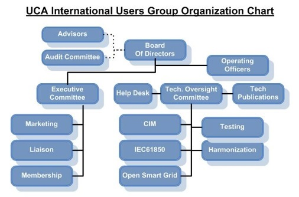

Figure 4‑1. UCA International Users Group Organization Chart

The CIM Technical Subcommittee is responsible for handling all technical and maintenance issues concerning the CIM and related standards. Responsibilities of the CIM Subcommittee related to CIM Management include:

1.  **Chair Modeling Meetings**

- Review model updates submitted by working groups with working group representative(s)

2.  **Manage the CIM Issues Process**

    - Compile and categorize issues

    - Develop proposed resolutions

    - Obtain agreement on resolutions from CIM Technical Subcommittee and IEC TC57 WG13, WG14, WG16 and WG21.

3.  **Manage Versions of CIM Artifacts**

    - Provide version management of the CIM UML model

    - Provide version management of derived files in other formats (e.g., XML, RDF, etc.)

4.  **Maintain Oversight of CIM Support Tools**

    - Maintain oversight of which version of Sparx Enterprise Architect is used to maintain the CIM UML.

    - Maintain oversight of the jCleanCIM tool used for validation of the CIM UML model.

5.  **Maintain CIM Repositories**

    - Maintain repositories for artifacts produced by individual projects implementing the CIM and related standards, such as:

      - submitted CIM extensions;

      - message payload definitions;

      - tools, and;

      - training materials.

    - Maintain repositories for sample CIM/XML/RDF power system model files

## CIM Management Functions

### Model Change Management

Model change management (MCM) is the ongoing process of identifying and managing CIM UML change requests. A model change management plan (MCMP) is developed to define, document and track the information required to effectively manage change requests throughout the CIM UML development life cycle.

### Model Change Validation

Model change validation (MCV) is the ongoing process of ensuring proposed CIM UML changes are in compliance with CIM modeling rules.

### Model Change Implementation

Model change implementation (MCI) is the ongoing process of making changes to an existing CIM UML baseline to create a new CIM UML baseline.

### Configuration Management

Configuration management (CM) is the ongoing process of identifying and managing changes to the CIM UML and other work products. A configuration management plan (CM Plan) is developed to define, document, control, implement, account for, and audit changes to the various CIM configuration items. The CM Plan provides information on the requirements and procedures necessary for CMP activities and establishes the methodology for configuration identification and control of releases and changes to configuration items. It also describes the process for maintaining status accounting and verifying the completeness and correctness of configuration items throughout the CIM UML development life cycle.

### Model Distribution

Model distribution (MD) is the ongoing process of distributing CIM UML baselines to official repositories and authorized consumers of the CIM UML.

### Continuous Process Improvement

Continuous process improvement (CPI) is the ongoing process of improving the CIM management processes through incremental and breakthrough improvements. The goal of CPI is to improve the quality of the CIM UML or the efficiency of the CIM management processes.

### CIM Management Function Mappings

Mapping of the CIM management functions includes two (2) mappings of the CIM management functions. The first shows the mapping between CIM management functions and CIM management responsibilities assigned to the CIM Subcommittee with the UCAIug. The second shows the mapping between CIM management functions and the CIM management processes that realize those functions. The first mapping is shown in Figure 4‑2. The second mapping is discussed in Section 4.4 and shown in Figure 4‑9

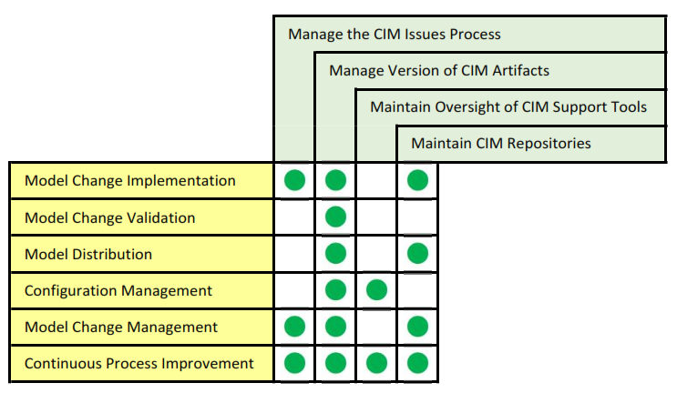

Figure 4‑2. CIM Management Functions-to-UCA CIM Responsibilities Mapping

## CIM Management Processes

CIM management processes are the realization of CIM management functions. There are five (5) CIM management processes. The CIM management processes are shown in Figure 4‑3. A list of the processes and their descriptions are provided in Table 4‑2.

Figure 4‑3. CIM Management Processes

Table 4‑2. CIM Management Processes

| **Process**                    | **Process Description**                                                                                                                                                                                                                                                                                                                                                                                                                |
|--------------------------------|----------------------------------------------------------------------------------------------------------------------------------------------------------------------------------------------------------------------------------------------------------------------------------------------------------------------------------------------------------------------------------------------------------------------------------------|
| Model Development              | The model development process is the core CIM UML process. It is executed to extend the CIM UML and create a new baseline of the CIM UML. This process is triggered by any one of the roles that is responsible for model development. The model development process flow is shown in Figure 4‑4. CIM Management is performed as part of the “Verify Extended Model” subprocess.                                                       |
| Change Management              | The Change Management Process establishes an orderly and effective procedure for tracking the submission, coordination, review, evaluation, categorization of change requests, and approval for release of changes to CIM UML baselines. The Change Management Process is shown in Figure 4‑5. Changes can either be modifications to existing model elements or the creation of new model elements.                                   |
| Document Generation            | The document generation process involves the creation of the document artifacts associated with the CIM. The CIM UML is used to create these documents as exemplified in Figure 4‑6. CIM Profiles (including RDF and XML schemas) are generated by the IEC working groups. CIM Model Managers may assist working groups in creating RDF and XML schemas. All other artifacts under CIM Management are generated by CIM Model Managers. |
| Artifact Distribution          | The artifact distribution process ensures comprehensive distribution of artifacts under CIM management (see Section 8 for details) to CIMug repositories and other subscribers of those artifacts. The artifact distribution process flow is shown in Figure 4‑7.                                                                                                                                                                      |
| Continuous Process Improvement | The continuous process improvement process establishes a sequence of activities for incremental improvement of the change request and model distribution processes with the goal of improving the quality of the CIM UML or the efficiency of the CIM management processes. The continuous process improvement process is shown in Figure 4‑8.                                                                                         |

Figure 4‑4. Model Development Process Flow

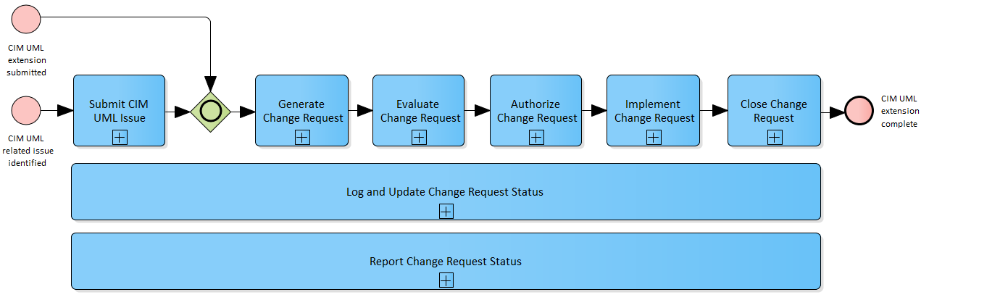

Figure 4‑5. Change Management Process

Figure 4‑6. Document generation from CIM UML

Figure 4‑7. Artifacts Distribution Process Flow

Figure 4‑8. Continuous Process Improvement Process Flow

### CIM Management Process Mappings

The mapping between CIM management functions and the CIM management processes are shown in Figure 4‑9.

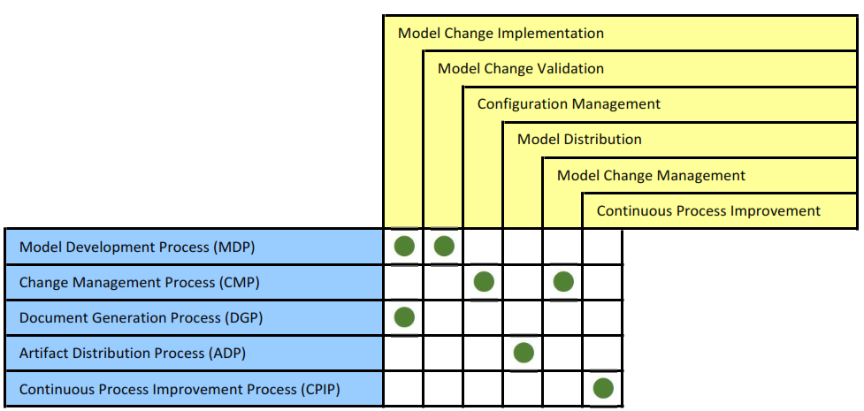

Figure 4‑9. CIM Management Process-to-CIM Management Functions Mapping

The CIM Model Managers perform most of the tasks within the CIM management processes. There are however, other roles within the CIMug and IEC working groups that also perform CIM management tasks. The following table provides a description of each role and its mapping to CIM management processes.

| **Role**                         | **Role Description**                                                                                                                                                                                                                 | **MDP** | **CMP** | **DGP** | **ADP** | **CPIP** |
|----------------------------------|--------------------------------------------------------------------------------------------------------------------------------------------------------------------------------------------------------------------------------------|---------|---------|---------|---------|----------|
| CIMug Focus Community            | This group role consists of individual CIMug members and IEC CIM Working Group members dedicated to developing CIM extensions that deal with a specific area of focus.                                                               |         |         |         |         |          |
| CIMug Project Team               | This group role consists of individual CIMug members and IEC CIM Working Group members working on projects that are jointly funded by participating utilities or vendor companies.                                                   |         |         |         |         |          |
| CIMug Working Group              | This group role consists of individual CIMug members working on issues of common interest to CIM Users.                                                                                                                              |         |         |         |         |          |
| IEC CIM Working Group            | This group role consists of individuals appointed by their respective IEC National Committee (technical experts) that take part in the drafting of IEC standard working documents.                                                   |         |         |         |         |          |
| IEC Working Group Project Leader | This individual role performed by an IEC Working Group member has overall responsibility for leading the development of a new edition of an international standard from the IEC proposal stage through to the IEC publication stage. |         |         |         |         |          |
| IEC Working Group Convener       | This individual role performed by an IEC Working Group member is responsible for arranging and leading face-to-face IEC Working Group meetings and providing working group oversight.                                                |         |         |         |         |          |
| Model Manager                    | This individual role performed by an individual that is a member of both the CIMug and an IEC Working Group has overall responsibility for artifacts under CIM management.                                                           |         |         |         |         |          |

Table 4‑3. Role-to-CIM Management Process Mapping

## CIM Management Process Integration with the IEC Standards Process

### IEC Standards Development Process

As IEC standards, the CIM standards must go through the IEC international standards development process to be published. An IEC International Standard is the result of an agreement between the National Committees of the IEC. The IEC standard development process and the documents created in the process are shown in Figure 4‑10. A description of the IEC stages is provided in Table 4‑4.

Figure 4‑10. IEC International Standard Development Process

**Table 4‑4. Description of IEC Standard Development Stages.**

<table>
<colgroup>
<col style="width: 22%" />
<col style="width: 77%" />
</colgroup>
<thead>
<tr class="header">
<th><strong>Stage</strong></th>
<th><strong>Stage Description</strong></th>
</tr>
</thead>
<tbody>
<tr class="odd">
<td>Preliminary Stage</td>
<td>The preliminary stage is applied for work items where no target dates can be established. This stage can be used for the elaboration of a new work item proposal and the development of an initial draft. These work items are subject to approval in accordance with the normal procedures before progressing to the preparatory stage.</td>
</tr>
<tr class="even">
<td>Proposal Stage</td>
<td>The proposal stage is the first step in creating a new standard. During this stage a working group generates a proposal for new work. The output of this stage is a New Work Item Proposal (NWIP). The NWIP is submitted via a National Committee to the IEC and communicated to the members of the appropriate IEC CIM working group.</td>
</tr>
<tr class="odd">
<td>Preparatory Stage</td>
<td>
During this stage a Working Draft (WD) is prepared, generally by a project leader within a project team. The availability of working draft (if not supplied with the proposal) is 6 months.

The preparatory stage ends when a working draft is available for circulation to the members of the technical committee or subcommittee as a first committee draft (CD) and is registered by the office of the CEO.
</td>
</tr>
<tr class="even">
<td>Committee Stage</td>
<td>The committee stage is the principal stage at which comments from National Committees are taken into consideration, with a view to reaching consensus on the technical content.</td>
</tr>
<tr class="odd">
<td>Enquiry Stage</td>
<td>After addressing the comments received from national committees about the CD the working group then prepares an updated version of the standard that is issued as a Committee Draft for Vote (CDV). This is circulated to member countries for a five-month voting period and is considered approved if two thirds of the votes cast are in favor and the number of negative votes does not exceed 25% of the votes cast. At this stage countries may still submit comments along with their vote.</td>
</tr>
<tr class="even">
<td>Approval Stage</td>
<td>
The working group, once again, addresses any comments that have been received and prepares a Final Draft International Standard (FDIS). This is submitted to the IEC Central Office and circulated to the national committees for a two-month voting period. At this stage a country may only make an explicit vote: positive, negative or abstention.

The FDIS is approved if two thirds of the votes cast are in favor and the number of negative votes cast does not exceed 25% of the votes cast. If approved, the document is published however if the conditions are not met it is referred back to the working group to be revised. Final publication is the responsibility of the IEC Central Office and leads to the publication of an international standard. This normally takes place within two months of the approval of the FDIS.
</td>
</tr>
<tr class="odd">
<td>Publication Stage</td>
<td>
This stage is entirely the responsibility of the Central Office and leads to publication of the International Standard, normally within 6 weeks of approval of the FDIS.

Once a final draft International Standard has been approved, only minor editorial changes are introduced into the final text. The International Standard is published with 1.5 months of approval of the FDIS.
</td>
</tr>
</tbody>
</table>

### Process Integration Points

The CIM management processes integrate with the IEC standards development process because the CIM UML provides the basis for IEC CIM standards. There are two types of integration points between the two processes: 1) draft standards preparation; and 2) draft standards submission.

A mapping between the applicable IEC standards development stages and the CIM Management processes are provided in Table 4‑5.

Table 4‑5. CIM Management Processes-to-IEC Standard Development Stage Mappings

|                               | Proposal Stage                                                                                                    | Preparatory Stage                                                                                                 | Committee Stage                                                                                                   | Enquiry Stage                                                                                                     | Approval Stage                                                                                                    | Publication Stage                                                                                                 |
|-------------------------------|-------------------------------------------------------------------------------------------------------------------|-------------------------------------------------------------------------------------------------------------------|-------------------------------------------------------------------------------------------------------------------|-------------------------------------------------------------------------------------------------------------------|-------------------------------------------------------------------------------------------------------------------|-------------------------------------------------------------------------------------------------------------------|
| Model Development Process     |  |  |  |  |  |                                                                                                                   |
| Change Management Process     |  |  |  |  |  |                                                                                                                   |
| Document Generation Process   |                                                                                                                   |                                                                                                                   |  |  |  |                                                                                                                   |
| Artifact Distribution Process |                                                                                                                   |  |  |  |  |  |

#### Draft Standards Preparation

The intermediate draft standards submitted to the IEC are produced during the execution of the Model Development process and the Document Generation process. CIM UML changes are incorporated to form the basis of the draft standards. Therefore, the Change Management process is also part of draft standards preparation.

#### Draft Standards Submission

The submission of the draft standards to the IEC takes place during the Artifact Distribution process. The IEC is considered one of the subscribers for the draft standards in the process.

# CIM UML Modeling Rules and Recommendations

## Overview

This section describes rules and recommendations on how to use the UML to model electric utility domain information. The UML does not include a step-by-step model development process. It is a general-purpose modeling language that all modelers can use. The primary goal behind CIM UML modeling rules and recommendations is to ensure a well-formed, consistent semantic information model is maintained in order to facilitate communication and understanding among people working with the CIM.

Due to the evolving nature of the CIM, there are notable rule exceptions throughout the CIM UML. The rationale for retaining exceptions include:

- past practices that represent irregularities today, but corrections lead to breaking changes for end users;

- false positive rule violations reported by a validation tool

- special circumstances warrant the need for an exception

### UML Concepts Used in the CIM

The CIM uses a very small subset of UML concepts. UML concepts and models can be grouped into the following concept areas: 1) static structure; 2) dynamic behavior; 3) implementation constructs; 4) model organization; and 5) extensibility mechanisms. The CIM only uses UML concepts in the static structure and model organization concept areas.

### UML Static Structure Concepts

The CIM uses UML concepts that model utility domain concepts, their internal properties, and their relationships to each other. Utility domain concepts are modeled as classes, each of which describes a set of discrete objects that hold information. Utility domain concept properties are modeled as class attributes. The relationships between utility domain concepts are modeled as class associations or generalisations. Many classes share common structure using generalisation. Static structure concepts are viewed using class diagrams.

### UML Model Organization Concepts

The CIM uses UML packages to organize modeling information. Packages are general-purpose hierarchical organizational units of UML models. The purpose of packages in the CIM is mainly for controlling working group ownership, with sub-packages mainly representing conceptual organization. This usage of the package structure allows for relatively easy movement of classes among packages without impacting concrete implementations. It also defines the area of responsibility for model managers.

The CIM also uses UML dependencies among packages to impose an overall model architecture. The contents of the packages must conform to the package dependencies and to the imposed model structure.

## Model Structure Rules

Model structure rules address UML metamodel rules, and the structure, dependencies, and assembly of CIM packages.

### UML Metamodel Rules

<table>
<colgroup>
<col style="width: 15%" />
<col style="width: 84%" />
</colgroup>
<thead>
<tr class="header">
<th><strong>RuleID</strong></th>
<th><strong>Description</strong></th>
</tr>
</thead>
<tbody>
<tr class="odd">
<td>Rule001</td>
<td>
The CIM shall be limited to the following UML metamodel elements:

<ol type="1">
<li>
Packages;
</li>
<li>
Classes
</li>
<li>
Attributes;
</li>
<li>
Associations;
</li>
<li>
Enumerated Literals;
</li>
<li>
Multiplicities;
</li>
<li>
Inheritance;
</li>
<li>
Diagrams;
</li>
<li>
Description of UML elements;
</li>
<li>
Namespaces;
</li>
<li>
Specified package stereotypes and
</li>
<li>
Specified class stereotypes.
</li>
</ol></td>
</tr>
<tr class="even">
<td>Rule002</td>
<td>The UML element unique identifier shall be the internally generated Enterprise Architect GUID.</td>
</tr>
</tbody>
</table>

### Package Structure Rules

<u>Overview</u>

The CIM is wholly contained in one top-level package named **TC57CIM.** TC57CIM contains all of the utility domain model elements.

**TC57CIM Package Structure**

TC57CIM is partitioned into packages corresponding to the IEC TC57 working groups and an additional package that describes the dependencies between the top-level IEC TC57 working group packages. The working groups are mapped to the corresponding UML top-level packages as follows:

- WG13 - IEC61970 package,

- WG14 - IEC61968 package,

- WG16 - IEC62325 package.

The TC57CIM package structure is shown in Figure 5‑1.

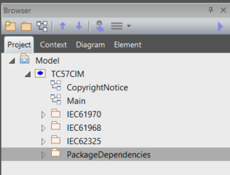

Figure 5‑1 - TC57CIM Package Structure

<table>
<colgroup>
<col style="width: 15%" />
<col style="width: 84%" />
</colgroup>
<thead>
<tr class="header">
<th><strong>RuleID</strong></th>
<th><strong>Description</strong></th>
</tr>
</thead>
<tbody>
<tr class="odd">
<td>Rule003</td>
<td>There shall be one and only one package in the root model that contains all of the TC57 CIM information.</td>
</tr>
<tr class="even">
<td>Rule004</td>
<td>
For each of the following TC57 working groups, there shall be one and only one package that contains all of its CIM information:

<ul>
<li>
Working Group 13;
</li>
<li>
Working Group 14;
</li>
<li>
Working Group 16.
</li>
</ul>

Each package is also referred to as a “Top Level” package.
</td>
</tr>
<tr class="odd">
<td>Rule005</td>
<td>The TC57 working group top level packages and the package that describes their dependencies shall be the only sub-packages within the TC57 CIM information package.</td>
</tr>
<tr class="even">
<td>Rule006</td>
<td>There shall be a diagram within the TC57 CIM information package that depicts the top-level TC57 CIM package structure that includes the TC57 working group packages and the package that describes their dependencies.</td>
</tr>
<tr class="odd">
<td>Rule007</td>
<td>There shall be a diagram within the TC57 CIM information package that contains a note as its only UML element and that note shall include the CIM UML copyright notice verbiage.</td>
</tr>
<tr class="even">
<td>Rule008</td>
<td>Each package should typically include at least one diagram that contains all the classes in a package, and an arbitrary number of other diagrams.</td>
</tr>
</tbody>
</table>

### Package Dependency Rules

The concept of package dependencies is critical to both the understanding of model ownership among working groups and the practical integration or assembly of packages from different owners. An additional package is maintained outside of the IEC working group packages to describe the dependencies among the packages of each working group. This package, named “PackageDependencies” contains a figure illustrating these dependencies as shown in Figure 4 UML package dependencies (for illustration, not official CIM standard). As such the PackageDependencies package is itself dependent upon all the other major packages

The package dependencies should rarely change and therefore it makes sense for the CIM model manager role to maintain this diagram through the normal model issues submittal process. There is no need for each package owner to edit this package. By design there are no circular dependencies among the major packages. Issues are resolved through the CMM board.

The rule of CIM ownership is that any model linkages between packages are owned by the depending package. Thus any linkage (generalisation, association, dependency relationship, attribute type reference, or diagram reference) between e.g. IEC61968 and IEC61970 is owned by the IEC61968 package since it depends upon IEC61970. In CIM, we model associations as implicitly bi-directional, and this rule of package ownership applies to both ends of an association (i.e., for an association between e.g. IEC61968 and IEC61970, both association ends are owned by the IEC61968 package). This is the convention applicable to CIM model management regardless of UML association end ownership, which standard UML does not explicitly specify.

Further we expect that derived classes (specialisations) are within the dependent package (e.g. cross package specialisations would be modelled within IEC61968 packages since IEC61968 depends upon IEC61970). Classes in a given package are allowed to specialise classes owned by packages upon which the given package depends.

Additionally we prefer to have the source end of associations in the dependent package. This is not strictly required, but is a good practice and can be validated by the CIM validation tools used to generate the CIM documentation. Following this convention may allow shortcuts in reassembling combined models, but this is not a formally documented feature of Enterprise Architect.

Diagrams should only include links to anything from packages upon which the containing package depends. Not following this practice will cause such linked elements to disappear when reassembling the combined model. This is the main reason for having the separate “PackageDependencies” package with its overview diagram from Figure 4. Importing this package last ensures that all the dependencies appear on the diagram when assembling the combined model from its partitions.

When a model linkage spans working group packages, both parties should be aware of the linkage once models are combined. Such linkages should normally be discussed among working groups so that inappropriate linkages are not established. At this point any change that impacts that linkage should be agreed among the affected working groups.

This coordination extends to any potentially inherited attributes and associations when the linkage is generalization. Namely, the class inheriting attributes and associations from its base class that is in another working group package depends on types used for attributes and association ends of the base class. Therefore, any change in the base class will impact all those that inherit from that base class.

Types used for attributes in a class introduce dependencies that must be coordinated among the working groups as well.

<table>
<colgroup>
<col style="width: 15%" />
<col style="width: 84%" />
</colgroup>
<thead>
<tr class="header">
<th><strong>RuleID</strong></th>
<th><strong>Description</strong></th>
</tr>
</thead>
<tbody>
<tr class="odd">
<td>Rule009</td>
<td>There shall be one and only one package in the CIM that describes the dependencies between the TC57 working group packages.</td>
</tr>
<tr class="even">
<td>Rule010</td>
<td>The package that describes the dependencies between the TC57 working group packages shall be maintained outside of the IEC working group packages.</td>
</tr>
<tr class="odd">
<td>Rule011</td>
<td>The package used to contain IEC working group package dependencies shall be named “PackageDependencies”</td>
</tr>
<tr class="even">
<td>Rule012</td>
<td>There shall be no circular dependencies among IEC working group packages</td>
</tr>
<tr class="odd">
<td>Rule013</td>
<td>The “PackageDependencies” package shall contain a figure illustrating package dependencies as shown in Figure 5‑2.</td>
</tr>
<tr class="even">
<td>Rule014</td>
<td>Dependencies between packages shall be owned by the dependent package.</td>
</tr>
<tr class="odd">
<td>Rule015</td>
<td>
The source end of associations between classes in different working group sub-packages shall be owned by the dependent package.

NOTE: Following this convention may allow shortcuts in reassembling combined models, but this is not a formally documented feature of Enterprise Architect.
</td>
</tr>
<tr class="even">
<td>Rule016</td>
<td>Class inheritances between classes in different packages (specialisations) shall be owned by the dependent package</td>
</tr>
<tr class="odd">
<td>Rule017</td>
<td>Associations between classes in different IEC working group packages shall be owned by the source (dependent) working group package (i.e., for an association between e.g. an IEC61968 class and an IEC61970 class, both association ends are owned by the IEC61968 package).</td>
</tr>
</tbody>
</table>

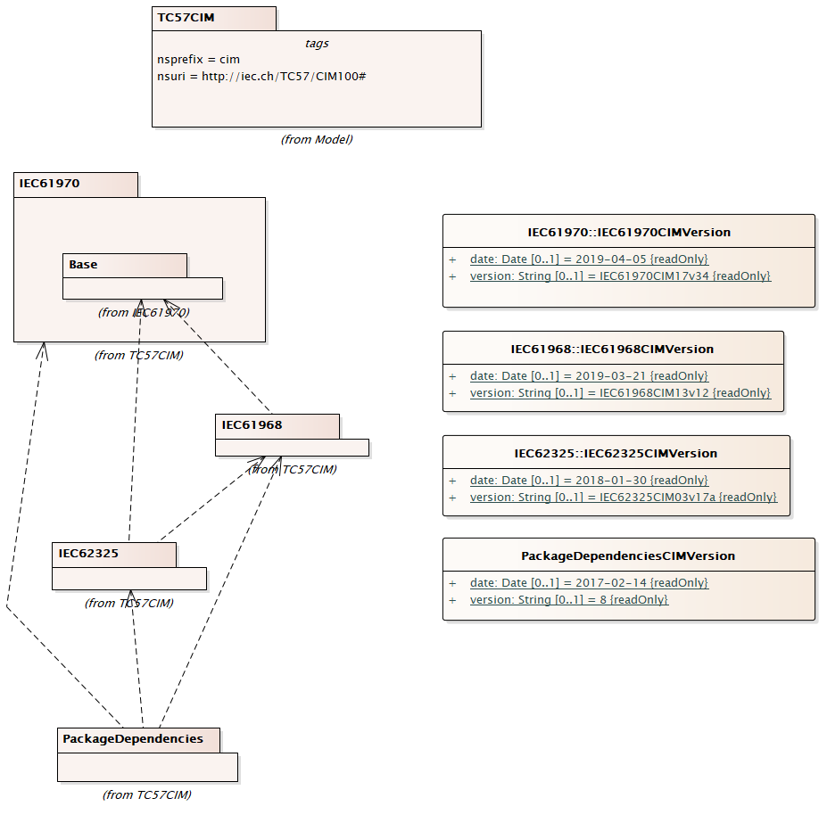

Figure 5‑2. TC57CIM Top-Level Package Dependencies

### Package Assembly Rules

Each working group edits what it owns and merges what others own. With three working groups this results in six possible ways to exchange portioned model files between the groups as shown in Figure 2.

Figure Possible partition file exchanges between WG13, WG14 and WG16

A box in Figure 2 represents a complete UML model while the rows under the working group name correspond to package numbers in CIM.

With four working groups the number of possible exchanges increases to twelve and with five it becomes twenty and so on.

The procedure to update a package with a partition file corresponds to an arrow in Figure 2 and consists of the following steps:

- Export the partition file from the source model,

- Delete the corresponding package in the destination model along with any packages depending on it, and,

- Import the partition file in the destination model and subsequently import any packages depending on it in dependency order.

To properly obtain the correct UML package versions in a synchronized model, one can follow the steps in Figure 2. Complete synchronisation can be achieved by copying whole models as shown in Figure 3 in Figure 3.

Figure 3 Complete synchronisation example

In Figure 3 a complete synchronisation of all model files is made in the following steps:

1 – Synchronise the WG14 model with 61970 from WG13,

2 – Synchronise the WG16 model with 61970 from WG13 and 61968 from WG14,

3 – Copy the complete and synchronised WG16 model to WG13 and WG14.

This procedure minimizes the number of steps.

The whole process can be summarized as simply merging packages from the owner of that package. The package can be either obtained directly from the owner or indirectly from the owner. The additional rules are that we merge packages via the procedure in clause 2.2.2 and we must follow the guidance for model ownership of cross package linkages as defined in clause 2.2.4. We stamp each major package with a version revision stamp which is representative of the package (as defined by our ownership rules) in any combined model which has followed this process.

The merging process can inadvertently change dependent models so care must be taken to not make changes that invalidate dependent models. For example if WG13 were to delete a class from which WG14 generalizes, that generalization owned by WG14 would be lost in any merge where the class was deleted. This is why it is important to track the dependencies and make or break such dependencies only when agreed on both sides.

It is vital when using Enterprise Architect tool to start with an empty model and import packages in dependency order as defined in the PackageDependendencies diagram shown in Figure 4. This assembly process will ensure that combined models are created properly. For example import the IEC61970 package before IEC61968, and import PackageDependencies package last. At any point when assembling packages, the model will be complete in regards to anything owned by the imported packages according to the definition of ownership in clause 2.2.4.

UML element Identity in Enterprise Architect UML is by internally generated GUID’s. Thus it is not equivalent to delete something and then enter the same data again. Such an operation will break linkages in the model, though the source model appears identical from the user interface. In Enterprise Architect you can change the names without breaking linkages. Some tools rely upon the name of the class or attribute not the Enterprise Architect GUID values for reference matching and will break linkages if names are changed. Modelling actions should be aware of both implications.

The best practice is to always import and work with the standard packages upon which your package depends so you get the proper GUID based linkages.

<table>
<colgroup>
<col style="width: 15%" />
<col style="width: 84%" />
</colgroup>
<thead>
<tr class="header">
<th><strong>RuleID</strong></th>
<th><strong>Description</strong></th>
</tr>
</thead>
<tbody>
<tr class="odd">
<td>Rule018</td>
<td>Working group package assembly must start with an empty Enterprise Architect project containing a single empty model.</td>
</tr>
<tr class="even">
<td>Rule019</td>
<td>Packages must be first exported from a properly combined model and then imported into an empty Enterprise Architect project containing a single empty model in order to perform proper package assembly.</td>
</tr>
<tr class="odd">
<td>Rule020</td>
<td>Packages may be exported in any order.</td>
</tr>
<tr class="even">
<td>Rule021</td>
<td>Package exportation must follow the procedure specified in Appendix TBD.</td>
</tr>
<tr class="odd">
<td>Rule022</td>
<td>
The integrity of internally generated GUIDs for Enterprise Architect model elements must be preserved between model versions to ensure model integrity.

NOTE:: Some tools rely upon the name of the class or attribute not the Enterprise Architect GUID values for reference matching and will break linkages if names are changed.
</td>
</tr>
<tr class="even">
<td>Rule023</td>
<td>Package assembly must be performed by importing packages in dependency order as defined in the PackageDependencies diagram shown in Figure 5‑2. Specifically, the package import order is: 1) IEC61970; 2) IEC61968; 3) IEC6235; 4) PackageDependencies.</td>
</tr>
<tr class="odd">
<td>Rule024</td>
<td>
After each package import, the package dependency rules specified in Section 5.2.3 must be satisfied.

NOTE: Any cross-working group package associations to packages not yet imported will be discarded in the combined model as they are by definition not owned by the thus far imported packages.
</td>
</tr>
</tbody>
</table>

## Package Rules

The purpose of packages in the CIM model is mainly for controlling working group ownership, with sub-packages mainly representing conceptual organization. This usage of the package structure allows for relatively easy movement of classes among packages without impacting concrete implementations.

CIM package names are intended to be unique among all packages without consideration of package hierarchy.

Package ordering is typically specified in dependency order. For example, the Domain and Core packages are ordered first in the UML. The printed documentation will use this package ordering. If no clear dependency relation exists, order packages alphabetically.

To facilitate model management and evolution (and minimise IEC documents generation time), while preserving the means to print official documents at any time in the proper format, we have the following three special kinds of packages

“Inf” is the prefix used to denote informative CIM UML sub-packages. This is to avoid name clashes among normative and informative packages (e.g., ‘Core’ vs. ‘InfCore’), and to make informative sub-packages obvious through their name. Note that this will apply to all packages that start with this prefix (e.g., 'InfCore' as well as 'Informative').

The content of the informative package, including any sub-packages and its content, recursively, is considered as informative in the sense of IEC documents and is therefore by default excluded from the document generation. However, the CIM UML tool has an option to enable printing the informative content as well, which is useful for e.g., sharing documentation of the current work in an informative sandbox with the working group members, without impact to the stable, normative parts of the model.

An informative package can be defined at any depth in the CIM UML model. The only requirement is the “Inf” prefix in the package name. It is recommended to specify “Inf” packages as “private” packages in Enterprise Architect package properties, so they can be filtered out of diagrams showing the sub packages.

“Doc” is the prefix used to denote those CIM UML sub-packages that contain diagrams used for the IEC document template only, and that should not be printed with the content of the regular model. The sub-package of "ABC" with the name "DocABC" will be matched, and considered as informative package from the perspective of automatic document generation (i.e., it will be skipped), but it still can be referenced from the IEC document template to include the diagram, for instance in its introductory examples section.

It is recommended to specify “Doc” packages as “private” packages in Enterprise Architect package properties, so they can be filtered out of diagrams showing the sub packages.

### Package Naming Rules

Package names start with upper case (UpperCamelCase rule). Package names must be unique across the whole CIM.

<table>
<colgroup>
<col style="width: 15%" />
<col style="width: 84%" />
</colgroup>
<thead>
<tr class="header">
<th><strong>RuleID</strong></th>
<th><strong>Description</strong></th>
</tr>
</thead>
<tbody>
<tr class="odd">
<td>Rule025</td>
<td>Names for packages shall use the Upper Camel Case naming convention.</td>
</tr>
<tr class="even">
<td>Rule026</td>
<td>Names for packages shall be British English names.</td>
</tr>
<tr class="odd">
<td>Rule027</td>
<td>All packages containing classes shall have unique names. (i.e., the package containment hierarchy shall not be used in uniquely identifying a package).</td>
</tr>
<tr class="even">
<td>Rule028</td>
<td>The name of the top-level CIM package at the root of the model shall be “TC57CIM”.</td>
</tr>
<tr class="odd">
<td>Rule029</td>
<td>
The following names shall be used to identify TC57CIM top-level packages:

<ol type="1">
<li>
“IEC61970” for IEC TC57 WG13 domain information;
</li>
<li>
“IEC61968” for IEC TC57 WG14 domain information;
</li>
<li>
“IEC62325” for IEC TC57 WG16 domain information;
</li>
</ol></td>
</tr>
<tr class="even">
<td>Rule030</td>
<td>The “Inf” prefix shall be used in package names to denote informative CIM UML sub-packages.</td>
</tr>
<tr class="odd">
<td>Rule031</td>
<td>An informative package can be defined at any depth in the CIM UML model. The only requirement is the “Inf” prefix in the package name.</td>
</tr>
<tr class="even">
<td>Rule032</td>
<td>The “Doc” prefix shall be used in package names to denote CIM UML sub-packages that contain diagrams used during the generation of IEC documents.</td>
</tr>
<tr class="odd">
<td>Rule033</td>
<td>The package name “DetailedDiagrams” shall be a reserved package name.</td>
</tr>
<tr class="even">
<td>Rule034</td>
<td>There may be multiple instances of packages named “DetailedDiagrams” in the CIM.</td>
</tr>
</tbody>
</table>

### Package Specification Rules

| **RuleID** | **Description**                                                                                                                                                                    |
|------------|------------------------------------------------------------------------------------------------------------------------------------------------------------------------------------|
| Rule035    | Informative packages should be specified as “private” packages in Enterprise Architect package properties, so they can be filtered out of diagrams showing the sub-packages.       |
| Rule036    | “Doc” packages should be specified as “private” packages in Enterprise Architect package properties, so they can be filtered out of diagrams showing the sub-packages.             |
| Rule037    | “DetailedDiagram” packages should be specified as “private” packages in Enterprise Architect package properties, so they can be filtered out of diagrams showing the sub-packages. |

## Class Rules

The following UML class features are used in CIM:

• Name

• Documentation

• Stereotype

In CIM, a class is used to describe either domain entities or various data types specific to the CIM domain:

• \<\<Primitive\>\> Primitive data types as Booleans, Float, String etc. Primitive cannot have attributes.

• \<\<CIMDatatype\>\> Simple data types specific for the CIM, e.g. ActivePower, Resistance etc. CIMDatatype has at least three attributes: value, unit and multiplier. The “value” attribute is of Primitive type, and unit and multiplier are of an enumeration type. When required additional attributes can be defined to describe for example “demoninatorUnit” and “denominatorMultiplier”, but only one “value” attribute is allowed.

• \<\<Compound\>\> Compound data types specific for the CIM, e.g.StreetAddress etc. Compound has no identity and is a simple group of related attributes, Compound may have attributes whose types are Primitive, enumeration, CIMDatatype or Compound. A circular dependency among Compound types is to be avoided.

• \<\<enumeration\>\> Enumerations, e.g. UnitSymbol, UnitMultiplier, Currency, etc.

• None of the above stereotypes. A domain object that participates in inheritance and/or association relationships with other domain objects. Most of domain objects inherit from the class IdentifiedObject and thus get the identifier and one or multiple names.

CIM classes with a stereotype other than \<\<deprecated\>\> are types that never participate in relationships (i.e., no associations, no inheritance), but are used as types for attributes.

CIM does not use abstract classes, because CIM is in itself an abstract model. In contrast, profiles may distinguish between concrete and abstract classes.

CIM does not use association classes, for the sake of keeping the used subset of UML to the minimum that is well supported by tools and well understood by the wide community.

CIM class names are unique among all TC57CIM class names without consideration of the package hierarchy.

Classes should be ordered alphabetically or in order of importance or by logical grouping. We do not enforce alphabetically ordering automatically in the UML tool. The order of classes in the UML tool with be the order of classes printed in the IEC document.

| **RuleID** | **Description**                                                                                                                                                  |
|------------|------------------------------------------------------------------------------------------------------------------------------------------------------------------|
| Rule038    | Names for classes shall use the Upper Camel Case naming convention.                                                                                              |
| Rule039    | Names for classes shall be British English names.                                                                                                                |
| Rule040    | All classes shall have unique names. The package containment hierarchy shall not be used in uniquely identifying a class.                                        |
| Rule041    | A CIM class shall be used to describe either an electric utility domain entity or an information entity used in the electric utility domain.                     |
| Rule042    | All class names shall be the singular form of a utility domain concept.                                                                                          |
| Rule043    | A CIM class that has the \<\<CIMDatatype\>\> stereotype shall have at minimum, the following attributes: 1. value; 2. unit; and 3. multiplier.                   |
| Rule044    | A CIM class shall not be an abstract class.                                                                                                                      |
| Rule045    | A CIM class shall not be an association class.                                                                                                                   |
| Rule046    | CIM classes with a stereotype other than \<\<deprecated\>\> shall never participate in relationships with other classes (i.e., no associations, no inheritance). |
| Rule047    | CIM classes with a stereotype other than \<\<deprecated\>\> shall only be used as datatypes for attributes.                                                      |
| Rule048    | CIM classes should be ordered alphabetically or in order of importance or by logical grouping within a package.                                                  |

## Attribute Rules

The following UML attribute features are used in CIM:

Name, always used and must be unique among all levels of specialisation.

Type that is one of the stereotyped classes (Primitive, CIMDatatype, Compound, enumeration). When choosing type, ensure you select it from the list of existing types rather than simply type the text into Enterprise Architect. Attention on Primitives: use CIM Primitive datatypes (e.g., String, Boolean), not default UML ones (string, boolean).

Scope is always public

Multiplicity is always \[0..1\]

Initial value, if used, always denotes a constant for all instances of the class where the attribute belongs, and the attribute has to be set as both static and constant.

Documentation. The documentation should not use or rely upon special formatting. Plain text is assumed. It is suggested to avoid special characters here also.

The attribute stereotype can temporarily be used to describe the development state of the attribute or use case that initiated the creation of the attribute. Once the attribute is fully incorporated in the model the stereotype is removed.

Attribute names are unique within a classifier and Enterprise Architect will enforce this.

The attribute order should normally be alphabetical unless there is some clear reason to group like attributes together. We do not enforce alphabetic ordering in the UML tool.

| **RuleID** | **Description**                                                                                                                                               |
|------------|---------------------------------------------------------------------------------------------------------------------------------------------------------------|
| Rule049    | Names for attributes shall use the Lower Camel Case naming convention.                                                                                        |
| Rule050    | Names for attributes shall be British English names.                                                                                                          |
| Rule051    | Attribute names shall be singular form concepts.                                                                                                              |
| Rule052    | The "value" attribute of a CIM class that has the "\<\<CIMDatatype\>\>" stereotype shall be a Primitive data type.                                            |
| Rule053    | The "unit" attribute of a CIM class that has the "\<\<CIMDatatype\>\>" stereotype shall be an enumeration data type.                                          |
| Rule054    | The "multiplier" attribute of a CIM class that has the "\<\<CIMDatatype\>\>" stereotype shall be an enumeration data type.                                    |
| Rule055    | Attribute data types shall be one of the stereotyped CIM classes (i.e. shall not be one of the Enterprise Architect native data types).                       |
| Rule056    | In instances where an attribute of a CIM class has an initial value, it shall denote a constant for all instance of the class to which the attribute belongs. |
| Rule057    | In instances where an attribute of a CIM class has an initial value, it shall be set as both static and constant.                                             |
| Rule058    | Attribute multiplicity shall always be \[0..1\] (i.e. all CIM attributes are optional).                                                                       |
| Rule059    | Names for attributes shall use the Lower Camel Case naming convention.                                                                                        |
| Rule060    | Attribute names shall be unique among all levels of specialisation.                                                                                           |
| Rule061    | The scope of a CIM attribute shall be "Public".                                                                                                               |
| Rule062    | The "value" attribute of a CIM class that has the "\<\<CIMDatatype\>\>" stereotype shall be a Primitive data type.                                            |
| Rule063    | The "unit" attribute of a CIM class that has the "\<\<CIMDatatype\>\>" stereotype shall be an enumeration data type.                                          |
| Rule064    | Datatypes used for attributes in cross-working group dependencies shall be coordinated among the affected working groups.                                     |

## Association Rules

Associations describe how classes are related. Only classes describing domain objects, i.e. classes without data type stereotypes such as \<\<enumeration\>\>, \<\<Primitive\>\>, \<\<Compound\>\>, or \<\<CIMDatatype\>\>, may participate in associations.

An association has two ends referred to as association ends. CIM associations have unspecified direction but have both ends specified which means they are implicitly bi-directional (i.e., it is possible, through end names, to navigate from A to B and from B to A).

The association description and association name are not specified. These become a maintenance problem if specified and also show up on diagrams by default. Instead, we specify the association end names and descriptions.

The UML association features used in CIM are as follows:

Stereotype \<\<informative\>\>, only in case the association is informative. No other stereotypes are allowed.

The UML association end features used in CIM are:

Association end name

Association end multiplicity

Association end description.

No other options should be used, although some association ends in CIM are defined as aggregation (= shared).

Note that, depending on local user settings for EA tool:

it may happen to create by default a directed association, so ensure that the direction for association and both its ends is “Unspecified”;

if using aggregation from the toolbox, the diamond may be on unexpected side of relationship, so always create first a simple association.

Furthermore, to facilitate the correct dependency processing (see 2.2.2), draw an association from a class in the depending package (source end) towards a class in the dependent package (target end). For example, an association between a class in IEC61968 and a class within IEC61970 would be drawn from (the source end of) the class defined within IEC61968 towards (the target end of) the class within IEC61970. This since IEC61968 depends upon the IEC61970 package.

There appears to be no clear manner to control the association end ordering (within the context of a class) in the Enterprise Architect tool so this is an unmanaged aspect of the UML model. In fact, UML does not specify association ends are owned by the class, they are by default owned by the association itself.

Association end names should be unique among all specialisations of a class. For example, if IdentifiedObject associates to the Name class with an end name of “Name”, no specialisation of IdentifiedObject may create another association whose end name is “Name” regardless of the class to which it associates. Note that any number of associations from other classes may use the same name (e.g. “IdentifiedObject”) as the association end name on the IdentifiedObject end of the association, as long as the prior rule of uniqueness among specializations is respected.

Multiplicities are used to describe the number of expected objects at each end of an association as well as if an attribute is optional or mandatory. The following multiplicities are common for association ends in CIM:

- 0..1 an object may or may not exist,

- 1 an object always exists,

- 0..\* any number of objects may exist,

- 1..\* at least one object exists.

Multiplicities shall be chosen to specify what can be expected in the domain. Multiplicity minimum does not mean all profiles must include the association, but if a profile does include the association it should respect the minimum. Note that minimum multiplicities are normally not enforced by implementations at all times. For example in the middle of a transaction one may require violation of minimum multiplicities.

<table>
<colgroup>
<col style="width: 15%" />
<col style="width: 84%" />
</colgroup>
<thead>
<tr class="header">
<th><strong>RuleID</strong></th>
<th><strong>Description</strong></th>
</tr>
</thead>
<tbody>
<tr class="odd">
<td>Rule065</td>
<td>Associations shall not have names.</td>
</tr>
<tr class="even">
<td>Rule066</td>
<td>Associations shall not have descriptions.</td>
</tr>
<tr class="odd">
<td>Rule067</td>
<td>Association ends shall have role names.</td>
</tr>
<tr class="even">
<td>Rule068</td>
<td>Names for association roles shall use the Upper Camel Case naming convention.</td>
</tr>
<tr class="odd">
<td>Rule069</td>
<td>Names for association roles shall be British English names.</td>
</tr>
<tr class="even">
<td>Rule070</td>
<td>Association ends shall have descriptions.</td>
</tr>
<tr class="odd">
<td>Rule071</td>
<td>Association ends shall have specified multiplicity.</td>
</tr>
<tr class="even">
<td>Rule072</td>
<td>The CIM shall not include composition associations between classes.</td>
</tr>
<tr class="odd">
<td>Rule073</td>
<td>Associations shall implicitly be bi-directional (i.e. the ‘Navigability’ property of the association ends is unspecified).</td>
</tr>
<tr class="even">
<td>Rule074</td>
<td>Multiplicities for association ends shall be chosen to specify what is expected in the domain.</td>
</tr>
<tr class="odd">
<td>Rule075</td>
<td>Only CIM classes without datatype stereotypes shall participate in associations.</td>
</tr>
<tr class="even">
<td>Rule076</td>
<td>When associations span working group packages, both working groups shall be made aware of the association once models are combined.</td>
</tr>
<tr class="odd">
<td>Rule077</td>
<td>Cross-working group associations shall be discussed among affected working groups to ensure inappropriate cross-working group associations are not established.</td>
</tr>
<tr class="even">
<td>Rule078</td>
<td>Any change that impacts cross-working group associations shall be agreed upon by the affected working groups</td>
</tr>
<tr class="odd">
<td>Rule079</td>
<td>Any change to potentially inherited associations and attributes due to cross-working group associations shall be discussed among affected working groups to ensure inappropriate cross-working group associations are not established.</td>
</tr>
<tr class="even">
<td>Rule080</td>
<td>Any change to potentially inherited associations and attributes due to cross-working group associations shall be agreed upon by the affected working groups</td>
</tr>
<tr class="odd">
<td>Rule081</td>
<td>Aggregation associations involving IEC 61968 classes should be avoided.</td>
</tr>
<tr class="even">
<td>Rule082</td>
<td>Enterprise Architect should be configured by the user so the default value of the navigability property of an association is “Unspecified” to ensure compliance with Rule073.</td>
</tr>
<tr class="odd">
<td>Rule083</td>
<td>
Associations should be drawn from the dependent (source) class to the target class in Enterprise Architect to facilitate correct dependency processing.

Note: If the source and target classes of the association are incorrect (i.e. class roles are incorrect), the direction of the association can be reversed through the Enterprise Architect user interface.
</td>
</tr>
</tbody>
</table>

## Enumeration Rules

Enumeration literals are attributes within an \<\<enumeration\>\> type. The following UML attribute features are used in CIM:

Name, always used and must be unique among all levels of specialisation.

UML stereotype \<\<enum\>\>.

(enumeration literal has no type by definition).

(enumeration literal scope is public by definition).

(enumeration literal has no multiplicity by definition).

Initial value, if used, denotes a code that has semantic binding. If used, the code must be unique among all the codes for literals within the containing enumeration type. Also, either all or no literals within an enumeration type have a code.

Documentation. The documentation should not use or rely upon special formatting. Plain text is assumed. It is suggested to avoid special characters here also.

Other than \<\<enum\>\> or \<\<deprecated\>\> attribute stereotype can temporarily be used to describe the development state of the attribute or use case that initiated the creation of the attribute. Once the literal is fully incorporated in the model, the stereotype is removed.

Like for attributes, literal names are unique within a classifier and Enterprise Architect will enforce this.

There is no ordering required or reinforced; the order found in the UML model will be the order of printing.

<table>
<colgroup>
<col style="width: 15%" />
<col style="width: 84%" />
</colgroup>
<thead>
<tr class="header">
<th><strong>RuleID</strong></th>
<th><strong>Description</strong></th>
</tr>
</thead>
<tbody>
<tr class="odd">
<td>Rule084</td>
<td>A CIM enumeration shall be a UML class with the "&lt;&lt;enumeration&gt;&gt;" stereotype.</td>
</tr>
<tr class="even">
<td>Rule085</td>
<td>All enumeration classes shall have unique names.</td>
</tr>
<tr class="odd">
<td>Rule086</td>
<td>Names for enumeration literals shall use the Lower Camel Case naming convention.</td>
</tr>
<tr class="even">
<td>Rule087</td>
<td>Names for enumeration literals shall be British English names.</td>
</tr>
<tr class="odd">
<td>Rule088</td>
<td>Enumeration literal names must always be used.</td>
</tr>
<tr class="even">
<td>Rule089</td>
<td>Enumeration literals must be unique among all levels of specialisation.</td>
</tr>
<tr class="odd">
<td>Rule090</td>
<td>All enumeration literals shall use the stereotype &lt;&lt;enum&gt;&gt;.</td>
</tr>
<tr class="even">
<td>Rule091</td>
<td>Enumeration literals shall have no datatype (by UML definition).</td>
</tr>
<tr class="odd">
<td>Rule092</td>
<td>Enumeration literals scope is public (by UML definition).</td>
</tr>
<tr class="even">
<td>Rule093</td>
<td>Enumeration literals have no multiplicity (by UML definition).</td>
</tr>
<tr class="odd">
<td>Rule094</td>
<td>In instances where an initial value for enumeration literals is used, they shall denote a code that has semantic binding.</td>
</tr>
<tr class="even">
<td>Rule095</td>
<td>In instances where an initial value for enumeration literals is used, the code must be unique among all the codes for enumeration literals within the containing CIM class.</td>
</tr>
<tr class="odd">
<td>Rule096</td>
<td>
Either all or no enumeration literals within a CIM type shall have a code.

NOTE: Some of the existing CIM UML enumerations do not comply with this rule because changes would break existing integrations.
</td>
</tr>
</tbody>
</table>

## Diagram Rules

The following UML diagram features are used in CIM:

Name

Documentation

Diagrams should not use shadows, colours or diagram frames when printing model documents.

Diagrams should use A4 page size.

Each package should typically include at least one diagram that contains all the classes in a package, and an arbitrary number of other diagrams.

In general, when editing diagrams, it is possible to set show/hide attributes or relationships for a diagram, to display the desired subset of the model.

Diagram names are used for model document generation and should be unique across the whole CIM model. The CIM UML tool documentation generationallows for the combination of containing package (unique in model) and diagram name to uniquely identify a diagram, but we strive to keep diagram names unique across all packages.

Diagrams should be placed inside of packages (the normal case) or classes (e.g. in Dynamics package). The order of diagrams in the package is retained and should be from most general to specifics. Otherwise, diagrams should be in alphabetical order.

| **RuleID** | **Description**                                                                                                                                                                               |
|------------|-----------------------------------------------------------------------------------------------------------------------------------------------------------------------------------------------|
| Rule097    | Names for diagrams shall use the Upper Camel Case naming convention.                                                                                                                          |
| Rule098    | All diagrams shall have unique names. The package containment hierarchy shall not be used in uniquely identifying a diagram (i.e., diagram names shall be unique across the whole CIM model). |
| Rule099    | Names for diagrams shall be British English names.                                                                                                                                            |
| Rule100    | Diagrams shall only include associations from packages upon which the containing package depends                                                                                              |
| Rule101    | Diagrams should use A4 page size.                                                                                                                                                             |
| Rule102    | Diagrams should be placed inside of packages (the normal case) or classes (e.g. in Dynamics package).                                                                                         |
| Rule103    | The order of diagrams in the package should be from most general to most specific.                                                                                                            |

## Element Description Rules

Make sure to add a description to the UML elements (package, diagram, class, attribute, association ends etc.) when creating them. The description shall explain the meaning of the entity as clearly as possible. It is often useful to search dictionaries and the web for good descriptions.

Use full sentences with proper upper case start and ending period. These get put into IEC documents and must conform to standard editing of such a document. Any references to standards should be specified in a manner compatible with inclusion in IEC documents. The same is true of units, variable names, or other IEC editorial policies.

Make sure to update the description every time you do a modification to existing element (e.g., when changing name of an association end or a class, do extended search in the overall model and ensure to update the in-text references to the element whose name changes).

Document the element itself, not its related or contained elements. Details of attributes should be documented on the attributes themselves, rather than on the class that contains them.

Document the purpose of the attribute. Avoid "This attribute is used ..." or similar.

Document the purpose of association end. Avoid "A is related to one or more B" since UML shows it already.

Avoid using CIM class names in the description/notes. For example, prefer “usage point” over “UsagePoint”. In some rare cases an explicit reference to an attribute may be required for clarity (e.g., “phase information is available in ‘Terminal.phases’.”), but such references create a maintenence problem.

Avoid using mark-up in the documentation (e.g., bold, lists, superscripts). Note this means avoid using variable names in equations in the text to also conform to the IEC documentation rules which require italic type for variable names.

<table>
<colgroup>
<col style="width: 15%" />
<col style="width: 84%" />
</colgroup>
<thead>
<tr class="header">
<th><strong>RuleID</strong></th>
<th><strong>Description</strong></th>
</tr>
</thead>
<tbody>
<tr class="odd">
<td>Rule104</td>
<td>All CIM packages, classes, and attributes shall contain a description in the 'Element Notes' field in Enterprise Architect (i.e. the 'Element Notes' field shall not be blank).</td>
</tr>
<tr class="even">
<td>Rule105</td>
<td>
The description shall explain the meaning of the model element as clearly as possible.

NOTE: If the existing description is ambiguous or unclear, immediately file a CIM issue.
</td>
</tr>
<tr class="odd">
<td>Rule106</td>
<td>Element descriptions shall use full sentences with proper uppercase words and ending with a period.</td>
</tr>
<tr class="even">
<td>Rule107</td>
<td>Any references to standards should be specified in a manner compatible with inclusion in IEC documents. The same is true of units, variable names, or other IEC editorial policies.</td>
</tr>
<tr class="odd">
<td>Rule108</td>
<td>Element descriptions shall be updated every time a modification is made to existing model elements (e.g., when changing name of an association end or a class, do extended search in the overall model and ensure to update the in-text references to the element whose name changes).</td>
</tr>
<tr class="even">
<td>Rule109</td>
<td>Element descriptions shall describe the element itself, not its related or contained elements (e.g., descriptions of attributes should be documented with the attributes themselves, rather than with the description of the class that contains them).</td>
</tr>
<tr class="odd">
<td>Rule110</td>
<td>Attribute descriptions shall describe the purpose of the attribute. Avoid describing how the attribute is used.</td>
</tr>
<tr class="even">
<td>Rule111</td>
<td>Association descriptions shall describe the purpose of association ends. Avoid "A is related to one or more B" since the diagrams already show the relationship.</td>
</tr>
<tr class="odd">
<td>Rule112</td>
<td>The use of CIM class names in element descriptions shall be avoided. For example, use “usage point” instead of “UsagePoint”.</td>
</tr>
<tr class="even">
<td>Rule113</td>
<td>In some rare cases an explicit reference to an attribute may be required for clarity (e.g., “phase information is available in ‘Terminal.phases’.”), but such references create data synchronization challenges.</td>
</tr>
<tr class="odd">
<td>Rule114</td>
<td>
Avoid using mark-up in element descriptions (e.g., bold, lists, superscripts).

NOTE: this means avoid using variable names in equations in the text to also conform to the IEC documentation rules which require italic type for variable names.
</td>
</tr>
</tbody>
</table>

## Inheritance Rules

Inheritance is used to specialise an existing class. The inheriting class is more specific than the base class. Inheritance is the strongest possible dependency; it is often misused and should be used with care (note: everything that can be expressed through inheritance could also be expressed through composition).

The CIM is currently using a single type inheritance hierarchy and the use of multiple inheritance is not allowed (except as specified for extensions, see 5.4).

Inheritance relationship must be drawn from the more specific class to the more general class. In case the classes from two top-level packages are involved, the subclass must be in the dependent package, and inherit from the class in a package upon which it depends (see 2.2.2).

Inheritance should never create situations where attribute names or role names are duplicated or “override” within the inheritance linage.

| **RuleID** | **Description**                                                                                                                                                             |
|------------|-----------------------------------------------------------------------------------------------------------------------------------------------------------------------------|
| Rule115    | Multiple inheritance shall not be used.                                                                                                                                     |
| Rule116    | Inheritance relationships must be drawn from the more specific class to the more general class.                                                                             |
| Rule117    | In case the classes from two top-level packages are involved, the subclass must be in the dependent package, and inherit from the class in a package upon which it depends. |
| Rule118    | Inheritance should never create situations where attribute names or role names are duplicated or “override” within the inheritance lineage.                                 |
| Rule119    | Inheritance shall not be used with stereotyped classes.                                                                                                                     |

## Stereotype Rules

### General and \<\<Deprecated\>\> Stereotype Rules

This stereotype is recognised by the CIM UML validation and document generation tool and can be applied to any of the UML concepts defined below. The typical usage of the \<\<deprecated\>\> stereotype is for the purpose of preserving backwards compatibility for the normative, already published content, during a release or two, while indicating to the users that the item is likely to actually be removed in the future. This is a graceful means of phasing out obsolete or re-factored elements, and leaving some time to the users to provide implementation in terms of the new features replacing those marked with \<\<deprecated\>\>.

It is possible and supported by the CIM UML tool to have multiple stereotypes on an element (e.g. \<\<deprecated, CIMDatatype\>\>).

The \<\<deprecated\>\> strereotype may be used on attributes, associations, classes, packages, and diagrams in the UML model. It is recommended when deprecating a package to deprecate all its contained classes as well. When deprecating a class it is recommended to deprecate all associations in which it is involved and all its native attributes. Inheritance from a deprecated class is less clear and no general guidance is given, except to avoid this situation if possible.

| **RuleID** | **Description**                                                                                                                                                      |
|------------|----------------------------------------------------------------------------------------------------------------------------------------------------------------------|
| Rule120    | CIM elements may have multiple stereotypes.                                                                                                                          |
| Rule121    | The \<\<deprecated\>\> stereotype may be used on attributes, associations, classes, packages, and diagrams in the CIM.                                               |
| Rule122    | The \<\<deprecated\>\> stereotype should be used when it is desired to deprecate a package and all its contained classes as well.                                    |
| Rule123    | The \<\<deprecated\>\> stereotype should be used when it is desired to deprecate a class and all associations in which it is involved and all its native attributes. |
| Rule124    | Usage of the \<\<deprecated\>\> stereotype should be for the purpose of preserving backwards compatibility for normative, already published content.                 |
| Rule125    | The \<\<deprecated\>\> stereotype should be used for no more than two (2) releases of the CIM.                                                                       |

### Package Stereotype Rules

| **RuleID** | **Description**                                                                                                                                                                                                    |
|------------|--------------------------------------------------------------------------------------------------------------------------------------------------------------------------------------------------------------------|
| Rule126    | A package stereotype may be used temporarily to describe the development state of the package, e.g. \<\<Work in progress\>\>. Once the package is fully incorporated in the model the stereotype shall be removed. |

### Class Stereotype Rules

| **RuleID** | **Description**                                                                                                                                                                                                                                                          |
|------------|--------------------------------------------------------------------------------------------------------------------------------------------------------------------------------------------------------------------------------------------------------------------------|
| Rule127    | The "\<\<CIMDatatype\>\>" stereotype shall be used to extend the semantics of the UML class element to represent an electric utility domain data type.                                                                                                                   |
| Rule128    | The "\<\<Primitive\>\>" stereotype shall be used to extend the semantics of the UML class element to represent the following data types: 1. Boolean; 2. Date; 3. DateTime; 4. Decimal; 5. Duration; 6. Float; 7. Integer; 8. MonthDay; 9. String; 10. Time; and 11. URI. |
| Rule129    | The "\<\<Compound\>\>" stereotype shall be used to extend the semantics of the UML class element to represent an electric utility domain datatype that is a collection of related class attributes.                                                                      |
| Rule130    | The "\<\<enumeration\>\>" stereotype shall be used to extend the semantics of the UML class element to represent a data type whose instances form a list of named literal values.                                                                                        |
| Rule131    | A CIM class that represents a domain object that participates in inheritance and / or association relationships shall not use a stereotype with the exception of the \<\<deprecated\>\> stereotype specified in \[Rule 124\].                                            |

## Namespace Rules

Namespaces are specified at level of packages in the CIM UML model. The namespaces apply to classes, attributes, association ends, data types (\<\<CIMDatatype\>\>, \<\<Compound\>\>, \<\<Primitive\>\>, and \<\<enumeration\>\>) and enums. Namespaces are useful for marking the source of CIM models for either standards or extensions.

Namespaces are derived from the rules given below.

Namespaces applied at the package level propagate to sub packages without a namespace and any contained classes. Namespaces on classes propagate to contained attributes. Namespaces on classes propagate to both ends a connected association if the association is owned by the package. Namespaces on cross package associations are propagated from the owning class as defined in clause 2.2.4 UML cross package dependencies and ownership.

If a namespace is specified at a subpackage level it takes precedence over the containing package.

The form is a tag of named “nsuri” with the value being the namespace URI value. A second tag named “nsprefix” whose value is used to specify the XML prefix. (The “nsuri” tag is similar to how CIMTool uses the tag named “uml:baseuri” with the value being the namespace URI, where “uml” is defined as “http://langdale.com.au/2005/UML#”.)

The namespace tagged value approach can be extended to allow specific namespace assignment to classes, attributes, association ends, datatypes, and enumeration literals. Such extensions are not required for the CIM information model or extensions to the information model because all such features can be added to packages with the appropriate namespace, but the same approach could be used for profiles in UML However, document does not address profiles in UML.

For example the base cim 61970-301 we use: \[Note the example does not match proposal.\]

nsprefix=cim

nsuri=http://iec.ch/TC57/2015/CIM17

61970-302 nsprefix=dycim nsuri=… dynamics…

61968-11 nsprefix=dcim nsuri= <http://iec.ch/2015/dcim12>

62325-301 nsprefix=mcim nsuri=htt://iec.ch/ …. Market…

\[Proposed\] The IEC is taking an approach of using a consistent namespace for all standard CIM within one consistent version of total CIM. Thus namespaces are only specified one time at the top level package (TC57CIM) and version would be bumped when any subpackage changes. Therefore the namespace approach is useful to encode this single namespace in the UML for standard CIM canonical model plus namespace for any extension packages.

<table>
<colgroup>
<col style="width: 15%" />
<col style="width: 84%" />
</colgroup>
<thead>
<tr class="header">
<th><strong>RuleID</strong></th>
<th><strong>Description</strong></th>
</tr>
</thead>
<tbody>
<tr class="odd">
<td>Rule132</td>
<td>CIM Namespace specifications shall consist of two (2) namespaces: 1) a CIM Universal Resource Identifier (URI) namespace; and 2) a CIM XML prefix.</td>
</tr>
<tr class="even">
<td>Rule133</td>
<td>CIM Namespaces shall be stored in Enterprise Architect as tagged values.</td>
</tr>
<tr class="odd">
<td>Rule134</td>
<td>The tagged value name for the CIM URI namespace shall be “nsuri”.</td>
</tr>
<tr class="even">
<td>Rule135</td>
<td>The tagged value name for the CIM XML prefix shall be “nsprefix”.</td>
</tr>
<tr class="odd">
<td>Rule136</td>
<td>Namespaces shall be specified at the package level in the CIM UML model.</td>
</tr>
<tr class="even">
<td>Rule137</td>
<td>Namespaces shall apply to classes, attributes, association ends, datatypes (&lt;&lt;CIMDatatype&gt;&gt;, &lt;&lt;Compound&gt;&gt;, &lt;&lt;Primitive&gt;&gt;, and &lt;&lt;enumeration&gt;&gt;) and enumerations.</td>
</tr>
<tr class="odd">
<td>Rule138</td>
<td>Namespaces specified at the package level shall propagate to sub-packages without both specified namespaces and any contained classes.</td>
</tr>
<tr class="even">
<td>Rule139</td>
<td>Namespaces on classes shall propagate to contained attributes.</td>
</tr>
<tr class="odd">
<td>Rule140</td>
<td>Namespaces on classes shall propagate to both ends of a connected association if the association is owned by the same package.</td>
</tr>
<tr class="even">
<td>Rule141</td>
<td>Namespaces on cross package associations shall be propagated from the owning class.</td>
</tr>
<tr class="odd">
<td>Rule142</td>
<td>If a namespace is specified at a sub-package level, it shall take precedence over the containing package’s specified namespace.</td>
</tr>
<tr class="even">
<td>Rule143</td>
<td>The TC57CIM package shall have a namespace specification.</td>
</tr>
<tr class="odd">
<td>Rule144</td>
<td>
The value of the TC57CIM package nsuri tag shall be: http://iec.ch/TC57/CIM&lt;version&gt;# where:

&lt;version&gt; = the version number of the CIM.
</td>
</tr>
<tr class="even">
<td>Rule145</td>
<td>The value of the TC57CIM package nsprefix tag shall be “cim”.</td>
</tr>
<tr class="odd">
<td>Rule146</td>
<td>The IEC61970 package shall have a namespace specification.</td>
</tr>
<tr class="even">
<td>Rule147</td>
<td>
The value of the IEC61970 package nsuri tag shall be:

http://iec.ch/TC57/61970/CIM&lt;XX&gt;.&lt;YY&gt;]# where:

&lt;XX&gt; = the major version number of the IEC61970 package; and

&lt;YY&gt; = the minor version number of the IEC61970 package.
</td>
</tr>
<tr class="odd">
<td>Rule148</td>
<td>The value of the IEC61970 package nsprefix tag shall be “cim61970”.</td>
</tr>
<tr class="even">
<td>Rule149</td>
<td>The IEC61968 package shall have a namespace specification.</td>
</tr>
<tr class="odd">
<td>Rule150</td>
<td>
The value of the IEC61968 package nsuri tag shall be:

http://iec.ch/TC57/61968/CIM&lt;XX&gt;.&lt;YY&gt;]# where:

&lt;XX&gt; = the major version number of the IEC61968 package; and

&lt;YY&gt; = the minor version number of the IEC61968 package.
</td>
</tr>
<tr class="even">
<td>Rule151</td>
<td>The value of the IEC61968 package nsprefix tag shall be “cim61968”.</td>
</tr>
<tr class="odd">
<td>Rule152</td>
<td>The IEC62325 package shall have a namespace specification.</td>
</tr>
<tr class="even">
<td>Rule153</td>
<td>
The value of the IEC62325 package nsuri tag shall be:

http://iec.ch/TC57/62325/CIM&lt;XX&gt;.&lt;YY&gt;]# where:

&lt;XX&gt; = the major version number of the IEC62325 package; and

&lt;YY&gt; = the minor version number of the IEC62325 package.
</td>
</tr>
<tr class="odd">
<td>Rule154</td>
<td>The value of the IEC62325 package nsprefix tag shall be “cim62325”.</td>
</tr>
</tbody>
</table>

## Documentation Rules

| **RuleID** | **Description**                                                                                                                                                                                                                |
|------------|--------------------------------------------------------------------------------------------------------------------------------------------------------------------------------------------------------------------------------|
| Rule155    | Diagrams contained in packages with the “Doc” prefix will not be printed as part of the model content information, but will be printed as part of a document template’s static (boilerplate) information in CIM documentation. |
| Rule156    | Documentation will use the package order to determine the order for printing model information.                                                                                                                                |
| Rule157    | Documentation will use the class order within a package to determine the order for printing class information.                                                                                                                 |
| Rule158    | Documentation will use the attribute order within a class to determine the order for printing attribute information.                                                                                                           |
| Rule159    | Documentation will use the enumeration order within a package to determine the order for printing enumeration information.                                                                                                     |
| Rule160    | Documentation will use the enumeration literal order within an enumeration class to determine the order for printing enumeration literal information.                                                                          |
| Rule161    | The content of the informative package, including any sub-packages and its content, recursively, is considered as informative in the sense of IEC documents and is therefore by default excluded from the document generation. |
| Rule162    | Diagrams should not use shadows, colours or diagram frames when printing model documents.                                                                                                                                      |

#  CIM UML Extension Rules and Recommendations

## Overview

The CIM UML is an ever-evolving semantic information model. It is extended periodically based on work performed by the IEC TC57 working groups 13, 14, 16 and 21, and work performed by the CIMug through its various focus communities, projects, and working groups. CIM extensions originating from IEC TC57 working group are classified as “Standard” CIM extensions. CIM extensions originating from the CIMug are classified as “User-Defined” CIM extensions.

### Application of CIM UML Extension Rules and Recommendations

Work on Standard CIM extensions is started with the full understanding that the extensions are intended to become part of the standard CIM and ultimately to be used to as the basis of new standard CIM profiles. Whereas work on User-Defined extensions is started because the CIM needs to be extended to address the needs and constraints of a particular user’s instance of the CIM. All User-Defined CIM extensions will not become part of the standard CIM. User-Defined CIM extensions must be evaluated to see if they can also be applied in the broader CIM user community as is or with some modifications.

For the reasons presented above, some extension rules and recommendations apply only to Standard CIM extensions; some only to User-Defined CIM extensions; and some to all CIM extensions. The language of the rules and recommendations is intended to be unambiguous so the users of this document will know to which class of CIM extensions each rule and recommendation applies.

### Custom CIM Extensions

The objective of these recommendations is to allow for clear modularization of extensions such that they can be readily identified as extensions and migrated more easily to updated versions of the standard CIM,

Extensions to the CIM model should be included in the extension package just as any other CIM modeling except for the differences noted in this clause. The extension package should have the \<\<CIMExtension\>\> stereotype to identify all its contents as extensions to the CIM information model. The extension package should also introduce a new namespace.

The subpackage structure of the extensions may pattern after that of standard CIM packages, but the package structure should reflect the needs for individually managing and organising parts of the extensions.

It is recommended to utilize existing data types and CIM classes where possible. New classes can be created where new business objects concepts are introduced with their own lifecycle.

The typical case of adding a new extension class and associating with existing standard classes is can be modeled in a diagram within the extension package as shown in Figure 10 Example UML model for extension class with association to standard class. This situation does not require multiple inheritance.

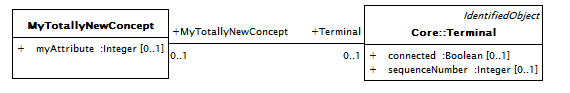

Figure Example UML model for extension class with association to standard class

Note that the introduction of an association from a new extension class to an existing standard CIM class requires nothing special, just make the association as it is implicitly owned by the depending extension class’s package. It is more clear to put both ends of the association into the extension package as the namespace for both association ends will follow CIM package containment rules which rely upon package dependency.

In the case of a new association with both ends referencing existing classes or new attributes on existing classes, a method of using multiple inheritance is allowed and discussed below.

Name the new extension class with the same name as the standard CIM class. Give the new class a generalization relationship from the standard CIM class such that the standard CIM class is a specialisation of the extension class. Generally the extension class will have no base class and the standard CIM class will now have multiple inheritance. The generalisation relationship should have the \<\<CIMExtension\>\> stereotype.

\[Should we also add a CIMExtension stereotype to the extension class to make it easily distinquished without having to look at the package containment?\]

The new attributes or associations can be added to the new extension class and they will be inherited by the standard CIM class and in effect appearing as new properties of the standard class.

A new attribute is effectively added to an existing CIM class within the new extension package using a diagram within the extension package as shown in Figure 11 Example UML model for attribute extensions to standard CIM classes.

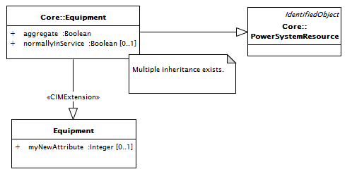

Figure Example UML model for attribute extensions to standard CIM classes.

A new association can be effectively between two standard CIM classes by introducing one of the classes as an extension class in the extension package then making the association to the other class. There is no guidance on which end to chose as the extension class and it may be driven by having already added one of the extension classes to the extension package for other purposes. A diagram in the extension package can be used as shown in Figure 12 Example UML model for association extensions to standard CIM classes. If both classes are already extension classes, the association should be added between the two extension classes for better modularity.

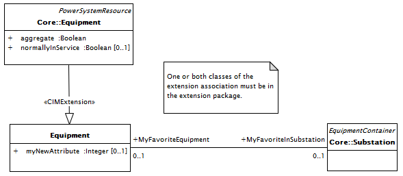

Figure Example UML model for association extensions to standard CIM classes

An extension class should be used only one time within a namespace. The extension class should have the \<\<CIMExtension\>\> generalization pointing to a standard CIM class of the same name. A particular extension is an extension to the one and only standard CIM class. A standard CIM class may have any number of \<\<CIMExtension\>\> generalization relationships where each should be from an extension class of the same name but with unique namespaces. The possiblity exists for extension classes extending other extension classes, though it is preferred to extend the standard CIM class if it exits.

## General Extension Rules

General rules for IEC TC57, available in “TC57 CIM Naming_Rules_Draft_R00_2008-05-16v3.doc”, give the overall guidelines for naming conventions of UML models at any abstraction level. The rules defined in this technical report, dedicated to CIM UML information model, take precedence over the rules in the above document in case the rules differ.

Use English language for names.

Names shall describe the problem domain so it aids human understanding.

Words in concatenated names use camel notation (UpperCamelCase or lowerCamelCase rule).

Names contain alphanumeric characters only, i.e. \[0..9, A..Z\]. Space or special characters are not allowed, e.g.\< \> & \_ - “ ‘ ( ) \[ \] { } ? ! ; : . , \* etc.

Names always start with a letter, a numeric value is not allowed.

Make sure a new name for a package or class is unique within its package scope and preferably in the whole model to avoid any ambiguity.

Make sure to reuse an existing attribute name for a new attribute (e.g. sequenceNumber instead of sequence or seqNum or seqNumber).

It is discouraged to distinguished names by upper and lower case changes alone. We have a few examples of this, but the practice is discouraged.

| **RuleID** | **Description**                                                                                                                                                                                                  |
|------------|------------------------------------------------------------------------------------------------------------------------------------------------------------------------------------------------------------------|
| Rule163    | CIM extensions shall be based on at least one business use case that describes a business need that will be satisfied by the extension.                                                                          |
| Rule164    | CIM extensions should be a specific as possible based on the business use case(s) it satisfies. Specific CIM extensions will give less room for interpretation which will result in better interoperability.     |
| Rule165    | Existing standard CIM shall not be changed for simply violating any CIM extension rules.                                                                                                                         |
| Rule166    | A cost/benefit analysis must be submitted with CIM extensions that are not backwards compatible with the current standard CIM. The analysis must include an impact assessment for standardized message profiles. |
| Rule167    | During development of Standard CIM extensions, custom rules may be temporarily used.                                                                                                                             |
| Rule168    | Custom rules must no longer be in effect or enforced before merging Standard CIM extensions with the CIM.                                                                                                        |
| Rule169    | UML packages shall be used to structure CIM extensions into manageable and logical model parts.                                                                                                                  |
| Rule170    | Before creating a new model element, the CIM should be searched to see if an element similar to the intended extension element already exists. If it does exist, it may influence the extension to the model.    |

## Package Extension Rules

Package names start with upper case (UpperCamelCase rule). Package names must be unique across the whole CIM.

<table>
<colgroup>
<col style="width: 15%" />
<col style="width: 84%" />
</colgroup>
<thead>
<tr class="header">
<th><strong>RuleID</strong></th>
<th><strong>Description</strong></th>
</tr>
</thead>
<tbody>
<tr class="odd">
<td>Rule171</td>
<td>Standard CIM extensions shall exist within the TC57CIM package.</td>
</tr>
<tr class="even">
<td>Rule172</td>
<td>A single top-level package for User-Defined CIM extensions that exist outside of the TC57CIM package shall be created at the root level of the CIM.</td>
</tr>
<tr class="odd">
<td>Rule173</td>
<td>The top-level User-Defined CIM extension package should have the stereotype &lt;&lt;CIMExtension&gt;&gt; to identify all its contents as extension to the standard CIM.</td>
</tr>
<tr class="even">
<td>Rule174</td>
<td>The top-level User-Defined CIM extension package should introduce a new namespace.</td>
</tr>
<tr class="odd">
<td>Rule175</td>
<td>
User-Defined CIM extensions shall exist either within a sub-package within the top-level User-Defined CIM extension package or within the TC57CIM package.

NOTE: The preferred approach is to have User-Defined CIM extensions contained within a sub-package within the top-level User-Defined CIM extension package. However, there are known instances where implementation constraints make it necessary to place some User-Defined CIM extensions within the TC57CIM package.
</td>
</tr>
<tr class="even">
<td>Rule176</td>
<td>Before creating a CIM extension sub-package, the model should be searched to ensure no existing CIM package has the intended name of the CIM extension package.</td>
</tr>
<tr class="odd">
<td>Rule177</td>
<td>
In instances where an existing CIM package has the intended name of the CIM extension package, the intended name of the CIM extension package shall be changed.

NOTE: Consider using another name or adding a prefix to the name of the new package.
</td>
</tr>
<tr class="even">
<td>Rule178</td>
<td>CIM extension package names shall use the Upper Camel Case naming convention.</td>
</tr>
<tr class="odd">
<td>Rule179</td>
<td>The sub-package structure of the extensions should be patterned after the Standard CIM sub-package structure as applicable.</td>
</tr>
<tr class="even">
<td>Rule180</td>
<td>The “Inf” and “Doc” name prefix rules specified in section 5.3 shall apply to CIM extension packages.</td>
</tr>
<tr class="odd">
<td>Rule181</td>
<td>The “DetailedDiagram” rules specified in section 5.3 shall apply to CIM extension packages.</td>
</tr>
<tr class="even">
<td>Rule182</td>
<td>The Informative packages rules specified in section 5.3 shall apply to CIM extension packages.</td>
</tr>
<tr class="odd">
<td>Rule183</td>
<td>The sub-package structure of the extensions should take into consideration how the extensions will be managed.</td>
</tr>
</tbody>
</table>

## Class Extension Rules

Class names start with upper case (UpperCamelCase rule). Class names should use singular form. Class names must be unique across the whole CIM. Be aware there is a potential conflict of profile names and class names that may occur from the 62321-100 standard for XSD naming rules, so the choice of profile names and class names should be made with this consideration.

| **RuleID** | **Description**                                                                                                                                                                                                     |
|------------|---------------------------------------------------------------------------------------------------------------------------------------------------------------------------------------------------------------------|
| Rule184    | Before creating a new extension class to represent a utility domain concept, the CIM should be searched to make sure the concept Is not already present in the CIM.                                                 |
| Rule185    | The creation of new primitive data types should be avoided. As a semantic data model, the CIM is intended to represent utility domain concepts, not extensive data typing available in implementation technologies. |
| Rule186    | The creation of CIM extension classes that represent synthesized utility domain concepts and not real domain objects should be avoided.                                                                             |
| Rule187    | Class rules specified in section 5.4 shall apply to CIM extension classes.                                                                                                                                          |
| Rule188    | The choice of new CIM extension class names should be made in consideration of potential conflicts with profile names. This conflict may occur based on the IEC62321-100 standard for XSD naming rules.             |
| Rule189    | User-Defined CIM extension classes should use a class name prefix, suffix, or a stereotype to facilitate model searches for the class.                                                                              |
| Rule190    | User-Defined CIM extension class names may include an underscore character.                                                                                                                                         |
| Rule191    | Relationships between User-Defined CIM extension classes and standard CIM classes should be generalisations whenever possible.                                                                                      |

## Attribute Extension Rules

Attribute names start with lower case (lowerCamelCase rule). Attribute names should use singular form. Attribute names are unique within a classifier. Inherited attribute names should be unique

| **RuleID** | **Description**                                                                                                     |
|------------|---------------------------------------------------------------------------------------------------------------------|
| Rule192    | Attribute rules specified in 5.5 shall apply to CIM extension attributes.                                           |
| Rule193    | Standard CIM extension attributes shall not be stereotyped.                                                         |
| Rule194    | User-Defined CIM extension attributes that are part of a User-Defined CIM extension class shall not be stereotyped. |
| Rule195    | User-Defined CIM extension attributes that are part of a standard CIM class shall be stereotyped.                   |

## Association Extension Rules

### Association names

Association names are not used and should be left empty.

### Association end names

Association end names are mandatory at both sides for an association.

Association end names start with upper case (UpperCamelCase rule).Historically, if association end had a multiplicity greater than 1, its name would end with an “s”. (Note that given that this has historically been the convention over the years, and many profiles actually use those association end names, it would be hard to change the convention and not include the “s” now for existing classes). However, for all new associations the singular form should be used independent of the cardinality at a role end.

In case the role is clear from the referenced class the class name can be used as association end name. However, a role may have a specific meaning that does not correspond to the class name. In that case the meaning shall be captured in the association end name.

In case there are multiple associations between two classes, it is essential to give different names to association ends of those associations. As a further generalisation of the previous sentence, it is also essential to give unique association end names for the opposite end class. Additionally, association end names should not duplicate attribute names on the opposite end class, though the likelihood of this is small given our other naming conventions.

Inherited association ends should have unique names.

| **RuleID** | **Description**                                                                                                                                                                                                                                                             |
|------------|-----------------------------------------------------------------------------------------------------------------------------------------------------------------------------------------------------------------------------------------------------------------------------|
| Rule196    | CIM extension associations shall comply with association rules specified in section 5.6.                                                                                                                                                                                    |
| Rule197    | In instances where a CIM extension association role has multiplicity greater than 1, its role name may be plural. This is allowed as a concession for backwards compatibility. For all new associations it is recommended that end role names be expressed in the singular. |
| Rule198    | In instances where there are multiple associations between two classes, all role names shall be different (see Figure 6‑1).                                                                                                                                                 |
| Rule199    | In instances where there is self-association, the two role names shall be different (see Figure 6‑2).                                                                                                                                                                       |
| Rule200    | In instances where the role of a class in an association is clear from the referenced class, the class name may be used as the association role name.                                                                                                                       |
| Rule201    | In instances where the role of a class in an association does not correspond to the class name, the role of the class in the association shall be contained in its association role name.                                                                                   |
| Rule202    | In instances where a class is in associations with multiple classes, the association role names may be duplicated if the role names on the other end of the associations are different (see Figure 6‑3).                                                                    |
| Rule203    | Inherited association ends shall have unique role names.                                                                                                                                                                                                                    |
| Rule204    | Associations between CIM extension classes and high-level standard CIM classes should be minimized.                                                                                                                                                                         |

Figure 6‑1. Example of two associations between two classes

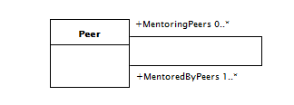

Figure 6‑2. Example of self-association

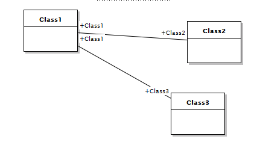

Figure 6‑3. Allowed duplication of association end names

## Enumeration Extension Rules

Enumeration literal names should follow the same rules as attribute names (5.4.7), except in case some established conventions exist, e.g. SI unit symbols or currencies.

<table>
<colgroup>
<col style="width: 15%" />
<col style="width: 84%" />
</colgroup>
<thead>
<tr class="header">
<th><strong>RuleID</strong></th>
<th><strong>Description</strong></th>
</tr>
</thead>
<tbody>
<tr class="odd">
<td>Rule205</td>
<td>
CIM extension enumerations names shall comply with class extension rules specified in section 6.4 and shall end with the suffix “Kind”.

NOTE: There are several standard CIM classes that do not comply with this naming convention. This is an instance where backwards compatibility supersedes a modeling rule.
</td>
</tr>
<tr class="even">
<td>Rule206</td>
<td>CIM extension enumerations shall comply with enumeration rules specified in section 5.7with the exception in cases where established conventions exist (e.g. SI unit symbols or currencies).</td>
</tr>
</tbody>
</table>

# CIM UML Transformation Rules and Recommendations

## Overview

The CIM UML is a semantic information model (also referred to as a conceptual data model). It is a conceptual model of utility objects and their relationships with each other. It is application independent, but defines all the concepts needed for any application. It essentially provides the vocabulary (sometimes referred to as a data dictionary) to be used when utility domain data is exchanged between systems.

Since the CIM UML is a conceptual model, it cannot be used as is for data exchange. A subset of CIM elements needs to be selected and constrained for a specific business context for use in a data exchange between systems. This is analogous to the need for the grammatical structure of words and phrases to create coherent sentences in a given language. The CIM UML subset must therefore be transformed from a semantic information model into a contextual data model (also referred to as a canonical data model). The contextual data model is called a “CIM Profile”. The resultant CIM Profile is the syntax of a data exchange between utility domain systems.

This section specifies the rules and recommendations for transforming a subset of the CIM UML into a contextual data model. The contextual data model can then be used to derive implementation models which define the data and the structure of the data required to exchange information between two systems to execute a single interaction in a System Use Case.

## General Transformation Rules and Recommendations

| **RuleID** | **Description**                                                                                                                                                                     |
|------------|-------------------------------------------------------------------------------------------------------------------------------------------------------------------------------------|
| Rule207    | A contextual data model derived from the CIM UML shall not contain any classes, attributes, or associations that are not part of the CIM UML, with the exception of CIM extensions. |
| Rule208    | In instances where CIM extensions have been added to the CIM UML, the extensions may be part of a contextual data model derived from the CIM UML.                                   |
| Rule209    | A class diagram that contains all candidate classes and associations should be created, which may be used as a reference diagram, for each contextual data model.                   |

## Package Transformation Rules and Recommendations

| **RuleID** | **Description**                                                                                                                                                                                                              |
|------------|------------------------------------------------------------------------------------------------------------------------------------------------------------------------------------------------------------------------------|
| Rule210    | Transformation of all CIM UML packages shall not be required to create a contextual data model (i.e. entire packages may be left out of a contextual data models if they are not needed).                                    |
| Rule211    | Transformation of an entire package shall not be required to create a contextual data model (i.e. classes, attributes, and associations within a package may be left out of a contextual data model if they are not needed). |
| Rule212    | A single top-level package for contextual data models that exists outside of the TC57CIM package should be created at the root level of the CIM.                                                                             |

## Class Transformation Rules and Recommendations

| **RuleID** | **Description**                                                    |
|------------|--------------------------------------------------------------------|
| Rule213    | A contextual data model shall contain at least one concrete class. |
| Rule214    | A contextual data model may contain abstract classes.              |

## Attribute Transformation Rules and Recommendations

| **RuleID** | **Description**                                                                                                                                                              |
|------------|------------------------------------------------------------------------------------------------------------------------------------------------------------------------------|
| Rule215    | A contextual data model should contain at least one mandatory attribute.                                                                                                     |
| Rule216    | Mandatory attributes in the CIM UML shall be mandatory when included in a contextual data model.                                                                             |
| Rule217    | Optional attributes in the CIM UML may be restricted to be mandatory when included in a contextual data model.                                                               |
| Rule218    | A contextual data model should contain the attributes necessary to execute a System use case interaction.                                                                    |
| Rule219    | A contextual data model should not contain attributes not used in a System use case interaction (i.e. not all class attributes must be included in a contextual data model). |

## Association Transformation Rules and Recommendations

| **RuleID** | **Description**                                                                                                                                                                  |
|------------|----------------------------------------------------------------------------------------------------------------------------------------------------------------------------------|
| Rule220    | A contextual data model should contain the associations necessary to execute a System use case interaction.                                                                      |
| Rule221    | A contextual data model should not contain associations not used in a System use case interaction (i.e. not all class associations must be included in a contextual data model). |
| Rule222    | Mandatory association roles in the CIM UML shall be mandatory when included in a contextual data model.                                                                          |
| Rule223    | Optional association roles in the CIM UML may be restricted to be mandatory when included in a contextual data model.                                                            |
| Rule224    | Association roles in the CIM UML with unspecified maximum multiplicity may be restricted to a maximum multiplicity when included in a contextual data model.                     |

# CIM UML Version Control Rules

## Overview

After the top-level CIM packages have been synchronized and deployed as the complete CIM UML for use by either working groups or into the public domain, profiles will naturally be developed that have dependencies on it. When the need arises to make changes to the CIM UML, an impact assessment needs to be made to determine:

- Whether the changes will negatively impact existing (and potentially future) CIM Profiles

- How changes that will or will not impact CIM Profiles should be implemented and communicated.

These issues result in the need for versioning. How versioning is implemented and communicated is specified in a **Version Control Strategy**. The Version Control Strategy must answer the following questions:

- What exactly constitutes a new version of the CIM UML?

- What is the difference between a major and a minor version?

- What do the parts of a version number indicate?

- Will the new version of the CIM UML still work with existing profiles that were designed for the old CIM UML version?

- Will the current version of the CIM UML work with new profiles that have different data exchange requirements?

- What is the best way to add changes to the CIM UML while minimizing the impact on profiles?

The remaining subsections of this overview address these questions and provide a set of options for solving common versioning problems.

### The Scope of a Version

We have established that the CIM UML is partitioned into three top-level packages that must be merged and synchronized before being deployed for use. So, when a new version of the CIM UML is created, exactly what is being referring to must be defined.

### Versioning and Compatibility

The number one concern when developing and deploying a new version of the CIM UML is the impact it will have on users that will develop CIM Profiles that have dependencies on it. The measure of impact is directly related to how compatible the new CIM UML is with the old version(s) of the CIM UML.

This subsection establishes the fundamental types of compatibility that relate to the content of new CIM UML versions and also tie into the goals and limitations of different versioning strategies covered in section 8.2. The different types of compatibility are listed and described in Table 8‑1.

| **Compatibility Type**      | **Compatibility Type Description**                                                                                                                                                                                                                                                                                                                                                                                   |
|-----------------------------|----------------------------------------------------------------------------------------------------------------------------------------------------------------------------------------------------------------------------------------------------------------------------------------------------------------------------------------------------------------------------------------------------------------------|
| **Backwards Compatibility** | A new version of the CIM UML continues to support CIM Profiles designed to work with the old version is considered *backwards-compatible*.                                                                                                                                                                                                                                                                           |
| **Forwards Compatibility**  | When a new version of the CIM UML can support a range of future CIM Profiles it is considered to have an extent of forwards compatibility. A new version of the CIM UML will support future CIM Profiles by definition. The extent of forwards compatibility is defined by the number of new use case interactions that can be supported with the new CIM UML.                                                       |
| **Compatible Changes**      | When the changes incorporated in a new version of the CIM UML do not negatively affect existing CIM Profiles, then the change itself is considered a *compatible change*. Common compatible changes include adding an enumeration literal, and changes to a UML element description for clarification.                                                                                                               |
| **Incompatible Changes**    | If after a change the CIM UML is no longer compatible with existing CIM Profiles, then the CIM UML is considered to have received an *incompatible change.* The term “Incompatible change” indicates an absence of backwards compatibility. Common incompatibility changes include changing the multiplicity of an association end from “0..”, changing an association role name, and deleting enumeration literals. |

Table 8‑1. Compatibility Types

### Version Identifiers

Version identifiers always follow some version identification pattern. The version identification pattern used must not only express the version number at the CIM UML level, but right down to the lowest level changeable element or element property. The version identification patterns for the CIM UML are specified in section 8.2.3, Version Identification.

### Versioning Strategies

There is no one versioning strategy that is right for everyone. Because versioning represents a governance-related phase in the overall lifecycle of the CIM UML, it is a practice that is subject to conventions, preferences, and requirements that are distinct to CIM Management.

Even though there is no de facto versioning strategy for UML models, a number of advocated versioning strategies have emerged, each with its own benefits and tradeoffs. This sub-section will cover the three known versioning strategies considered for the CIM UML.

#### The Strict Strategy

The Strict Strategy is the simplest approach to CIM UML versioning. Any compatible or incompatible changes result in a new version of the CIM UML. This approach is commonly implemented by changing the target namespace value. In effect, namespaces are used for version identification instead of a version attribute because changing the namespace value automatically forces a change in all CIM Profiles that need to access the new version of the CIM UML.

This “super-strict” approach is not really practical, but it is the safest and sometimes warranted when there are significant implications to CIM UML changes. Because both compatible and incompatible changes will result in a new CIM UML version, this strategy does not support backwards or forwards compatibility.

***Pros and Cons***

The benefit of this strategy is having full control over the evolution of the CIM UML, and because backwards and forwards compatibility are intentionally disregarded, it is not necessary to be concerned with the impact of any change in particular (because all changes will effectively break existing CIM Profiles).

On the downside, by forcing a new namespace upon the CIM UML with each change, it is guaranteed that all existing CIM Profiles will not longer be compatible with any new version of the CIM UML. CIM Profiles will only be able to continue to enable data exchanges while the old version of the CIM UML remains available along side the new version or until the CIM Profiles themselves are updated to conform to the new CIM UML.

Therefore, this strategy will increase the governance burden on users of the CIM UML and will require careful transitioning strategies. Having two or more version of the CIM UML at the same time can become a common requirement for which a supporting infrastructure will need to be prepared.

#### The Flexible Strategy

A common strategy used to balance practical considerations with an attempt at minimizing the impact of changes to the CIM UML is to allow compatible changes to occur without forcing a new CIM UML version, while not attempting to support forwards compatibility at all.

This means that any backwards-compatible change is considered safe in that it ends up extending or augmenting the existing CIM UML without affecting any of the existing CIM Profiles. A common example of this is changing the description of UML element which results in no material change to the model.

As with the Strict strategy, any change that breaks existing CIM Profiles does result in a new version of the CIM UML, usually implemented by changing the target namespace value of the CIM UML.

***Pros and Cons***

The primary advantage to this strategy is that it can be used to accommodate a variety of changes while consistently retaining the CIM UML’s backwards compatibility.

However, when compatibility changes are made, these changes become permanent and cannot be reversed without introducing an incompatible change. Therefore, a governance process is required during which each proposed change is evaluated to ensure CIM Profiles do not become overly bloated or convoluted.

#### The Loose Strategy

As with the previous two strategies, this strategy requires that incompatible changes result in a new version of the CIM UML. The difference is the changes are modeled in the CIM UML to be intrinsically extensible so that the CIM UML remains able to support a broad range of future, unknown data exchange requirements. Since the CIM UML is, by definition, a semantic information model, it is structured to be intrinsically extensible.

***Pros and Cons***

The fact that all attributes are optional and most associations have an undefined upper range provides a constant opportunity to further expand the CIM UML. On the other hand, there is a governance process required during which each proposed change is evaluated to ensure CIM Profiles do not become overly bloated or convoluted.

#### Summary Table

Table 8‑2 broadly summarizes how the three strategies compare based on three fundamental characteristics.

The three characteristics used in this table to form the basis of this comparison are as follows:

- Strictness – The rigidity of the CIM UML versioning options. The Strict strategy is clearly the most rigid in its versioning rules, while the Loos strategy provides the broadest range of versioning options.

- Governance Impact – The amount of governance burden imposed by a strategy. Both Strict and Loose strategies increase governance burden impact but for different reasons. The Strict strategy requires the issuance of more CIM UML versions which impacts CIM Profiles and infrastructure, while the Loose strategy introduces the need to accommodate large message sets through custom programming of the consuming application.

- Complexity – The overall complexity of the versioning strategy. The Loose strategy has the highest complexity potential, while the straight-forward rules that form the basis of the Strict strategy make it the simplest option.

|                       | **Strategy** |              |           |
|-----------------------|--------------|--------------|-----------|
|                       | **Strict**   | **Flexible** | **Loose** |
| **Rigidity**          | High         | Medium       | Low       |
| **Governance Impact** | High         | Medium       | High      |
| **Complexity**        | Low          | Medium       | High      |

Table 8‑2. A general comparison of the three versioning strategies.

## Version Control Strategy

The version control strategy is expressed as a set of rules that address version scope, version compatibility, and version identification. The following sub-sections address each area, respectively.

**NOTE**: The versioning strategy presented here is still under discussion amongst the CIM managers and is subject to change once discussions are completed. The versioning strategy will then be updated to reflect any changes.

### Version Scope

| **RuleID** | **Description**                                                                                                                                                                                                                              |
|------------|----------------------------------------------------------------------------------------------------------------------------------------------------------------------------------------------------------------------------------------------|
| Rule225    | A new version of a top-level package shall be created when the contents of the top-level package (which includes any of its normative sub-packages) has been changed, and the change has been verified by the appropriate CIM model manager. |
| Rule226    | A new version of the CIM UML shall be created when a new version of a top-level package has been created.                                                                                                                                    |

### Version Compatibility

| **RuleID** | **Description**                                                                                                                                                                                                                                              |
|------------|--------------------------------------------------------------------------------------------------------------------------------------------------------------------------------------------------------------------------------------------------------------|
| Rule227    | A new version of the CIM UML shall be considered backwards-compatible if it continues to support CIM Profiles designed to work with the old version of the CIM UML (i.e. the changes incorporated in the new version of the CIM UML are compatible changes). |
| Rule228    | A new version of the CIM UML shall be considered not backwards-compatible if it does not support CIM Profiles designed to work with the old version of the CIM UML.                                                                                          |

### Version Identification

Version identification rules are based on the needs of the CIM UML users. There are two types of CIM UML users: 1) working group members involved in the development of standards; and 2) the broader CIM community (end users). Each type of user has different requirements for version identification.

Working group members need interim versions of the CIM UML in order to work with a synchronized model while developing new model content and creating CIM Profiles. Some of these interim versions may not ever be released to the end users. Therefore, the version identifier for working group members needs to communicate which versions of the top-level CIM packages have been merged and synchronized to create the interim version of the CIM UML.

End users need to be able to distinguish one version of the CIM UML from another, and know which versions of the top-level CIM packages are included in each version. It would be helpful, but not necessary, to be able to determine version compatibility from the version identifier.

The version identification rules specify version naming conventions and how version identification will be communicated.

<table>
<colgroup>
<col style="width: 15%" />
<col style="width: 84%" />
</colgroup>
<thead>
<tr class="header">
<th><strong>RuleID</strong></th>
<th><strong>Description</strong></th>
</tr>
</thead>
<tbody>
<tr class="odd">
<td>Rule229</td>
<td>There shall be one and only one class in the PackageDependencies package that contains date and version information about the combined CIM (hereinafter referred to as the “CIM Version Class”).</td>
</tr>
<tr class="even">
<td>Rule230</td>
<td>The name of the CIM Version Class shall be “PackageDependenciesCIMVersion”.</td>
</tr>
<tr class="odd">
<td>Rule231</td>
<td>The CIM Version Class shall contain two (2) and only two mandatory read only attributes: “date” and “version”.</td>
</tr>
<tr class="even">
<td>Rule232</td>
<td>The value of the “date” attribute of the CIM Version Class shall be the effective date of the CIM UML.</td>
</tr>
<tr class="odd">
<td>Rule233</td>
<td>
The value of the “version” attribute of the CIM Version Class shall comply with the following version identification pattern when the CIM UML is deployed for public use:

“CIM&lt;XX&gt;.&lt;YY&gt;”

where “XX” stands for the CIM UML major version number and “YY” stands for the minor version number.
</td>
</tr>
<tr class="even">
<td>Rule234</td>
<td>The CIM UML major version number for versions deployed for public use shall be incremented when either: 1) a significant amount of new model content has been added; or 2) the new version is not backwards compatible.</td>
</tr>
<tr class="odd">
<td>Rule235</td>
<td>The CIM UML minor version number for versions deployed for public use shall be incremented when minor compatible changes have been incorporated into the old version of the CIM UML.</td>
</tr>
<tr class="even">
<td>Rule236</td>
<td>Each working group and its respective model manager shall determine what is a “significant” amount of new model content and what constitutes “minor” compatible changes in order to specify a new CIM UML version number.</td>
</tr>
<tr class="odd">
<td>Rule237</td>
<td>The initial value for the CIM UML minor version number for versions deployed for public use shall be “0” (e.g. “CIM100.0”).</td>
</tr>
<tr class="even">
<td>Rule238</td>
<td>
The value of the “version” attribute of the CIM Version Class shall comply with the following version identification pattern when the CIM UML is deployed for working group use:

“CIM&lt;XX1&gt;.&lt;YY1&gt;.&lt;XX2&gt;.&lt;YY2&gt;.&lt;XX3&gt;.&lt;YY3&gt;”

Where

“XX1” stands for the IEC61970CIM major version number

“YY1” stands for the IEC61970CIM minor version number

“XX2” stands for the IEC61968CIM major version number

“YY2” stands for the IEC61968CIM minor version number

“XX3” stands for the IEC62325CIM major version number

“YY3” stands for the IEC62325CIM minor version number.

Example: CIM17.34.13.12.03.17a
</td>
</tr>
<tr class="odd">
<td>Rule239</td>
<td>Each top-level package shall contain one and only one class (referred to as the “IEC Version Class”) that contains date and version information about the CIM UML for the working group.</td>
</tr>
<tr class="even">
<td>Rule240</td>
<td>
The name of the IEC Version Class shall comply with the following version identification pattern:

“&lt;top-level package name&gt;CIMVersion&gt;”.
</td>
</tr>
<tr class="odd">
<td>Rule241</td>
<td>The IEC Version Class shall contain two (2) and only two mandatory read only attributes: “date” and “version”.</td>
</tr>
<tr class="even">
<td>Rule242</td>
<td>The value of the “date” attribute of the IEC Version Class shall be the effective date of the CIM UML contained in the top-level package.</td>
</tr>
<tr class="odd">
<td>Rule243</td>
<td>
The value of the “version” attribute of the IEC Version Class shall comply with the following version identification pattern:

“&lt;top-level-package-name&gt;CIM&lt;XX&gt;v&lt;YY&gt;”

where “XX” stands for the top-level CIM package release number (major version), “YY” stands for the top-level CIM package minor version (update). The release corresponds to a major change in the model while a version is used to keep track of work in progress changes.
</td>
</tr>
</tbody>
</table>

# Artifacts Under CIM Management

## Overview

Artifacts under CIM Management consist of: 1) model artifacts (CIM Artifacts); 2) draft standards; 3) CIM Schemas; 4) CIM Management documents and records; and 5) tool customizations. These artifacts are described in this section.

### Draft Standards Artifacts

As IEC standards, the CIM standards must go through the IEC standards development process to be published (see Section 8.1). This process results in the creation of several draft standard artifacts as intermediate work products. The types IEC draft standard artifacts under CIM management are listed below. The description of each type of draft standard is provided in Section 8.1.

1.  New Work Item Proposal (NWIP)

2.  Working Draft & Committee Draft (CD)

3.  Committee Draft for Vote (CDV)

4.  Final Draft International Standard FDIS)

## CIM Artifacts

CIM Artifacts are model artifacts that are maintained in the Sparx Systems Enterprise Architect modeling tool. CIM Artifacts are stored in four (4) file formats: 1) as an EA project file in the native EA file format (\*.eap or \*.eapx); 2) in the ZIP compressed file format (\*.zip); 3) in the XML Metadata Interchange file format (\*.xmi); and 4) as a collection of web pages in HyperText Markup Language file format (\*.html). The EA project file is also exported and maintained as a Web Ontology Language project file (\*.owl). The CIM Artifacts under CIM Management are listed and described in Table 9‑1.

| **CIM Artifact**                    | **Artifact Description**                                                                                                                                                                                                             |
|-------------------------------------|--------------------------------------------------------------------------------------------------------------------------------------------------------------------------------------------------------------------------------------|
| CIM UML                             | The CIM UML is the semantic common information model expressed in UML.                                                                                                                                                               |
| CIM Interface Reference Model (IRM) | The IRM is contained in the same EA project file as the CIM UML as a separate root model. The IRM is stored in the same four (4) file formats as the CIM UML.                                                                        |
| Schema Composer Profile Artifacts   | Schema Composer profile artifacts are contained in the same EA project file as the CIM UML as a separate top level package within the CIM UML. Schema profile artifacts are stored in the same four (4) file formats as the CIM UML. |

Table 9‑1. CIM Artifacts Under CIM Management

## Model Documents

Model documents are CIM standards that are derived from the CIM UML using the CIM document generation tool jCleanCim. Draft versions of the CIM standard model documents under CIM Management are listed and described in Table 9‑2.

| **Model Document** | **Model Document Description**                                                                                                                                                                                                                                                                                                                                                                                                                                                                                                                                                                                                                                                                                                                          |
|--------------------|---------------------------------------------------------------------------------------------------------------------------------------------------------------------------------------------------------------------------------------------------------------------------------------------------------------------------------------------------------------------------------------------------------------------------------------------------------------------------------------------------------------------------------------------------------------------------------------------------------------------------------------------------------------------------------------------------------------------------------------------------------|
| IEC 61968-11       | This part of IEC 61968 specifies the distribution extensions of the common information model (CIM) specified in IEC 61970-301. It defines a standard set of extensions of common information model (CIM), which support message definitions in IEC 61968-3 to IEC 61968-9, IEC 61968-13 and IEC 61968-142. The scope of this standard is the information model that extends the base CIM for the needs of distribution networks, as well as for integration with enterprise-wide information systems typically used within electrical utilities.                                                                                                                                                                                                        |
| IEC 61970-301      | This document specifies a Base set of packages which provide a logical view of the functional aspects of Energy Management System (EMS) and power system modelling information within the electric utility enterprise that is shared between all applications.                                                                                                                                                                                                                                                                                                                                                                                                                                                                                          |
| IEC 61970-303      | This proposed specification IEC 61970-303 extends the Common Information Model (CIM) with information describing how network model data is organised and administrated. A specific network model not only describe its equipment but also include additional data about the network model itself as its origin, responsible organisation, author, when it was created, version, the time (e.g. past, current, future) when the model is valid, usage (e.g. operation, operation planning, extension planning), purpose for its creation (e.g. commissioning of new equipment, test of network changes/extensions), relation to neighbouring networks etc. IEC 61970-303 extends the basic CIM (IEC 61970-301 and IEC 61970-302) with this kind of data. |
| IEC 62325-301      | This international standard specifies a set of packages which provide a logical view of the functional aspects of market management within an electricity market that is shared between a market management system and other systems concerned with different aspects of market management, such as capacity allocation, day-ahead management, balancing, settlement, etc. This international standard includes support for demand-side resource communication with a wholesale market and support for environmental (weather) forecast, observation, phenomena, and alerts data.                                                                                                                                                                       |

Table 9‑2. Model Documents Under CIM Management

## CIM Profiles

A CIM Profile is a subset of the full CIM UML that is derived to define data exchanges required between systems. Each profile is a collection of classes, attributes and references along with additional restrictions such as making attributes mandatory or restricting the cardinalities on associations. Draft versions of CIM standard profiles are artifacts under CIM Management. Also included as a CIM Profile is 61968-1 which is not a subset of the CIM UML; it is a reference to be used in the development of CIM Profiles. The CIM Profiles under CIM Management are listed and described in Table 9‑3.

Table 9‑3. CIM Profiles Under CIM Management

<table>
<colgroup>
<col style="width: 22%" />
<col style="width: 77%" />
</colgroup>
<thead>
<tr class="header">
<th><strong>CIM Profile</strong></th>
<th><strong>CIM Profile Description</strong></th>
</tr>
</thead>
<tbody>
<tr class="odd">
<td>IEC 61968-1</td>
<td>This Part of the IEC 61968 International Standard identifies and establishes recommendations for standard interfaces based on an Interface Reference Model (IRM). Subsequent clauses of this standard are based on each interface identified in the IRM. This set of standards is limited to the definition of interfaces. They provide for interoperability among different computer systems, platforms, and languages. Methods and technologies used to implement functionality conforming to these interfaces are recommended in IEC 61968-100.</td>
</tr>
<tr class="even">
<td>IEC 61968-3</td>
<td>This part of the IEC 61968 International Standard specifies the information content of a set of message types that can be used to supervise main substation topology (breaker and switch state) and control equipment status. It also provides the means for handling network connectivity and loading conditions. Finally, it makes it possible for utilities to locate customer telephone complaints and supervise the location of field crews.</td>
</tr>
<tr class="odd">
<td>IEC 61968-4</td>
<td>This Part of IEC 61968 International Standard specifies the information content of a set of message types that can be used to support many of the business functions related to records and asset management.</td>
</tr>
<tr class="even">
<td>IEC 61968-5</td>
<td>This Part of IEC 61968 International Standard specifies a set of functions that are needed for enterprise integration of DERMS functions. These exchanges are most likely between a DERMS and a DMS. However, an enterprise integration standard leveraging IEC 61968-100:2013 for application integration, there are no technical limitation for systems with which a DERMS might exchange information.</td>
</tr>
<tr class="odd">
<td>IEC 61968-6</td>
<td>This Part of IEC 61968 International Standard specifies the information content of a set of message types that can be used to support business functions related to Maintenance and Construction. Typical uses of the message types defined in Part 6 include planned maintenance, unplanned maintenance, conditional maintenance, and work management</td>
</tr>
<tr class="even">
<td>IEC 61968-7</td>
<td>This Part of IEC 61968 International Standard specifies the information content of a set of message types that can be used to support business functions related to engineering design.</td>
</tr>
<tr class="odd">
<td>IEC 61968-8</td>
<td>This Part of IEC 61968 International Standard specifies the information content of a set of message types that can be used to support many of the business functions related to customer support.</td>
</tr>
<tr class="even">
<td>IEC 61968-9</td>
<td>This Part of IEC 61968 International Standard specifies the information content of a set of message types that can be used to support many of the business functions related to meter reading and control.</td>
</tr>
<tr class="odd">
<td>IEC 61968-13</td>
<td>This part of IEC 61968 specifies profiles that can be used to exchange Network Models in a Utility or between a Utility and external applications to the utility. This standard provides a list of profiles which allow to model balanced and unbalanced distribution networks in order to conduct network analysis (Power flow calculation).</td>
</tr>
<tr class="even">
<td>IEC 61968-100</td>
<td>This document specifies an implementation profile for the application of the other parts of IEC 61968 using common integration technologies, including JMS and web services. This International Standard also provides guidance with respect to the use of Enterprise Service Bus (ESB) technologies.</td>
</tr>
<tr class="odd">
<td>IEC 61970-452</td>
<td>This document contains a subset of classes, class attributes, and associations from the CIM UML necessary to describe a static transmission network model. This document defines a Core Equipment Profile, an Operation Profile, and a Short Circuit Profile.</td>
</tr>
<tr class="even">
<td>IEC 61970-453</td>
<td>This document contains a subset of classes, class attributes, and associations from the CIM UML necessary to exchange schematic information between systems. This document defines a Diagram Layout Profile.</td>
</tr>
<tr class="odd">
<td>IEC 61970-456</td>
<td>This document contains a subset of classes, class attributes, and associations from the CIM UML necessary to describe the steady state of a power system network. This document defines a State Variables Profile and a Topology Profile.</td>
</tr>
<tr class="even">
<td>IEC 61970-457</td>
<td>
This international standard specifies a standard interface for exchanging dynamic model information needed to support the analysis of the steady state stability (small-signal stability) and/or transient stability of a power system or parts of it. The schema(s) for expressing the dynamic model information shall be derived directly from the CIM.

The scope of this standard includes only the dynamic model information that needs to be exchanged as part of a dynamic study, namely the type, description and parameters of each control equipment associated with a piece of power system equipment included in the steady state solution of a complete power system network model.
</td>
</tr>
<tr class="odd">
<td>IEC 61970-458</td>
<td>This international standard specifies a standard interface to support the models and objects required for power generation information exchanges. The scope of information exchange includes all generation processes such as bulk and distributed resources, including processes generating by-products such as heat or steam. The scope of information exchange is focused on Generation specific applications such as scheduling, optimization, operation and maintenance of the Generation resources.</td>
</tr>
<tr class="even">
<td>IEC 61970-459</td>
<td>This international standard specifies a framework for network model exchange including description of network model parts, boundaries between network model parts, complete power flow cases and responsible authorities. The boundaries act as a frame where network model parts fit. A network model part, boundary or power flow case is described by additional meta-data such as source, author, study time, description, development of time (audit trail) etc. This additional meta-data is described in the framework information model and will be part of the IEC 61970 300 series documents.</td>
</tr>
<tr class="odd">
<td>IEC 61970-460</td>
<td>
This international standard specifies a standard interface for exchanging incremental network models of proposed changes to IEC 61970 network models used for network analysis. These incremental network models of proposed changes are called IEC 61970 Projects, or in this document, simply ‘Projects’.

The scope of this document shall include models for all types of changes that impact IEC 61970 network model datasets. The initial version of this specification, however, focuses on Projects that define plans for new construction activity in the power grid.

The exchanges which are in scope here, (i.e. the proposed change) are datasets of long-term interest which are a fundamental component used by various parties in the construction of network analysis cases for many different purposes.
</td>
</tr>
<tr class="even">
<td>IEC 62325-351</td>
<td>This part of IEC 62325 provides the European style market profile specifications that support the European style design electricity markets. These electricity markets are based on the European regulations, and on the concepts of third-party access and zonal market.</td>
</tr>
<tr class="odd">
<td>IEC 62325-450</td>
<td>This document provides the modelling rules necessary to ensure that Contextual Models derived from the CIM for information exchanges between electricity market actors participating in various market business processes are in conformity with the CIM model.</td>
</tr>
<tr class="even">
<td>IEC 62325-451-1</td>
<td>This document provides for the European style market profile the generic technical and application acknowledgement document that can be used in all European style market processes.</td>
</tr>
<tr class="odd">
<td>IEC 62325-451-2</td>
<td>This document provides for the European style market profile the time-based scheduling process. These market processes are based on the European regulations, and on the concepts of third-party access and zonal market.</td>
</tr>
<tr class="even">
<td>IEC 62325-451-3</td>
<td>This document provides for the European style market profile the transmission capacity allocation business process based on either explicit or implicit auction that can be used throughout a European style market.</td>
</tr>
<tr class="odd">
<td>IEC 62325-451-4</td>
<td>This document provides for the European style market profile the settlement and reconciliation business process that can be used throughout a European style market.</td>
</tr>
<tr class="even">
<td>IEC 62325-451-5</td>
<td>This document provides for the European style market profile the problem statement and status request business processes that can be used throughout a European style market.</td>
</tr>
<tr class="odd">
<td>IEC 62325-451-6</td>
<td>This document provides for the European style market profile the publication (or transparency) information exchanges to submit either to a data aggregator or to an electronic publication platform the necessary information to be published about the electricity market.</td>
</tr>
<tr class="even">
<td>IEC 62325-451-7</td>
<td>This document provides, for the European style market profile, the necessary information to be exchanged between Balancing Service Providers, Transmission System Operators and a Common Merit Order List about the Electricity Balancing market.</td>
</tr>
<tr class="odd">
<td>IEC 62325-451-8</td>
<td>Based on the European style market profile, IEC 62325-351, this document specifies a package for the HVDC Scheduling business processes and the associated document’s contextual models, assembly models and XML schema for use within European style markets.</td>
</tr>
<tr class="even">
<td>IEC 62325-451-10</td>
<td>Based on the European style market contextual model (IEC 62325-351), this particular part of IEC 62325 series specifies a UML package for the Energy Consumption Data business process and its associated document contextual model, assembly model and XML schema for use within the European style electricity markets.</td>
</tr>
</tbody>
</table>

**Table 9‑3. CIM Profiles Under CIM Management (Cont’d)**

## CIM Schemas

### Background

XML, the eXtensible Markup Language, is a “universal format for structured documents and data” which is quickly becoming the standard for storing machine-readable data in a structured, extensible format that is accessible over the Internet. XML uses *tags* to denote the elements within XML documents.

While XML itself has no set tag-syntax or semantics, *schemas* can be defined for expressing almost any kind of data using XML notation. An application interpreting XML data must be given this knowledge of the syntax and semantics used; otherwise it will have trouble interpreting it. This requires the tag-syntax and semantics of the XML to be expressed as a schema, which provides constraints on the structure and contents of an XML document.

CIM Schemas provide the constraints on the structure and contents of CIM based XML data exchanges. The types of CIM Schemas under CIM Management are: 1) RDF Schemas (RDFS – used for exchange of network model information); 2) XML Schemas (XSDs – used for message exchanges between applications); and 3) CIM based schemas that contain RDFS and XSD elements, and non-XML elements. The later are referred to as “Hybrid Schemas”.

The following subsections list and describe the CIM Schemas under CIM Management. Some of the CIM Schemas are IEC International Standards and some are schemas derived from CIM Profiles.

### RDF Schemas

The RDF schemas under CIM management are listed and described in Table 9‑4.

Table 9‑4. RDF Schemas Under CIM Management

| **RDF Schema** | **RDF Schema Description**                                                                                                                                                                                                                                                                                                                                                                                                                                                            |
|----------------|---------------------------------------------------------------------------------------------------------------------------------------------------------------------------------------------------------------------------------------------------------------------------------------------------------------------------------------------------------------------------------------------------------------------------------------------------------------------------------------|
| IEC 61970-501  | This part of the IEC 61970 series specifies the mapping between the semantic information model (in the UML) specified in IEC 61970-301 and the machine-readable Extensible Markup Language (XML) representation of that model using the Resource Description Framework (RDF) Schema specification language.                                                                                                                                                                           |
| IEC 61970-552  | This part of the IEC 61970 series specifies how the CIM RDF schema specified in IEC 61970-501 is used to exchange power system models using XML (referred to as CIMXML) defined in the 61970-45x series of profile standards, such as the CIM Transmission Network Model Exchange Profile described in IEC 61970-452.                                                                                                                                                                 |
| IEC 61970-556  | This part of the IEC 61970 series specifies how the CIM RDF schema specified in IEC 61970-501 is used to exchange CIM based graphic objects; and how to display an object using XML defined in the 61970-453. This standard defines a format (CIM/G) to facilitate efficient graphic data transfer, which will support on-line remote diagram browsing and exchanging, and off-line exchange of graphic displays. It includes graphic file structure and graphic element definitions. |
| IEC 62325-503  | The purpose of this part of the 62325 series is to provide the guidelines to exchange European style market messages specified in IEC 62325-451-x. The common information model (CIM UML) specifies the basis for the semantics for the message exchange. The European style market profile specifications that support the European style design electricity markets are defined in IEC 62325 part 351.                                                                              |

**Table 9‑4. RDF Schemas Under CIM Management (Cont’d)**

### XML Schemas

The XML schemas under CIM management are listed and described in Table 9‑5.

Table 9‑5. XML Schemas Under CIM Management

<table>
<colgroup>
<col style="width: 22%" />
<col style="width: 77%" />
</colgroup>
<thead>
<tr class="header">
<th><strong>XML Schema</strong></th>
<th><strong>XML Schema Description</strong></th>
</tr>
</thead>
<tbody>
<tr class="odd">
<td>61968-3 Schemas</td>
<td>IEC61968 Part 3 XSDs specify the message payloads for system interactions in network operations support use cases.</td>
</tr>
<tr class="even">
<td>61968-4 Schemas</td>
<td>IEC61968 Part 4 XSDs specify the message payloads for system interactions in asset management use cases.</td>
</tr>
<tr class="odd">
<td>61968-5 Schemas</td>
<td>IEC61968 Part 5 XSDs specify the message payloads for system interactions in Distributed Energy Resources and DERMS use cases.</td>
</tr>
<tr class="even">
<td>61968-6 Schemas</td>
<td>IEC61968 Part 6 XSDs specify the message payloads for system interactions in work management use cases.</td>
</tr>
<tr class="odd">
<td>61968-7 Schemas</td>
<td>IEC61968 Part 7 XSDs specify the message payloads for system interactions in engineering design use cases.</td>
</tr>
<tr class="even">
<td>61968-8 Schemas</td>
<td>IEC61968 Part 8 XSDs specify the message payloads for system interactions in customer support use cases.</td>
</tr>
<tr class="odd">
<td>61968-9 Schemas</td>
<td>IEC61968 Part 9 XSDs specify the message payloads for system interactions in meter reading and control use cases.</td>
</tr>
<tr class="even">
<td>61968-100 Schemas</td>
<td>IEC61968 Part 100 XSDs specify the message headers for CIM message payloads.</td>
</tr>
<tr class="odd">
<td>IEC 62325-504</td>
<td>
This part of the 32325 series defines the services needed to support the electronic data interchanges between different actors on the European Energy Market for Electricity (EME) in a fast (near-real time), and secure way. At the same time, this Technical Specification can also be applied to integration problems outside the scope of IEC 62325-451, such as to the integration of gas market systems or general enterprise integration

Web Services (in WSDL) will be specified for the defined services, applying the Basic Web Service Pattern implementation profile from IEC 61968-100.
</td>
</tr>
</tbody>
</table>

**Table 9‑5. XML Schemas Under CIM Management (Cont’d)**

### Hybrid Schemas

The Hybrid schemas under CIM management are listed and described in Table 9‑6.

Table 9‑6. Hybrid Schemas Under CIM Management

<table>
<colgroup>
<col style="width: 22%" />
<col style="width: 77%" />
</colgroup>
<thead>
<tr class="header">
<th><strong>Hybrid Schema</strong></th>
<th><strong>Hybrid Schema Description</strong></th>
</tr>
</thead>
<tbody>
<tr class="odd">
<td>IEC 61970-555</td>
<td>
This international standard specifies the translation of the CIM UML into a CIM based machine-readable format named the "Efficient Model Exchange Format"(CIM/E). The CIM/E, which is in use in China, is an alternative to 61970-552 (CIM/XML) for serializing CIM data exchanges. A CIM/E formatted exchange document will contain some symbols with semantic meaning that are not compliant with the XML standard.

IEC 61970-555 specifies how the CIM/E schema is used to support power system models or particular application data models exchange requirements, especially for real-time or online applications. Similar to CIM/XML, CIM/E is an efficient serialization format to describe CIM objects. The power system model described by CIM/E can be converted bi-directionally with consistent result.
</td>
</tr>
</tbody>
</table>

## CIM Management Documents and Records

CIM management documents are electronic or paper objects that contain instructions for tasks, requirements for how and when to perform a task or function, and logs the task execution and decisions. CIM management documents can communicate and share information and knowledge. Examples of CIM management documents include procedures, protocols, methods, and specifications.

CIM records are a subset of CIM management documents that provide evidence that actions were taken and decisions were made in keeping with procedures; they can serve as evidence of the Working Group’s activity and compliance with IEC processes and procedures.

### CIM Management Documents

Table 9‑7 is a list and description of CIM Management Documents maintained by CIM model managers.

Table 9‑7. CIM Management Documents

| **Document**                                | **Document Description**                                                                                                                                                                                                                                                       |
|---------------------------------------------|--------------------------------------------------------------------------------------------------------------------------------------------------------------------------------------------------------------------------------------------------------------------------------|
| **Action Item List**                        | The action item list is a list of actions that have been assigned to one of the model managers to complete. The action item list is used to identify and track the activity of the model managers.                                                                             |
| **CIM Management Processes and Procedures** | The purpose of this document is to provide a detailed description of the processes and procedures that are involved in CIM Model Management. This document is written by CIM model managers for CIM model managers and anyone who is considering becoming a CIM model manager. |
| **CIM Modeling Guide**                      | The purpose of this document is to provide guidance to individuals working with the CIM UML on how to modify the CIM in accordance with the CIM modeling rules and CIM change management. The rules and process are maintained and enforced by the CIM model managers.         |
| **Combined Issues List**                    | The combined issues list is a collection of issues concerning the CIM UML that need to be resolved by a joint effort of more than working group.                                                                                                                               |
| **Model Manager Checklist**                 | The Model Manager Checklist is a list of tasks that need to be completed as a matter of course in implementing a model change request. Currently there is a Model Manager Checklist maintained for each working group.                                                         |
| **Working Group Issues List**               | The working group issues list is a collection of issues raised by a working group concerning the CIM UML contained in their respective top-level CIM package. The issues on these lists can be resolved without involving other working groups.                                |

### CIM Records

Table 9‑8 is a list and description of CIM Records managed by CIM model managers.

Table 9‑8. CIM Records

| **Record**                      | **Record Description**                                                                                                                                                                                                                                                                                                                                                                                                                         |
|---------------------------------|------------------------------------------------------------------------------------------------------------------------------------------------------------------------------------------------------------------------------------------------------------------------------------------------------------------------------------------------------------------------------------------------------------------------------------------------|
| **Country Comment Responses**   | Country Comment Responses are tracked by CIM Model Management and are used as part of a check and balance to ensure CIM UML changes are included in new versions of the CIM UML to address the responses as intended.                                                                                                                                                                                                                          |
| **Lessons Learned**             | Lessons learned are records that capture experience-based learning at the completion of a major milestone in a CIM Management process or at the completion of a CIM Management process. The lessons are used as input to planning process improvements.                                                                                                                                                                                        |
| **Meeting Agendas**             | Meeting agendas are documents that capture what is planned to be covered during a Model Manager led meeting. The purpose of the agenda is twofold: 1) To be used as a guide during the meeting to make sure everything intended to be covered is known; and 2) To be used as part of a meeting invite to help ensure individuals who should or want to be in attendance are aware of what topics will be covered so they can plan accordingly. |
| **Meeting Minutes**             | Meeting minutes are records of what took place during a Model Manager led meeting.                                                                                                                                                                                                                                                                                                                                                             |
| **Model Change Request**        | A model change request is the document used to identify and track changes to the CIM UML.                                                                                                                                                                                                                                                                                                                                                      |
| **Model Managers Report**       | The Model Managers report is a Model Management status report delivered at face-to-face CIMug and IEC CIM working group meetings. A Model Managers report is prepared for each working group and presented by the working group’s model manager.                                                                                                                                                                                               |
| **Model Release/Change Report** | The Model Release/Change Report is a document that describes changes implemented in a particular release and version of the CIM UML. Each working group prepares its own report.                                                                                                                                                                                                                                                               |
| **Model Validation Report**     | The Model Validation Report is the output of CIM UML validation checking that is used as input to the process step that creates the Model Release/Change Report.                                                                                                                                                                                                                                                                               |
| **Process Metrics**             | Process metrics are records of key performance indicators used to identify under-performing CIM Management processes and to make decisions about changes necessary to improve CIM Management processes.                                                                                                                                                                                                                                        |

**Table 9‑8. CIM Records (Cont’d)**

## Tool Customizations

Tool customizations are artifacts that facilitate or help automate tasks performed by CIM Model Mangers in conjunction with a software tool. Table 9‑9 is a list and description of Tool customizations managed by CIM Model Managers.

Table 9‑9. Tool Customizations

| **Document**                            | **Document Description**                                                                                                                                                                                                                            |
|-----------------------------------------|-----------------------------------------------------------------------------------------------------------------------------------------------------------------------------------------------------------------------------------------------------|
| **Automation Scripts**                  | Automation scripts are used in Enterprise Architect to automate workflows or perform modeling tasks. An automation script can be written, for example, to perform Model Validation.                                                                 |
| **Model Management Document Templates** | Model management document templates are used in the auto generation of CIM Documents. Document templates are used with jCleanCim and can be used with Word and Enterprise Architect.                                                                |
| **User-Defined Add-ins**                | User-defined add-ins (also referred to as plug-ins) are developed software that is designed to be procedurally added to a tool to extend the base functionality of a tool. User-defined add-ins can be developed for Enterprise Architect.          |
| **User-Defined Configuration Files**    | User-defined configuration files are used to setup an automated tool activity. User-defined configuration files are used with jCleanCim and can be used with Enterprise Architect.                                                                  |
| **User-Defined Model Searches**         | User-defined model searches are used in Enterprise Architect to query the in-memory database of the open Enterprise Architect project.                                                                                                              |
| **Vendor Add-ins**                      | Vendor add-ins (also referred to as plug-ins) are vendor supplied software that is designed to be procedurally added to a tool to extend the base functionality of a tool. Vendor supplied add-ins are available for Word and Enterprise Architect. |

Table 9‑9. Tool Customizations (Cont’d)

# CIM Management Tools

This section gives a brief description of the software tools used to help carry out the responsibilities of CIM Management.

## Sparx Enterprise Architect

Sparx Systems Enterprise Architect modeling tool is the tool used to maintain the CIM UML. CIM Management leverages the tool support for partitioning a model into several model files, which allows working groups to develop top-level package model content separately, and then merge the model changes into a complete version of the CIM UML.

Enterprise Architect can also be used to generate CIM Profiles with its Schema Composer tool.

## jCleanCIM

jCleanCim is a Java application that is used to auto generate draft model standards from the CIM UML. It uses a Word document template, a configuration file, and a CIM UML project file to create the 61970-301, 61968-11, and 62325-301 model documents.

## CIMug Website

The CIMug website serves as the tool that provides online access to artifacts under CIM Management. The CIMug website provides unrestricted access to the CIM UML and controlled access (security credentials required) to artifacts that fall under the Liason D relationship UCA has with the IEC.

[^1]: “IntelliGrid Common Information Model Primer: Second Edition”; EPRI, Palo Alto, CA: 2013 3002001040
