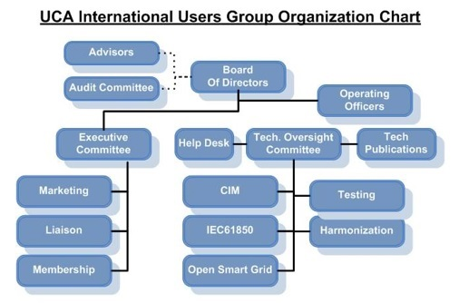
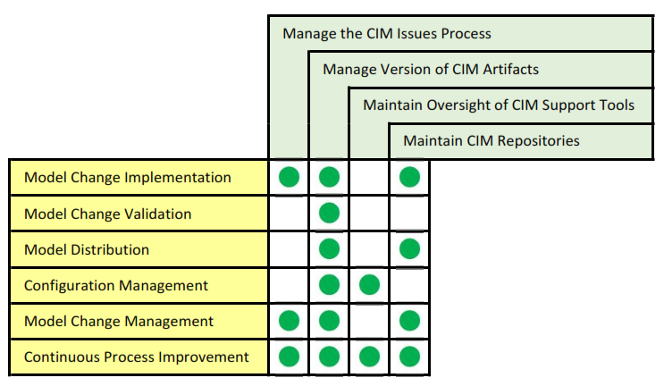
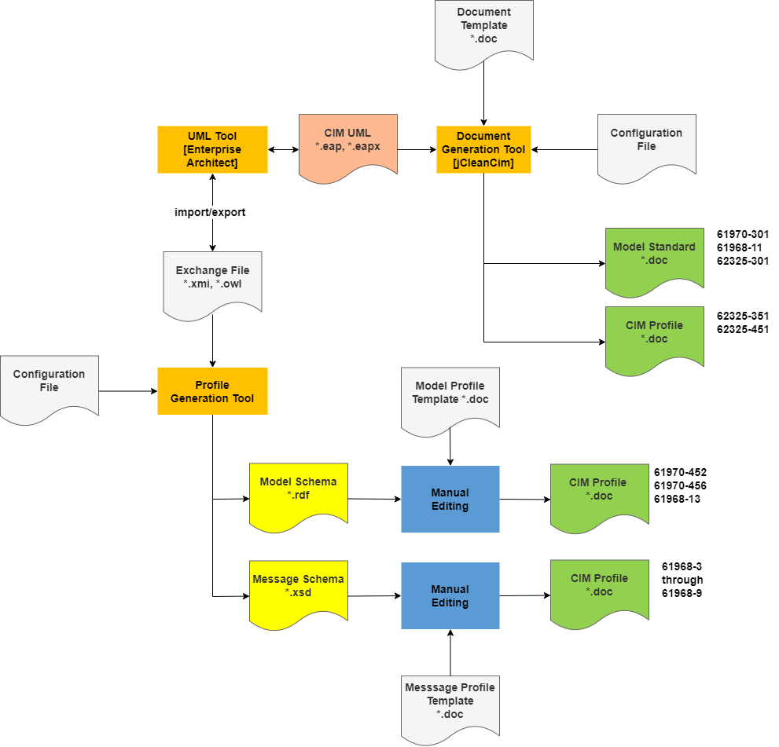

# CIM Overview

**Background**

Since international deregulation of energy markets began in the 1990’s, the need for electric utility companies to exchange data externally on a regular basis, and internally between software applications, has steadily increased. The exponential growth in integration complexity due to the large number of proprietary application interfaces created a significant risk to the reliable operation of an interconnected electric power grid owned and operated by different electric utility companies. This business concern was the driver for a common format for all data exchanges in the electrical power domain.

This business driver led to the need for: 

1.  a semantic information model that represents all of the real-world and information entities (concepts) in the electric power domain and the relationships between them; and
2.  a canonical data model to provide a non-proprietary way to exchange data between utility domain systems and databases.

The Common Information Model (CIM) is an open source semantic information model expressed in the Unified Modeling Language (CIM UML) representing real-world electric utility objects and information entities, and the relationships between them (sometimes called a “domain model”). The CIM UML also represents the properties of the concepts as UML class attributes. The CIM UML model is hosted and maintained in a Sparx Systems Enterprise Architect Project by the UCAIug.

The IEC Technical Committee 57 (IEC TC57) CIM working groups develop a set of standards to enable electric power systems integration and information exchange based on the CIM UML. New model content provided by members of either the IEC TC57 CIM working groups or the UCAIug is formally incorporated into the CIM UML. These members volunteer their time and subject matter expertise to accomplish the goals of each organization.

The IEC publishes international standards derived directly from the CIM UML for each IEC TC57 CIM working group. The IEC also publishes international standards derived from canonical data models that constrain fragments of the CIM UML for specific data exchanges between utility domain systems and databases. These international standards for data exchange are called “CIM Profiles”.

In recent years, the IEC TC57 has come under increasing pressure from utility companies and vendors to release new versions of the CIM-based standards more quickly in order to respond to the transformative changes occurring in the industry. UCAIug leadership has determined that in order to reduce the time to market of new standards, updates to the CIM must occur often enough to support the release of new versions of the IEC TC57 standards once a year while simultaneously expanding the organization’s ability to effectively manage a higher volume of content change to the CIM UML.

In order to achieve these two goals, the UCAIug leadership has decided that the UCAIug can best improve its effectiveness in these areas by: 

1.  aligning CIM UML Management processes with the IEC fast track International Standard release process; 
2.  facilitating communication and understanding among individuals working with CIM UML domain models; and 
3.  facilitating the incorporation of new content into the CIM UML.

For the past two years the IEC TC57 CIM working groups have emphasized the importance (to their productivity) of having access to documented rules and recommendations for creating new CIM content. Up until the release of this document, CIM management guidelines resided in draft documents owned by CIM Model Managers.

## CIM UML Scope

The CIM UML is semantic information model that represents real-world physical electric grid objects and information entities. The CIM UML is the basis for data that is exchanged between systems to: 

1.  enable grid operation and planning;
2.  support grid operations, grid maintenance, and customer support;
3.  support wholesale electricity market activity between market participants; and
4.  support interfaces with non-utility owned systems connected on the other side of the meter to the grid. The CIM UML is used by IEC TC57 CIM working groups as the foundation for creating CIM profiles. The mission statement for each IEC TC57 CIM working group is provided in Table 4‑1.

Table 4‑1. IEC TC57 CIM Working Group Mission Statements

<table>
<colgroup>
<col style="width: 13%" />
<col style="width: 86%" />
</colgroup>
<thead>
<tr class="header">
<th><strong>Group ID</strong></th>
<th><strong>Mission Statement</strong></th>
</tr>
</thead>
<tbody>
<tr class="odd">
<td>WG13</td>
<td>Define standards for information exchange among systems supporting business functions directly involved with operation and planning of the overall interconnected electric grid. These functions rely on power system network models to analyse the behaviour of the grid. These business functions cover the entire interconnected grid at all voltage levels, and they often involve interactions between systems at various different participants in the grid (e.g. RTO, TSO, DSO, microgrid, generator, consumer).</td>
</tr>
<tr class="even">
<td>WG14</td>
<td>Define standards for information exchange among systems supporting business functions that support power system operations, maintenance and customer support. This includes major business functions such as asset management, work management, meter data management, customer information, geographic information systems and engineering design. Also included is interoperating with assets and business capabilities governed by interconnection agreements with customers.</td>
</tr>
<tr class="odd">
<td>WG16</td>
<td>Define standards which facilitate the integration of electricity market application software developed independently by different vendors into a market management system, between market management systems and market participant systems. This is accomplished by defining message exchanges to enable these applications or systems access to public data and exchange information independent of how such information is represented internally.</td>
</tr>
<tr class="even">
<td>WG21</td>
<td>
Define standards for system interfaces, communication protocols and profiles in consideration of:

<ul>
<li>
Interconnecting a large number of geographically distributed systems (aggregator, (utility, QSE, SC) to end customer)
</li>
<li>
Domain specific protocols for industrial, home and building automation
</li>
<li>
Domain specific protocols for retail markets, real time pricing, and traditional non-market load management
</li>
<li>
State-of-the-art wireless and wired communication
</li>
<li>
Efficient installation, commissioning and maintenance
</li>
</ul></td>
</tr>
</tbody>
</table>

## CIM Management Business Context

CIM Management is a business function performed by the CIM Subcommittee of the UCAIug Technical Oversight Committee (see Figure 4‑1).

Figure 4‑1. UCA International Users Group Organization Chart

The CIM Technical Subcommittee is responsible for handling all technical and maintenance issues concerning the CIM and related standards. Responsibilities of the CIM Subcommittee related to CIM Management include:

1.  **Chair Modeling Meetings**

    - Review model updates submitted by working groups with working group representative(s)

2.  **Manage the CIM Issues Process**

    - Compile and categorize issues

    - Develop proposed resolutions

    - Obtain agreement on resolutions from CIM Technical Subcommittee and IEC TC57 WG13, WG14, WG16 and WG21.

3.  **Manage Versions of CIM Artifacts**

    - Provide version management of the CIM UML model

    - Provide version management of derived files in other formats (e.g., XML, RDF, etc.)

4.  **Maintain Oversight of CIM Support Tools**

    - Maintain oversight of which version of Sparx Enterprise Architect is used to maintain the CIM UML.

    - Maintain oversight of the jCleanCIM tool used for validation of the CIM UML model.

5.  **Maintain CIM Repositories**

    - Maintain repositories for artifacts produced by individual projects implementing the CIM and related standards, such as:

      - submitted CIM extensions;

      - message payload definitions;

      - tools, and;

      - training materials.

      - Maintain repositories for sample CIM/XML/RDF power system model files

## CIM Management Functions

### Model Change Management

Model change management (MCM) is the ongoing process of identifying and managing CIM UML change requests. A model change management plan (MCMP) is developed to define, document and track the information required to effectively manage change requests throughout the CIM UML development life cycle.

### Model Change Validation

Model change validation (MCV) is the ongoing process of ensuring proposed CIM UML changes are in compliance with CIM modeling rules.

### Model Change Implementation

Model change implementation (MCI) is the ongoing process of making changes to an existing CIM UML baseline to create a new CIM UML baseline.

### Configuration Management

Configuration management (CM) is the ongoing process of identifying and managing changes to the CIM UML and other work products. A configuration management plan (CM Plan) is developed to define, document, control, implement, account for, and audit changes to the various CIM configuration items. The CM Plan provides information on the requirements and procedures necessary for CMP activities and establishes the methodology for configuration identification and control of releases and changes to configuration items. It also describes the process for maintaining status accounting and verifying the completeness and correctness of configuration items throughout the CIM UML development life cycle.

### Model Distribution

Model distribution (MD) is the ongoing process of distributing CIM UML baselines to official repositories and authorized consumers of the CIM UML.

### Continuous Process Improvement

Continuous process improvement (CPI) is the ongoing process of improving the CIM management processes through incremental and breakthrough improvements. The goal of CPI is to improve the quality of the CIM UML or the efficiency of the CIM management processes.

### CIM Management Function Mappings

Mapping of the CIM management functions includes two (2) mappings of the CIM management functions. The first shows the mapping between CIM management functions and CIM management responsibilities assigned to the CIM Subcommittee with the UCAIug. The second shows the mapping between CIM management functions and the CIM management processes that realize those functions. The first mapping is shown in Figure 4‑2. The second mapping is discussed in Section 4.4 and shown in Figure 4‑9

Figure 4‑2. CIM Management Functions-to-UCA CIM Responsibilities Mapping

## CIM Management Processes

CIM management processes are the realization of CIM management functions. There are five (5) CIM management processes. The CIM management processes are shown in Figure 4‑3. A list of the processes and their descriptions are provided in Table 4‑2.

Figure 4‑3. CIM Management Processes

Table 4‑2. CIM Management Processes

| **Process**  | **Process Description**  |
|--------------------------------|----------------------------------------------------------------------------------------------------------------------------------------------------------------------------------------------------------------------------------------------------------------------------------------------------------------------------------------------------------------------------------------------------------------------------------------|
| Model Development | The model development process is the core CIM UML process. It is executed to extend the CIM UML and create a new baseline of the CIM UML. This process is triggered by any one of the roles that is responsible for model development. The model development process flow is shown in Figure 4‑4. CIM Management is performed as part of the “Verify Extended Model” subprocess. |
| Change Management | The Change Management Process establishes an orderly and effective procedure for tracking the submission, coordination, review, evaluation, categorization of change requests, and approval for release of changes to CIM UML baselines. The Change Management Process is shown in Figure 4‑5. Changes can either be modifications to existing model elements or the creation of new model elements.  |
| Document Generation | The document generation process involves the creation of the document artifacts associated with the CIM. The CIM UML is used to create these documents as exemplified in Figure 4‑6. CIM Profiles (including RDF and XML schemas) are generated by the IEC working groups. CIM Model Managers may assist working groups in creating RDF and XML schemas. All other artifacts under CIM Management are generated by CIM Model Managers. |
| Artifact Distribution | The artifact distribution process ensures comprehensive distribution of artifacts under CIM management (see Section 8 for details) to CIMug repositories and other subscribers of those artifacts. The artifact distribution process flow is shown in Figure 4‑7. |
| Continuous Process Improvement | The continuous process improvement process establishes a sequence of activities for incremental improvement of the change request and model distribution processes with the goal of improving the quality of the CIM UML or the efficiency of the CIM management processes. The continuous process improvement process is shown in Figure 4‑8. |

Figure 4‑4. Model Development Process Flow

Figure 4‑5. Change Management Process

Figure 4‑6. Document generation from CIM UML

Figure 4‑7. Artifacts Distribution Process Flow

Figure 4‑8. Continuous Process Improvement Process Flow

### CIM Management Process Mappings

The mapping between CIM management functions and the CIM management processes are shown in Figure 4‑9.

Figure 4‑9. CIM Management Process-to-CIM Management Functions Mapping

The CIM Model Managers perform most of the tasks within the CIM management processes. There are however, other roles within the CIMug and IEC working groups that also perform CIM management tasks. The following table provides a description of each role and its mapping to CIM management processes.

| **Role** | **Role Description** | **MDP** | **CMP** | **DGP** | **ADP** | **CPIP** |
|----------|----------------------|---------|---------|---------|---------|----------|
| CIMug Focus Community | This group role consists of individual CIMug members and IEC CIM Working Group members dedicated to developing CIM extensions that deal with a specific area of focus. |  X |         |         |         |          |
| CIMug Project Team | This group role consists of individual CIMug members and IEC CIM Working Group members working on projects that are jointly funded by participating utilities or vendor companies. | X |         |         |         |          |
| CIMug Working Group | This group role consists of individual CIMug members working on issues of common interest to CIM Users. | X |         |         |         |          |
| IEC CIM Working Group | This group role consists of individuals appointed by their respective IEC National Committee (technical experts) that take part in the drafting of IEC standard working documents. | X |         | X |         |          |
| IEC Working Group Project Leader | This individual role performed by an IEC Working Group member has overall responsibility for leading the development of a new edition of an international standard from the IEC proposal stage through to the IEC publication stage. | X |         | X |         |          |
| IEC Working Group Convener | This individual role performed by an IEC Working Group member is responsible for arranging and leading face-to-face IEC Working Group meetings and providing working group oversight.  |         | X |         |         | X |
| Model Manager | This individual role performed by an individual that is a member of both the CIMug and an IEC Working Group has overall responsibility for artifacts under CIM management. | X | X | X | X | X |

Table 4‑3. Role-to-CIM Management Process Mapping

## CIM Management Process Integration with the IEC Standards Process

### IEC Standards Development Process

As IEC standards, the CIM standards must go through the IEC international standards development process to be published. An IEC International Standard is the result of an agreement between the National Committees of the IEC. The IEC standard development process and the documents created in the process are shown in Figure 4‑10. A description of the IEC stages is provided in Table 4‑4.

Figure 4‑10. IEC International Standard Development Process

**Table 4‑4. Description of IEC Standard Development Stages.**

<table>
<colgroup>
<col style="width: 22%" />
<col style="width: 77%" />
</colgroup>
<thead>
<tr class="header">
<th><strong>Stage</strong></th>
<th><strong>Stage Description</strong></th>
</tr>
</thead>
<tbody>
<tr class="odd">
<td>Preliminary Stage</td>
<td>The preliminary stage is applied for work items where no target dates can be established. This stage can be used for the elaboration of a new work item proposal and the development of an initial draft. These work items are subject to approval in accordance with the normal procedures before progressing to the preparatory stage.</td>
</tr>
<tr class="even">
<td>Proposal Stage</td>
<td>The proposal stage is the first step in creating a new standard. During this stage a working group generates a proposal for new work. The output of this stage is a New Work Item Proposal (NWIP). The NWIP is submitted via a National Committee to the IEC and communicated to the members of the appropriate IEC CIM working group.</td>
</tr>
<tr class="odd">
<td>Preparatory Stage</td>
<td>
During this stage a Working Draft (WD) is prepared, generally by a project leader within a project team. The availability of working draft (if not supplied with the proposal) is 6 months.

The preparatory stage ends when a working draft is available for circulation to the members of the technical committee or subcommittee as a first committee draft (CD) and is registered by the office of the CEO.
</td>
</tr>
<tr class="even">
<td>Committee Stage</td>
<td>The committee stage is the principal stage at which comments from National Committees are taken into consideration, with a view to reaching consensus on the technical content.</td>
</tr>
<tr class="odd">
<td>Enquiry Stage</td>
<td>After addressing the comments received from national committees about the CD the working group then prepares an updated version of the standard that is issued as a Committee Draft for Vote (CDV). This is circulated to member countries for a five-month voting period and is considered approved if two thirds of the votes cast are in favor and the number of negative votes does not exceed 25% of the votes cast. At this stage countries may still submit comments along with their vote.</td>
</tr>
<tr class="even">
<td>Approval Stage</td>
<td>
The working group, once again, addresses any comments that have been received and prepares a Final Draft International Standard (FDIS). This is submitted to the IEC Central Office and circulated to the national committees for a two-month voting period. At this stage a country may only make an explicit vote: positive, negative or abstention.

The FDIS is approved if two thirds of the votes cast are in favor and the number of negative votes cast does not exceed 25% of the votes cast. If approved, the document is published however if the conditions are not met it is referred back to the working group to be revised. Final publication is the responsibility of the IEC Central Office and leads to the publication of an international standard. This normally takes place within two months of the approval of the FDIS.
</td>
</tr>
<tr class="odd">
<td>Publication Stage</td>
<td>
This stage is entirely the responsibility of the Central Office and leads to publication of the International Standard, normally within 6 weeks of approval of the FDIS.

Once a final draft International Standard has been approved, only minor editorial changes are introduced into the final text. The International Standard is published within 6 weeks of approval of the FDIS.
</td>
</tr>
</tbody>
</table>

### Process Integration Points

The CIM management processes integrate with the IEC standards development process because the CIM UML provides the basis for IEC CIM standards. There are two types of integration points between the two processes: 1) draft standards preparation; and 2) draft standards submission.

A mapping between the applicable IEC standards development stages and the CIM Management processes are provided in Table 4‑5.

Table 4‑5. CIM Management Processes-to-IEC Standard Development Stage Mappings

| | Proposal Stage | Preparatory Stage | Committee Stage | Enquiry Stage | Approval Stage | Publication Stage |
|-|----------------|-------------------|-----------------|---------------|----------------|-------------------|
| Model Development Process | **X** | **X** | **X** | **X** | **X** | |
| Change Management Process | **X** | **X** | **X** | **X** | **X** | |
| Document Generation Process | | | **X** | **X** | **X** | |
| Artifact Distribution Process | | **X** | **X** | **X** | **X** | **X** |

#### Draft Standards Preparation

The intermediate draft standards submitted to the IEC are produced during the execution of the Model Development process and the Document Generation process. CIM UML changes are incorporated to form the basis of the draft standards. Therefore, the Change Management process is also part of draft standards preparation.

#### Draft Standards Submission

The submission of the draft standards to the IEC takes place during the Artifact Distribution process. The IEC is considered one of the subscribers for the draft standards in the process.
