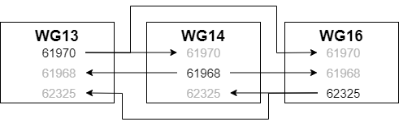
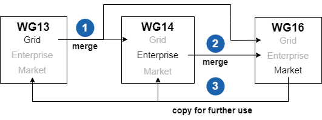

# Section 5 - CIM UML Modeling Rules and Recommendations

## 5.1 Overview

This section describes rules and recommendations on how to use the UML to model electric utility domain information. The UML does not include a step-by-step model development process. It is a general-purpose modeling language that all modelers can use. The primary goal behind CIM UML modeling rules and recommendations is to ensure a well-formed, consistent semantic information model is maintained in order to facilitate communication and understanding among people working with the CIM.

Due to the evolving nature of the CIM, there are notable rule exceptions throughout the CIM UML. The rationale for retaining exceptions include:

- past practices that represent irregularities today, but corrections lead to breaking changes for end users;

- false positive rule violations reported by a validation tool

- special circumstances warrant the need for an exception

### 5.1.1 UML Concepts Used in the CIM

The CIM uses a very small subset of UML concepts. UML concepts and models can be grouped into the following concept areas: 1) static structure; 2) dynamic behavior; 3) implementation constructs; 4) model organization; and 5) extensibility mechanisms. The CIM only uses UML concepts in the static structure and model organization concept areas.

### 5.1.2 UML Static Structure Concepts

The CIM uses UML concepts that model utility domain concepts, their internal properties, and their relationships to each other. Utility domain concepts are modeled as classes, each of which describes a set of discrete objects that hold information. Utility domain concept properties are modeled as class attributes. The relationships between utility domain concepts are modeled as class associations or generalisations. Many classes share common structure using generalisation. Static structure concepts are viewed using class diagrams.

### 5.1.3 UML Model Organization Concepts

The CIM uses UML packages to organize modeling information. Packages are general-purpose hierarchical organizational units of UML models. The purpose of packages in the CIM is mainly for controlling working group ownership, with sub-packages mainly representing conceptual organization. This usage of the package structure allows for relatively easy movement of classes among packages without impacting concrete implementations. It also defines the area of responsibility for model managers.

The CIM also uses UML dependencies among packages to impose an overall model architecture. The contents of the packages must conform to the package dependencies and to the imposed model structure.

## 5.2 Model Structure Rules

Model structure rules address UML metamodel rules, and the structure, dependencies, and assembly of CIM packages.

### 5.2.1 UML Metamodel Rules

<table>
<colgroup>
<col style="width: 15%" />
<col style="width: 84%" />
</colgroup>
<thead>
<tr class="header">
<th><strong>RuleID</strong></th>
<th><strong>Description</strong></th>
</tr>
</thead>
<tbody>
<tr class="odd">
<td>Rule001</td>
<td>
The CIM shall be limited to the following UML metamodel elements:

<ol type="1">
<li>
Packages;
</li>
<li>
Classes
</li>
<li>
Attributes;
</li>
<li>
Associations;
</li>
<li>
Enumerated Literals;
</li>
<li>
Multiplicities;
</li>
<li>
Inheritance;
</li>
<li>
Diagrams;
</li>
<li>
Description of UML elements;
</li>
<li>
Namespaces;
</li>
<li>
Specified package stereotypes and
</li>
<li>
Specified class stereotypes.
</li>
</ol></td>
</tr>
<tr class="even">
<td>Rule002</td>
<td>The UML element unique identifier shall be the internally generated Enterprise Architect GUID.</td>
</tr>
</tbody>
</table>

### 5.2.2 Package Structure Rules

<u>Overview</u>

The CIM is wholly contained in one top-level package named **TC57CIM.** TC57CIM contains all of the utility domain model elements.

**TC57CIM Package Structure**

TC57CIM is partitioned into packages corresponding to the IEC TC57 working groups and an additional package that describes the dependencies between the top-level IEC TC57 working group packages. The working groups are mapped to the corresponding UML top-level packages as follows:

- WG13 - IEC61970 package,

- WG14 - IEC61968 package,

- WG16 - IEC62325 package.

Both the legacy and new top-level package structure are shown in Figure 5‑1 and Figure 5-2 respectively.

Figure 5‑1 - TC57CIM Package Structure

Figure 5‑2 - CIM Package Structure (New)

<table>
<colgroup>
<col style="width: 15%" />
<col style="width: 84%" />
</colgroup>
<thead>
<tr class="header">
<th><strong>RuleID</strong></th>
<th><strong>Description</strong></th>
</tr>
</thead>
<tbody>
<tr class="odd">
<td>Rule003</td>
<td>There shall be one and only one package in the root model that contains all of the TC57 CIM information.</td>
</tr>
<tr class="even">
<td>Rule004</td>
<td>
For each of the following TC57 working groups, there shall be one and only one package that contains all of its CIM information:

<ul>
<li>
Working Group 13;
</li>
<li>
Working Group 14;
</li>
<li>
Working Group 16.
</li>
</ul>

Each package is also referred to as a “top-level” package.
</td>
</tr>
<tr class="odd">
<td>Rule005</td>
<td>The TC57 working group top-level packages and the package that describes their dependencies shall be the only sub-packages within the TC57 CIM information package.</td>
</tr>
<tr class="even">
<td>Rule006</td>
<td>There shall be a diagram within the TC57 CIM information package that depicts the top-level TC57 CIM package structure that includes the TC57 working group packages and the package that describes their dependencies.</td>
</tr>
<tr class="odd">
<td>Rule007</td>
<td>There shall be a diagram within the TC57 CIM information package that contains a note as its only UML element and that note shall include the CIM UML copyright notice verbiage.</td>
</tr>
<tr class="even">
<td>Rule008</td>
<td>Each package should typically include at least one diagram that contains all the classes in a package, and an arbitrary number of other diagrams.</td>
</tr>
</tbody>
</table>

### 5.2.3 Package Dependency Rules

The concept of package dependencies is critical to both the understanding of model ownership among working groups and the practical integration or assembly of packages from different owners. An additional package is maintained outside of the IEC working group packages to describe the dependencies among the packages of each working group. This package, named “PackageDependencies” contains a figure illustrating these dependencies as shown in Figure 4 UML package dependencies (for illustration, not official CIM standard). As such the PackageDependencies package is itself dependent upon all the other major packages

The package dependencies should rarely change and therefore it makes sense for the CIM model manager role to maintain this diagram through the normal model issues submittal process. There is no need for each package owner to edit this package. By design there are no circular dependencies among the major packages. Issues are resolved through the CMM board.

The rule of CIM ownership is that any model linkages between packages are owned by the depending package. Thus any linkage (generalisation, association, dependency relationship, attribute type reference, or diagram reference) between e.g. IEC61968 and IEC61970 is owned by the IEC61968 package since it depends upon IEC61970. In CIM, we model associations as implicitly bi-directional, and this rule of package ownership applies to both ends of an association (i.e., for an association between e.g. IEC61968 and IEC61970, both association ends are owned by the IEC61968 package). This is the convention applicable to CIM model management regardless of UML association end ownership, which standard UML does not explicitly specify.

Further we expect that derived classes (specialisations) are within the dependent package (e.g. cross package specialisations would be modelled within IEC61968 packages since IEC61968 depends upon IEC61970). Classes in a given package are allowed to specialise classes owned by packages upon which the given package depends.

Additionally we prefer to have the source end of associations in the dependent package. This is not strictly required, but is a good practice and can be validated by the CIM validation tools used to generate the CIM documentation. Following this convention may allow shortcuts in reassembling combined models, but this is not a formally documented feature of Enterprise Architect.

Diagrams should only include links to anything from packages upon which the containing package depends. Not following this practice will cause such linked elements to disappear when reassembling the combined model. This is the main reason for having the separate “PackageDependencies” package with its overview diagram from Figure 4. Importing this package last ensures that all the dependencies appear on the diagram when assembling the combined model from its partitions.

When a model linkage spans working group packages, both parties should be aware of the linkage once models are combined. Such linkages should normally be discussed among working groups so that inappropriate linkages are not established. At this point any change that impacts that linkage should be agreed among the affected working groups.

This coordination extends to any potentially inherited attributes and associations when the linkage is generalization. Namely, the class inheriting attributes and associations from its base class that is in another working group package depends on types used for attributes and association ends of the base class. Therefore, any change in the base class will impact all those that inherit from that base class.

Types used for attributes in a class introduce dependencies that must be coordinated among the working groups as well.

<table>
<colgroup>
<col style="width: 15%" />
<col style="width: 84%" />
</colgroup>
<thead>
<tr class="header">
<th><strong>RuleID</strong></th>
<th><strong>Description</strong></th>
</tr>
</thead>
<tbody>
<tr class="odd">
<td>Rule009</td>
<td>There shall be one and only one package in the CIM that describes the dependencies between the TC57 working group packages.</td>
</tr>
<tr class="even">
<td>Rule010</td>
<td>The package that describes the dependencies between the TC57 working group packages shall be maintained outside of the IEC working group packages.</td>
</tr>
<tr class="odd">
<td>Rule011</td>
<td>The package used to contain IEC working group package dependencies shall be named “PackageDependencies”</td>
</tr>
<tr class="even">
<td>Rule012</td>
<td>There shall be no circular dependencies among IEC working group packages</td>
</tr>
<tr class="odd">
<td>Rule013</td>
<td>The “PackageDependencies” package shall contain a figure illustrating package dependencies as shown in Figure 5‑2.</td>
</tr>
<tr class="even">
<td>Rule014</td>
<td>Dependencies between packages shall be owned by the dependent package.</td>
</tr>
<tr class="odd">
<td>Rule015</td>
<td>
The source end of associations between classes in different working group sub-packages shall be owned by the dependent package.

NOTE: Following this convention may allow shortcuts in reassembling combined models, but this is not a formally documented feature of Enterprise Architect.
</td>
</tr>
<tr class="even">
<td>Rule016</td>
<td>Class inheritances between classes in different packages (specialisations) shall be owned by the dependent package</td>
</tr>
<tr class="odd">
<td>Rule017</td>
<td>Associations between classes in different IEC working group packages shall be owned by the source (dependent) working group package (i.e., for an association between e.g. an IEC61968 class and an IEC61970 class, both association ends are owned by the IEC61968 package).</td>
</tr>
</tbody>
</table>

Figure 5‑2. TC57CIM Top-Level Package Dependencies

### 5.2.4 Package Assembly Rules

Each working group edits what it owns and merges what others own. With three working groups this results in six possible ways to exchange portioned model files between the groups as shown in Figure 2.

Figure Possible partition file exchanges between WG13, WG14 and WG16

A box in Figure 2 represents a complete UML model while the rows under the working group name correspond to package numbers in CIM.

With four working groups the number of possible exchanges increases to twelve and with five it becomes twenty and so on.

The procedure to update a package with a partition file corresponds to an arrow in Figure 2 and consists of the following steps:

- Export the partition file from the source model,

- Delete the corresponding package in the destination model along with any packages depending on it, and,

- Import the partition file in the destination model and subsequently import any packages depending on it in dependency order.

To properly obtain the correct UML package versions in a synchronized model, one can follow the steps in Figure 2. Complete synchronisation can be achieved by copying whole models as shown in Figure 3.

Figure 3 Complete synchronisation example

In Figure 3 a complete synchronisation of all model files is made in the following steps:

 1. Synchronise the WG14 model with 61970 from WG13,

 2. Synchronise the WG16 model with 61970 from WG13 and 61968 from WG14,

 3. Copy the complete and synchronised WG16 model to WG13 and WG14.

This procedure minimizes the number of steps.

The whole process can be summarized as simply merging packages from the owner of that package. The package can be either obtained directly from the owner or indirectly from the owner. The additional rules are that we merge packages via the procedure in clause 2.2.2 and we must follow the guidance for model ownership of cross package linkages as defined in clause 2.2.4. We stamp each major package with a version revision stamp which is representative of the package (as defined by our ownership rules) in any combined model which has followed this process.

The merging process can inadvertently change dependent models so care must be taken to not make changes that invalidate dependent models. For example if WG13 were to delete a class from which WG14 generalizes, that generalization owned by WG14 would be lost in any merge where the class was deleted. This is why it is important to track the dependencies and make or break such dependencies only when agreed on both sides.

It is vital when using Enterprise Architect tool to start with an empty model and import packages in dependency order as defined in the PackageDependendencies diagram shown in Figure 4. This assembly process will ensure that combined models are created properly. For example import the IEC61970 package before IEC61968, and import PackageDependencies package last. At any point when assembling packages, the model will be complete in regards to anything owned by the imported packages according to the definition of ownership in clause 2.2.4.

UML element Identity in Enterprise Architect UML is by internally generated GUID’s. Thus it is not equivalent to delete something and then enter the same data again. Such an operation will break linkages in the model, though the source model appears identical from the user interface. In Enterprise Architect you can change the names without breaking linkages. Some tools rely upon the name of the class or attribute not the Enterprise Architect GUID values for reference matching and will break linkages if names are changed. Modelling actions should be aware of both implications.

The best practice is to always import and work with the standard packages upon which your package depends so you get the proper GUID based linkages.

<table>
<colgroup>
<col style="width: 15%" />
<col style="width: 84%" />
</colgroup>
<thead>
<tr class="header">
<th><strong>RuleID</strong></th>
<th><strong>Description</strong></th>
</tr>
</thead>
<tbody>
<tr class="odd">
<td>Rule018</td>
<td>Working group package assembly must start with an empty Enterprise Architect project containing a single empty model.</td>
</tr>
<tr class="even">
<td>Rule019</td>
<td>Packages must be first exported from a properly combined model and then imported into an empty Enterprise Architect project containing a single empty model in order to perform proper package assembly.</td>
</tr>
<tr class="odd">
<td>Rule020</td>
<td>Packages may be exported in any order.</td>
</tr>
<tr class="even">
<td>Rule021</td>
<td>Package exportation must follow the procedure specified in Appendix TBD.</td>
</tr>
<tr class="odd">
<td>Rule022</td>
<td>
The integrity of internally generated GUIDs for Enterprise Architect model elements must be preserved between model versions to ensure model integrity.

NOTE:: Some tools rely upon the name of the class or attribute not the Enterprise Architect GUID values for reference matching and will break linkages if names are changed.
</td>
</tr>
<tr class="even">
<td>Rule023</td>
<td>Package assembly must be performed by importing packages in dependency order as defined in the PackageDependencies diagram shown in Figure 5‑2. Specifically, the package import order is: 1) IEC61970; 2) IEC61968; 3) IEC6235; 4) PackageDependencies.</td>
</tr>
<tr class="odd">
<td>Rule024</td>
<td>
After each package import, the package dependency rules specified in Section 5.2.3 must be satisfied.

NOTE: Any cross-working group package associations to packages not yet imported will be discarded in the combined model as they are by definition not owned by the thus far imported packages.
</td>
</tr>
</tbody>
</table>

## 5.3 Package Rules

The purpose of packages in the CIM model is mainly for controlling working group ownership, with sub-packages mainly representing conceptual organization. This usage of the package structure allows for relatively easy movement of classes among packages without impacting concrete implementations.

CIM package names are intended to be unique among all packages without consideration of package hierarchy.

Package ordering is typically specified in dependency order. For example, the Domain and Core packages are ordered first in the UML. The printed documentation will use this package ordering. If no clear dependency relation exists, order packages alphabetically.

To facilitate model management and evolution (and minimise IEC documents generation time), while preserving the means to print official documents at any time in the proper format, we have the following three special kinds of packages

“Inf” is the prefix used to denote informative CIM UML sub-packages. This is to avoid name clashes among normative and informative packages (e.g., ‘Core’ vs. ‘InfCore’), and to make informative sub-packages obvious through their name. Note that this will apply to all packages that start with this prefix (e.g., 'InfCore' as well as 'Informative').

The content of the informative package, including any sub-packages and its content, recursively, is considered as informative in the sense of IEC documents and is therefore by default excluded from the document generation. However, the CIM UML tool has an option to enable printing the informative content as well, which is useful for e.g., sharing documentation of the current work in an informative sandbox with the working group members, without impact to the stable, normative parts of the model.

An informative package can be defined at any depth in the CIM UML model. The only requirement is the “Inf” prefix in the package name. It is recommended to specify “Inf” packages as “private” packages in Enterprise Architect package properties, so they can be filtered out of diagrams showing the sub packages.

“Doc” is the prefix used to denote those CIM UML sub-packages that contain diagrams used for the IEC document template only, and that should not be printed with the content of the regular model. The sub-package of "ABC" with the name "DocABC" will be matched, and considered as informative package from the perspective of automatic document generation (i.e., it will be skipped), but it still can be referenced from the IEC document template to include the diagram, for instance in its introductory examples section.

It is recommended to specify “Doc” packages as “private” packages in Enterprise Architect package properties, so they can be filtered out of diagrams showing the sub packages.

### 5.3.1 Package Naming Rules

Package names start with upper case (UpperCamelCase rule). Package names must be unique across the whole CIM.

<table>
<colgroup>
<col style="width: 15%" />
<col style="width: 84%" />
</colgroup>
<thead>
<tr class="header">
<th><strong>RuleID</strong></th>
<th><strong>Description</strong></th>
</tr>
</thead>
<tbody>
<tr class="odd">
<td>Rule025</td>
<td>Names for packages shall use the Upper Camel Case naming convention.</td>
</tr>
<tr class="even">
<td>Rule026</td>
<td>Names for packages shall be British English names.</td>
</tr>
<tr class="odd">
<td>Rule027</td>
<td>All packages containing classes shall have unique names. (i.e., the package containment hierarchy shall not be used in uniquely identifying a package).</td>
</tr>
<tr class="even">
<td>Rule028</td>
<td>The name of the top-level package at the root of the model shall be "CIM" (formerly it was "TC57CIM").</td>
</tr>
<tr class="odd">
<td>Rule029</td>
<td>
The following names shall be used to identify CIM (formerly TC57CIM) top-level packages:

<ol type="1">
<li>
"Grid" (formerly IEC61970) for IEC TC57 WG13 domain information;
</li>
<li>
"Enterprise" (formerly IEC61968) for IEC TC57 WG14 domain information;
</li>
<li>
"Markets" (formerly IEC62325) for IEC TC57 WG16 domain information;
</li>
</ol></td>
</tr>
<tr class="even">
<td>Rule030</td>
<td>The “Inf” prefix shall be used in package names to denote informative CIM UML sub-packages.</td>
</tr>
<tr class="odd">
<td>Rule031</td>
<td>An informative package can be defined at any depth in the CIM UML model. The only requirement is the “Inf” prefix in the package name.</td>
</tr>
<tr class="even">
<td>Rule032</td>
<td>The “Doc” prefix shall be used in package names to denote CIM UML sub-packages that contain diagrams used during the generation of IEC documents.</td>
</tr>
<tr class="odd">
<td>Rule033</td>
<td>The package name “DetailedDiagrams” shall be a reserved package name.</td>
</tr>
<tr class="even">
<td>Rule034</td>
<td>There may be multiple instances of packages named “DetailedDiagrams” in the CIM.</td>
</tr>
</tbody>
</table>

### 5.3.2 Package Specification Rules

| **RuleID** | **Description**                                                                                                                                                                    |
|------------|------------------------------------------------------------------------------------------------------------------------------------------------------------------------------------|
| Rule035    | Informative packages should be specified as “private” packages in Enterprise Architect package properties, so they can be filtered out of diagrams showing the sub-packages.       |
| Rule036    | “Doc” packages should be specified as “private” packages in Enterprise Architect package properties, so they can be filtered out of diagrams showing the sub-packages.             |
| Rule037    | “DetailedDiagram” packages should be specified as “private” packages in Enterprise Architect package properties, so they can be filtered out of diagrams showing the sub-packages. |

## 5.4 Class Rules

The following UML class features are used in CIM:

 - Name
 - Documentation
 - Stereotype

In CIM, a class is used to describe either domain entities or various data types specific to the CIM domain:

 - **&lt;&lt;Primitive&gt;&gt;** Primitive data types as Booleans, Float, String etc. Primitive cannot have attributes.

 - **&lt;&lt;CIMDatatype&gt;&gt;** Simple data types specific for the CIM, e.g. ActivePower, Resistance etc. CIMDatatype has at least three attributes: value, unit and multiplier. The “value” attribute is of Primitive type, and unit and multiplier are of an enumeration type. When required additional attributes can be defined to describe for example “demoninatorUnit” and “denominatorMultiplier”, but only one “value” attribute is allowed.

 - **&lt;&lt;Compound&gt;&gt;** Compound data types specific for the CIM, e.g.StreetAddress etc. Compound has no identity and is a simple group of related attributes, Compound may have attributes whose types are Primitive, enumeration, CIMDatatype or Compound. A circular dependency among Compound types is to be avoided.

 - **&lt;&lt;enumeration&gt;&gt;** Enumerations, e.g. UnitSymbol, UnitMultiplier, Currency, etc.

 - None of the above stereotypes. A domain object that participates in inheritance and/or association relationships with other domain objects. Most of domain objects inherit from the class IdentifiedObject and thus get the identifier and one or multiple names.

CIM classes with a stereotype other than **&lt;&lt;deprecated&gt;&gt;** are types that never participate in relationships (i.e., no associations, no inheritance), but are used as types for attributes.

CIM does not use abstract classes, because CIM is in itself an abstract model. In contrast, profiles may distinguish between concrete and abstract classes.

CIM does not use association classes, for the sake of keeping the used subset of UML to the minimum that is well supported by tools and well understood by the wide community.

CIM class names are unique among all classes residing within the "CIM" top-level package without consideration of the package hierarchy.

Classes should be ordered alphabetically or in order of importance or by logical grouping. We do not enforce alphabetically ordering automatically in the UML tool. The order of classes in the UML tool with be the order of classes printed in the IEC document.

| **RuleID** | **Description** |
|------------|-------------------------|
| Rule038 | Names for classes shall use the Upper Camel Case naming convention. |
| Rule039 | Names for classes shall be British English names. |
| Rule040 | All classes shall have unique names. The package containment hierarchy shall not be used in uniquely identifying a class. |
| Rule041 | A CIM class shall be used to describe either an electric utility domain entity or an information entity used in the electric utility domain. |
| Rule042 | All class names shall be the singular form of a utility domain concept. |
| Rule043 | A CIM class that has the **&lt;&lt;CIMDatatype&gt;&gt;** stereotype shall have at minimum, the following attributes: 1. value; 2. unit; and 3. multiplier. |
| Rule044 | A CIM class shall not be an abstract class. |
| Rule045 | A CIM class shall not be an association class. |
| Rule046 | CIM classes with a stereotype other than **&lt;&lt;deprecated&gt;&gt;** shall never participate in relationships with other classes (i.e., no associations, no inheritance). |
| Rule047 | CIM classes with a stereotype other than **&lt;&lt;deprecated&gt;&gt;** shall only be used as datatypes for attributes. |
| Rule048 | CIM classes should be ordered alphabetically or in order of importance or by logical grouping within a package. |

## 5.5 Attribute Rules

The following UML attribute features are used in CIM:

Name, always used and must be unique among all levels of specialisation.

Type that is one of the stereotyped classes (Primitive, CIMDatatype, Compound, enumeration). When choosing type, ensure you select it from the list of existing types rather than simply type the text into Enterprise Architect. Attention on Primitives: use CIM Primitive datatypes (e.g., String, Boolean), not default UML ones (string, boolean).

Scope is always public

Multiplicity is always \[0..1\]

Initial value, if used, always denotes a constant for all instances of the class where the attribute belongs, and the attribute has to be set as both static and constant.

Documentation. The documentation should not use or rely upon special formatting. Plain text is assumed. It is suggested to avoid special characters here also.

The attribute stereotype can temporarily be used to describe the development state of the attribute or use case that initiated the creation of the attribute. Once the attribute is fully incorporated in the model the stereotype is removed.

Attribute names are unique within a classifier and Enterprise Architect will enforce this.

The attribute order should normally be alphabetical unless there is some clear reason to group like attributes together. We do not enforce alphabetic ordering in the UML tool.

| **RuleID** | **Description** |
|------------|-------------------------|
| Rule049 | Names for attributes shall use the Lower Camel Case naming convention. |
| Rule050 | Names for attributes shall be British English names. |
| Rule051 | Attribute names shall be singular form concepts. |
| Rule052 | The "value" attribute of a CIM class that has the **&lt;&lt;CIMDatatype&gt;&gt;** stereotype shall be a Primitive data type. |
| Rule053 | The "unit" attribute of a CIM class that has the **&lt;&lt;CIMDatatype&gt;&gt;** stereotype shall be an enumeration data type. |
| Rule054 | The "multiplier" attribute of a CIM class that has the **&lt;&lt;CIMDatatype&gt;&gt;** stereotype shall be an enumeration data type. |
| Rule055 | Attribute data types shall be one of the stereotyped CIM classes (i.e. shall not be one of the Enterprise Architect native data types). |
| Rule056 | In instances where an attribute of a CIM class has an initial value, it shall denote a constant for all instance of the class to which the attribute belongs. |
| Rule057 | In instances where an attribute of a CIM class has an initial value, it shall be set as both static and constant. |
| Rule058 | Attribute multiplicity shall always be \[0..1\] (i.e. all CIM attributes are optional). |
| Rule060 | Attribute names shall be unique among all levels of specialisation. |
| Rule061 | The scope of a CIM attribute shall be "Public".  |
| Rule062 | Datatypes used for attributes in cross-working group dependencies shall be coordinated among the affected working groups. |

## 5.6 Association Rules

Associations describe how classes are related. Only classes describing domain objects, i.e. classes without data type stereotypes such as **&lt;&lt;enumeration&gt;&gt;**, **&lt;&lt;Primitive&gt;&gt;**, **&lt;&lt;Compound&gt;&gt;**, or **&lt;&lt;CIMDatatype&gt;&gt;**, may participate in associations.

An association has two ends referred to as association ends. CIM associations have unspecified direction but have both ends specified which means they are implicitly bi-directional (i.e., it is possible, through end names, to navigate from A to B and from B to A).

The association description and association name are not specified. These become a maintenance problem if specified and also show up on diagrams by default. Instead, we specify the association end names and descriptions.

The UML association features used in CIM are as follows:

Stereotype **&lt;&lt;informative&gt;&gt;**, only in case the association is informative. No other stereotypes are allowed.

The UML association end features used in CIM are:

-   Association end name;

-   Association end multiplicity;

-   Association end description.

No other options should be used, although some association ends in CIM are defined as aggregation (= shared).

Note that, depending on local user settings for EA tool:

it may happen to create by default a directed association, so ensure that the direction for association and both its ends is “Unspecified”;

if using aggregation from the toolbox, the diamond may be on unexpected side of relationship, so always create first a simple association.

Furthermore, to facilitate the correct dependency processing (see 2.2.2), draw an association from a class in the depending package (source end) towards a class in the dependent package (target end). For example, an association between a class in "Enterprise" (formerly the "IEC61968" package) and a class within "Grid" (formerly the "IEC61970" package) would be drawn from (the source end of) the class defined within "Enterprise" towards (the target end of) the class within "Grid". This since "Enterprise" depends upon the "Grid" package.

There appears to be no clear manner to control the association end ordering (within the context of a class) in the Enterprise Architect tool so this is an unmanaged aspect of the UML model. In fact, UML does not specify association ends are owned by the class, they are by default owned by the association itself.

Association end names should be unique among all specialisations of a class. For example, if IdentifiedObject associates to the Name class with an end name of “Name”, no specialisation of IdentifiedObject may create another association whose end name is “Name” regardless of the class to which it associates. Note that any number of associations from other classes may use the same name (e.g. “IdentifiedObject”) as the association end name on the IdentifiedObject end of the association, as long as the prior rule of uniqueness among specializations is respected.

Multiplicities are used to describe the number of expected objects at each end of an association as well as if an attribute is optional or mandatory. The following multiplicities are common for association ends in CIM:

-   0..1 an object may or may not exist,

-   1 an object always exists,

-   0..\* any number of objects may exist,

-   1..\* at least one object exists.

Multiplicities shall be chosen to specify what can be expected in the domain. Multiplicity minimum does not mean all profiles must include the association, but if a profile does include the association it should respect the minimum. Note that minimum multiplicities are normally not enforced by implementations at all times. For example in the middle of a transaction one may require violation of minimum multiplicities.

<table>
<colgroup>
<col style="width: 15%" />
<col style="width: 84%" />
</colgroup>
<thead>
<tr class="header">
<th><strong>RuleID</strong></th>
<th><strong>Description</strong></th>
</tr>
</thead>
<tbody>
<tr class="odd">
<td>Rule065</td>
<td>Associations shall not have names.</td>
</tr>
<tr class="even">
<td>Rule066</td>
<td>Associations shall not have descriptions.</td>
</tr>
<tr class="odd">
<td>Rule067</td>
<td>Association ends shall have role names.</td>
</tr>
<tr class="even">
<td>Rule068</td>
<td>Names for association roles shall use the Upper Camel Case naming convention.</td>
</tr>
<tr class="odd">
<td>Rule069</td>
<td>Names for association roles shall be British English names.</td>
</tr>
<tr class="even">
<td>Rule070</td>
<td>Association ends shall have descriptions.</td>
</tr>
<tr class="odd">
<td>Rule071</td>
<td>Association ends shall have specified multiplicity.</td>
</tr>
<tr class="even">
<td>Rule072</td>
<td>The CIM shall not include composition associations between classes.</td>
</tr>
<tr class="odd">
<td>Rule073</td>
<td>Associations shall implicitly be bi-directional (i.e. the ‘Navigability’ property of the association ends is unspecified).</td>
</tr>
<tr class="even">
<td>Rule074</td>
<td>Multiplicities for association ends shall be chosen to specify what is expected in the domain.</td>
</tr>
<tr class="odd">
<td>Rule075</td>
<td>Only CIM classes without datatype stereotypes shall participate in associations.</td>
</tr>
<tr class="even">
<td>Rule076</td>
<td>When associations span working group packages, both working groups shall be made aware of the association once models are combined.</td>
</tr>
<tr class="odd">
<td>Rule077</td>
<td>Cross-working group associations shall be discussed among affected working groups to ensure inappropriate cross-working group associations are not established.</td>
</tr>
<tr class="even">
<td>Rule078</td>
<td>Any change that impacts cross-working group associations shall be agreed upon by the affected working groups</td>
</tr>
<tr class="odd">
<td>Rule079</td>
<td>Any change to potentially inherited associations and attributes due to cross-working group associations shall be discussed among affected working groups to ensure inappropriate cross-working group associations are not established.</td>
</tr>
<tr class="even">
<td>Rule080</td>
<td>Any change to potentially inherited associations and attributes due to cross-working group associations shall be agreed upon by the affected working groups</td>
</tr>
<tr class="odd">
<td>Rule081</td>
<td>Aggregation associations involving IEC 61968 classes should be avoided.</td>
</tr>
<tr class="even">
<td>Rule082</td>
<td>Enterprise Architect should be configured by the user so the default value of the navigability property of an association is “Unspecified” to ensure compliance with Rule073.</td>
</tr>
<tr class="odd">
<td>Rule083</td>
<td>
Associations should be drawn from the dependent (source) class to the target class in Enterprise Architect to facilitate correct dependency processing.

Note: If the source and target classes of the association are incorrect (i.e. class roles are incorrect), the direction of the association can be reversed through the Enterprise Architect user interface.
</td>
</tr>
</tbody>
</table>

## 5.7 Enumeration Rules

Enumeration literals are attributes within an **&lt;&lt;enumeration&gt;&gt;** type. The following UML attribute features are used in CIM:

Name, always used and must be unique among all levels of specialisation.

UML stereotype **&lt;&lt;enum&gt;&gt;**.

(enumeration literal has no type by definition).

(enumeration literal scope is public by definition).

(enumeration literal has no multiplicity by definition).

Initial value, if used, denotes a code that has semantic binding. If used, the code must be unique among all the codes for literals within the containing enumeration type. Also, either all or no literals within an enumeration type have a code.

Documentation. The documentation should not use or rely upon special formatting. Plain text is assumed. It is suggested to avoid special characters here also.

Other than **&lt;&lt;enum&gt;&gt;** or **&lt;&lt;deprecated&gt;&gt;** attribute stereotype can temporarily be used to describe the development state of the attribute or use case that initiated the creation of the attribute. Once the literal is fully incorporated in the model, the stereotype is removed.

Like for attributes, literal names are unique within a classifier and Enterprise Architect will enforce this.

There is no ordering required or reinforced; the order found in the UML model will be the order of printing.

<table>
<colgroup>
<col style="width: 15%" />
<col style="width: 84%" />
</colgroup>
<thead>
<tr class="header">
<th><strong>RuleID</strong></th>
<th><strong>Description</strong></th>
</tr>
</thead>
<tbody>
<tr class="odd">
<td>Rule084</td>
<td>A CIM enumeration shall be a UML class with the &lt;&lt;enumeration&gt;&gt; stereotype.</td>
</tr>
<tr class="even">
<td>Rule085</td>
<td>All enumeration classes shall have unique names.</td>
</tr>
<tr class="odd">
<td>Rule086</td>
<td>Names for enumeration literals shall use the Lower Camel Case naming convention.</td>
</tr>
<tr class="even">
<td>Rule087</td>
<td>Names for enumeration literals shall be British English names.</td>
</tr>
<tr class="odd">
<td>Rule088</td>
<td>Enumeration literal names must always be used.</td>
</tr>
<tr class="even">
<td>Rule089</td>
<td>Enumeration literals must be unique among all levels of specialisation.</td>
</tr>
<tr class="odd">
<td>Rule090</td>
<td>All enumeration literals shall use the stereotype &lt;&lt;enum&gt;&gt;.</td>
</tr>
<tr class="even">
<td>Rule091</td>
<td>Enumeration literals shall have no datatype (by UML definition).</td>
</tr>
<tr class="odd">
<td>Rule092</td>
<td>Enumeration literals scope is public (by UML definition).</td>
</tr>
<tr class="even">
<td>Rule093</td>
<td>Enumeration literals have no multiplicity (by UML definition).</td>
</tr>
<tr class="odd">
<td>Rule094</td>
<td>In instances where an initial value for enumeration literals is used, they shall denote a code that has semantic binding.</td>
</tr>
<tr class="even">
<td>Rule095</td>
<td>In instances where an initial value for enumeration literals is used, the code must be unique among all the codes for enumeration literals within the containing CIM class.</td>
</tr>
<tr class="odd">
<td>Rule096</td>
<td>
Either all or no enumeration literals within a CIM type shall have a code.

NOTE: Some of the existing CIM UML enumerations do not comply with this rule because changes would break existing integrations.
</td>
</tr>
</tbody>
</table>

## 5.8 Diagram Rules

The following UML diagram features are used in CIM:

-   Name

-   Documentation

Diagrams should not use shadows, colours or diagram frames when printing model documents.

Diagrams should use A4 page size.

Each package should typically include at least one diagram that contains all the classes in a package, and an arbitrary number of other diagrams.

In general, when editing diagrams, it is possible to set show/hide attributes or relationships for a diagram, to display the desired subset of the model.

Diagram names are used for model document generation and should be unique across the whole CIM model. The CIM UML tool documentation generation allows for the combination of containing package (unique in model) and diagram name to uniquely identify a diagram, but we strive to keep diagram names unique across all packages.

Diagrams should be placed inside of packages (the normal case) or classes (e.g. in Dynamics package). The order of diagrams in the package is retained and should be from most general to specifics. Otherwise, diagrams should be in alphabetical order.

| **RuleID** | **Description**                                                                                                                                                                               |
|------------|-----------------------------------------------------------------------------------------------------------------------------------------------------------------------------------------------|
| Rule097    | Names for diagrams shall use the Upper Camel Case naming convention.                                                                                                                          |
| Rule098    | All diagrams shall have unique names. The package containment hierarchy shall not be used in uniquely identifying a diagram (i.e., diagram names shall be unique across the whole CIM model). |
| Rule099    | Names for diagrams shall be British English names.                                                                                                                                            |
| Rule100    | Diagrams shall only include associations from packages upon which the containing package depends                                                                                              |
| Rule101    | Diagrams should use A4 page size.                                                                                                                                                             |
| Rule102    | Diagrams should be placed inside of packages (the normal case) or classes (e.g. in Dynamics package).                                                                                         |
| Rule103    | The order of diagrams in the package should be from most general to most specific.                                                                                                            |

## 5.9 Element Description Rules

Make sure to add a description to the UML elements (package, diagram, class, attribute, association ends etc.) when creating them. The description shall explain the meaning of the entity as clearly as possible. It is often useful to search dictionaries and the web for good descriptions.

Use full sentences with proper upper case start and ending period. These get put into IEC documents and must conform to standard editing of such a document. Any references to standards should be specified in a manner compatible with inclusion in IEC documents. The same is true of units, variable names, or other IEC editorial policies.

Make sure to update the description every time you do a modification to existing element (e.g., when changing name of an association end or a class, do extended search in the overall model and ensure to update the in-text references to the element whose name changes).

Document the element itself, not its related or contained elements. Details of attributes should be documented on the attributes themselves, rather than on the class that contains them.

Document the purpose of the attribute. Avoid "This attribute is used ..." or similar.

Document the purpose of association end. Avoid "A is related to one or more B" since UML shows it already.

Avoid using CIM class names in the description/notes. For example, prefer “usage point” over “UsagePoint”. In some rare cases an explicit reference to an attribute may be required for clarity (e.g., “phase information is available in ‘Terminal.phases’.”), but such references create a maintenence problem.

Avoid using mark-up in the documentation (e.g., bold, lists, superscripts). Note this means avoid using variable names in equations in the text to also conform to the IEC documentation rules which require italic type for variable names.

<table>
<colgroup>
<col style="width: 15%" />
<col style="width: 84%" />
</colgroup>
<thead>
<tr class="header">
<th><strong>RuleID</strong></th>
<th><strong>Description</strong></th>
</tr>
</thead>
<tbody>
<tr class="odd">
<td>Rule104</td>
<td>All CIM packages, classes, and attributes shall contain a description in the 'Element Notes' field in Enterprise Architect (i.e. the 'Element Notes' field shall not be blank).</td>
</tr>
<tr class="even">
<td>Rule105</td>
<td>
The description shall explain the meaning of the model element as clearly as possible.

NOTE: If the existing description is ambiguous or unclear, immediately file a CIM issue.
</td>
</tr>
<tr class="odd">
<td>Rule106</td>
<td>Element descriptions shall use full sentences with proper uppercase words and ending with a period.</td>
</tr>
<tr class="even">
<td>Rule107</td>
<td>Any references to standards should be specified in a manner compatible with inclusion in IEC documents. The same is true of units, variable names, or other IEC editorial policies.</td>
</tr>
<tr class="odd">
<td>Rule108</td>
<td>Element descriptions shall be updated every time a modification is made to existing model elements (e.g., when changing name of an association end or a class, do extended search in the overall model and ensure to update the in-text references to the element whose name changes).</td>
</tr>
<tr class="even">
<td>Rule109</td>
<td>Element descriptions shall describe the element itself, not its related or contained elements (e.g., descriptions of attributes should be documented with the attributes themselves, rather than with the description of the class that contains them).</td>
</tr>
<tr class="odd">
<td>Rule110</td>
<td>Attribute descriptions shall describe the purpose of the attribute. Avoid describing how the attribute is used.</td>
</tr>
<tr class="even">
<td>Rule111</td>
<td>Association descriptions shall describe the purpose of association ends. Avoid "A is related to one or more B" since the diagrams already show the relationship.</td>
</tr>
<tr class="odd">
<td>Rule112</td>
<td>The use of CIM class names in element descriptions shall be avoided. For example, use “usage point” instead of “UsagePoint”.</td>
</tr>
<tr class="even">
<td>Rule113</td>
<td>In some rare cases an explicit reference to an attribute may be required for clarity (e.g., “phase information is available in ‘Terminal.phases’.”), but such references create data synchronization challenges.</td>
</tr>
<tr class="odd">
<td>Rule114</td>
<td>
Avoid using mark-up in element descriptions (e.g., bold, lists, superscripts).

NOTE: this means avoid using variable names in equations in the text to also conform to the IEC documentation rules which require italic type for variable names.
</td>
</tr>
</tbody>
</table>

## 5.10 Inheritance Rules

Inheritance is used to specialise an existing class. The inheriting class is more specific than the base class. Inheritance is the strongest possible dependency; it is often misused and should be used with care (note: everything that can be expressed through inheritance could also be expressed through composition).

The CIM is currently using a single type inheritance hierarchy and the use of multiple inheritance is not allowed (except as specified for extensions, see 5.4).

Inheritance relationship must be drawn from the more specific class to the more general class. In case the classes from two top-level packages are involved, the subclass must be in the dependent package, and inherit from the class in a package upon which it depends (see 2.2.2).

Inheritance should never create situations where attribute names or role names are duplicated or “override” within the inheritance linage.

| **RuleID** | **Description**                                                                                                                                                             |
|------------|-----------------------------------------------------------------------------------------------------------------------------------------------------------------------------|
| Rule115    | Multiple inheritance shall not be used.                                                                                                                                     |
| Rule116    | Inheritance relationships must be drawn from the more specific class to the more general class.                                                                             |
| Rule117    | In case the classes from two top-level packages are involved, the subclass must be in the dependent package, and inherit from the class in a package upon which it depends. |
| Rule118    | Inheritance should never create situations where attribute names or role names are duplicated or “override” within the inheritance lineage.                                 |
| Rule119    | Inheritance shall not be used with stereotyped classes.                                                                                                                     |

## 5.11 Stereotype Rules

### 5.11.1 General and **&lt;&lt;Deprecated&gt;&gt;** Stereotype Rules

This stereotype is recognised by the CIM UML validation and document generation tool and can be applied to any of the UML concepts defined below. The typical usage of the **&lt;&lt;deprecated&gt;&gt;** stereotype is for the purpose of preserving backwards compatibility for the normative, already published content, during a release or two, while indicating to the users that the item is likely to actually be removed in the future. This is a graceful means of phasing out obsolete or re-factored elements, and leaving some time to the users to provide implementation in terms of the new features replacing those marked with **&lt;&lt;deprecated&gt;&gt;**.

It is possible and supported by the CIM UML tool to have multiple stereotypes on an element (e.g. **&lt;&lt;deprecated, CIMDatatype&gt;&gt;**).

The **&lt;&lt;deprecated&gt;&gt;** strereotype may be used on attributes, associations, classes, packages, and diagrams in the UML model. It is recommended when deprecating a package to deprecate all its contained classes as well. When deprecating a class it is recommended to deprecate all associations in which it is involved and all its native attributes. Inheritance from a deprecated class is less clear and no general guidance is given, except to avoid this situation if possible.

| **RuleID** | **Description**                                                                                                                                                      |
|------------|----------------------------------------------------------------------------------------------------------------------------------------------------------------------|
| Rule120    | CIM elements may have multiple stereotypes.                                                                                                                          |
| Rule121    | The **&lt;&lt;deprecated&gt;&gt;** stereotype may be used on attributes, associations, classes, packages, and diagrams in the CIM.                                               |
| Rule122    | The **&lt;&lt;deprecated&gt;&gt;** stereotype should be used when it is desired to deprecate a package and all its contained classes as well.                                    |
| Rule123    | The **&lt;&lt;deprecated&gt;&gt;** stereotype should be used when it is desired to deprecate a class and all associations in which it is involved and all its native attributes. |
| Rule124    | Usage of the **&lt;&lt;deprecated&gt;&gt;** stereotype should be for the purpose of preserving backwards compatibility for normative, already published content.                 |
| Rule125    | The **&lt;&lt;deprecated&gt;&gt;** stereotype should be used for no more than two (2) releases of the CIM.                                                                       |

### 5.11.2 Package Stereotype Rules

| **RuleID** | **Description**  |
|------------|------------------------------|
| Rule126    | A package stereotype may be used temporarily to describe the development state of the package, e.g. **&lt;&lt;Work in progress&gt;&gt;**. Once the package is fully incorporated in the model the stereotype shall be removed. |

### 5.11.3 Class Stereotype Rules

| **RuleID** | **Description** |
|------------|------------------------------|
| Rule127 | The **&lt;&lt;CIMDatatype&gt;&gt;** stereotype shall be used to extend the semantics of the UML class element to represent an electric utility domain data type. |
| Rule128 | The **&lt;&lt;Primitive&gt;&gt;** stereotype shall be used to extend the semantics of the UML class element to represent the following data types: 1. Boolean; 2. Date; 3. DateTime; 4. Decimal; 5. Duration; 6. Float; 7. Integer; 8. MonthDay; 9. String; 10. Time; and 11. URI. |
| Rule129 | The **&lt;&lt;Compound&gt;&gt;** stereotype shall be used to extend the semantics of the UML class element to represent an electric utility domain datatype that is a collection of related class attributes. |
| Rule130 | The **&lt;&lt;enumeration&gt;&gt;** stereotype shall be used to extend the semantics of the UML class element to represent a data type whose instances form a list of named literal values. |
| Rule131 | A CIM class that represents a domain object that participates in inheritance and / or association relationships shall not use a stereotype with the exception of the **&lt;&lt;deprecated&gt;&gt;** stereotype specified in \[Rule 124\]. |

## 5.12 Namespace Rules

Namespaces are specified at level of packages in the CIM UML model. The namespaces apply to classes, attributes, association ends, data types (**&lt;&lt;CIMDatatype&gt;&gt;**, **&lt;&lt;Compound&gt;&gt;**, **&lt;&lt;Primitive&gt;&gt;**, and **&lt;&lt;enumeration&gt;&gt;**) and enums. Namespaces are useful for marking the source of CIM models for either standards or extensions.

Namespaces are derived from the rules given below.

Namespaces applied at the package level propagate to sub packages without a namespace and any contained classes. Namespaces on classes propagate to contained attributes. Namespaces on classes propagate to both ends a connected association if the association is owned by the package. Namespaces on cross package associations are propagated from the owning class as defined in clause 2.2.4 UML cross package dependencies and ownership.

If a namespace is specified at a subpackage level it takes precedence over the containing package.

The form is a tag of named “nsuri” with the value being the namespace URI value. A second tag named “nsprefix” whose value is used to specify the XML prefix. (The “nsuri” tag is similar to how CIMTool uses the tag named “uml:baseuri” with the value being the namespace URI, where “uml” is defined as “http://langdale.com.au/2005/UML#”.)

The namespace tagged value approach can be extended to allow specific namespace assignment to classes, attributes, association ends, datatypes, and enumeration literals. Such extensions are not required for the CIM information model or extensions to the information model because all such features can be added to packages with the appropriate namespace, but the same approach could be used for profiles in UML However, document does not address profiles in UML.

For example the base cim 61970-301 we use: \[Note the example does not match proposal.\]

nsprefix=cim

nsuri=http://iec.ch/TC57/2015/CIM17

61970-302 nsprefix=dycim nsuri=… dynamics…

61968-11 nsprefix=dcim nsuri= <http://iec.ch/2015/dcim12>

62325-301 nsprefix=mcim nsuri=htt://iec.ch/ …. Market…

\[Proposed\] The IEC is taking an approach of using a consistent namespace for all standard CIM within one consistent version of total CIM. Thus namespaces are only specified one time at the top-level package (i.e. the "CIM" top-level package) and version would be bumped when any subpackage changes. Therefore the namespace approach is useful to encode this single namespace in the UML for standard CIM canonical model plus namespace for any extension packages.

<table>
<colgroup>
<col style="width: 15%" />
<col style="width: 84%" />
</colgroup>
<thead>
<tr class="header">
<th><strong>RuleID</strong></th>
<th><strong>Description</strong></th>
</tr>
</thead>
<tbody>
<tr class="odd">
<td>Rule132</td>
<td>CIM Namespace specifications shall consist of two (2) namespaces: 1) a CIM Universal Resource Identifier (URI) namespace; and 2) a CIM XML prefix.</td>
</tr>
<tr class="even">
<td>Rule133</td>
<td>CIM Namespaces shall be stored in Enterprise Architect as tagged values.</td>
</tr>
<tr class="odd">
<td>Rule134</td>
<td>The tagged value name for the CIM URI namespace shall be “nsuri”.</td>
</tr>
<tr class="even">
<td>Rule135</td>
<td>The tagged value name for the CIM XML prefix shall be “nsprefix”.</td>
</tr>
<tr class="odd">
<td>Rule136</td>
<td>Namespaces shall be specified at the package level in the CIM UML model.</td>
</tr>
<tr class="even">
<td>Rule137</td>
<td>Namespaces shall apply to classes, attributes, association ends, datatypes (&lt;&lt;CIMDatatype&gt;&gt;, &lt;&lt;Compound&gt;&gt;, &lt;&lt;Primitive&gt;&gt;, and &lt;&lt;enumeration&gt;&gt;) and enumerations.</td>
</tr>
<tr class="odd">
<td>Rule138</td>
<td>Namespaces specified at the package level shall propagate to sub-packages without both specified namespaces and any contained classes.</td>
</tr>
<tr class="even">
<td>Rule139</td>
<td>Namespaces on classes shall propagate to contained attributes.</td>
</tr>
<tr class="odd">
<td>Rule140</td>
<td>Namespaces on classes shall propagate to both ends of a connected association if the association is owned by the same package.</td>
</tr>
<tr class="even">
<td>Rule141</td>
<td>Namespaces on cross package associations shall be propagated from the owning class.</td>
</tr>
<tr class="odd">
<td>Rule142</td>
<td>If a namespace is specified at a sub-package level, it shall take precedence over the containing package’s specified namespace.</td>
</tr>
<tr class="even">
<td>Rule143</td>
<td>The "CIM" top-level package shall have a namespace specification.</td>
</tr>
<tr class="odd">
<td>Rule144</td>
<td>
The value of the "CIM" (formerly TC57CIM) top-level package nsuri tag shall be: http://iec.ch/TC57/CIM&lt;version&gt;# where:

&lt;version&gt; = the version number of the CIM.
</td>
</tr>
<tr class="even">
<td>Rule145</td>
<td>The value of the TC57CIM package nsprefix tag shall be “cim”.</td>
</tr>
<tr class="odd">
<td>Rule146</td>
<td>The IEC61970 package shall have a namespace specification.</td>
</tr>
<tr class="even">
<td>Rule147</td>
<td>
The value of the IEC61970 package nsuri tag shall be:

http://iec.ch/TC57/61970/CIM&lt;XX&gt;.&lt;YY&gt;]# where:

&lt;XX&gt; = the major version number of the IEC61970 package; and

&lt;YY&gt; = the minor version number of the IEC61970 package.
</td>
</tr>
<tr class="odd">
<td>Rule148</td>
<td>The value of the IEC61970 package nsprefix tag shall be “cim61970”.</td>
</tr>
<tr class="even">
<td>Rule149</td>
<td>The IEC61968 package shall have a namespace specification.</td>
</tr>
<tr class="odd">
<td>Rule150</td>
<td>
The value of the IEC61968 package nsuri tag shall be:

http://iec.ch/TC57/61968/CIM&lt;XX&gt;.&lt;YY&gt;]# where:

&lt;XX&gt; = the major version number of the IEC61968 package; and

&lt;YY&gt; = the minor version number of the IEC61968 package.
</td>
</tr>
<tr class="even">
<td>Rule151</td>
<td>The value of the IEC61968 package nsprefix tag shall be “cim61968”.</td>
</tr>
<tr class="odd">
<td>Rule152</td>
<td>The IEC62325 package shall have a namespace specification.</td>
</tr>
<tr class="even">
<td>Rule153</td>
<td>
The value of the IEC62325 package nsuri tag shall be:

http://iec.ch/TC57/62325/CIM&lt;XX&gt;.&lt;YY&gt;]# where:

&lt;XX&gt; = the major version number of the IEC62325 package; and

&lt;YY&gt; = the minor version number of the IEC62325 package.
</td>
</tr>
<tr class="odd">
<td>Rule154</td>
<td>The value of the IEC62325 package nsprefix tag shall be “cim62325”.</td>
</tr>
</tbody>
</table>

## 5.13 Documentation Rules

| **RuleID** | **Description**                                                                                                                                                                                                                |
|------------|--------------------------------------------------------------------------------------------------------------------------------------------------------------------------------------------------------------------------------|
| Rule155    | Diagrams contained in packages with the “Doc” prefix will not be printed as part of the model content information, but will be printed as part of a document template’s static (boilerplate) information in CIM documentation. |
| Rule156    | Documentation will use the package order to determine the order for printing model information.                                                                                                                                |
| Rule157    | Documentation will use the class order within a package to determine the order for printing class information.                                                                                                                 |
| Rule158    | Documentation will use the attribute order within a class to determine the order for printing attribute information.                                                                                                           |
| Rule159    | Documentation will use the enumeration order within a package to determine the order for printing enumeration information.                                                                                                     |
| Rule160    | Documentation will use the enumeration literal order within an enumeration class to determine the order for printing enumeration literal information.                                                                          |
| Rule161    | The content of the informative package, including any sub-packages and its content, recursively, is considered as informative in the sense of IEC documents and is therefore by default excluded from the document generation. |
| Rule162    | Diagrams should not use shadows, colours or diagram frames when printing model documents.                                                                                                                                      |
