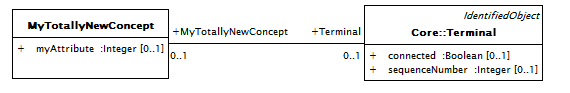
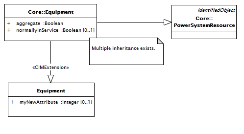
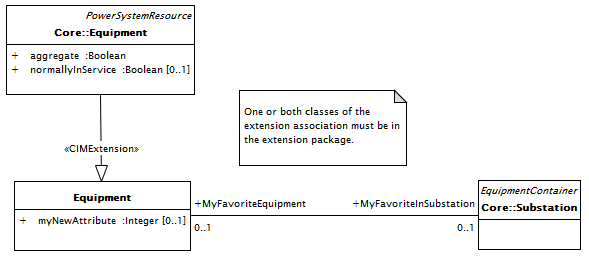
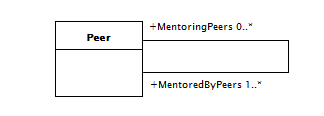
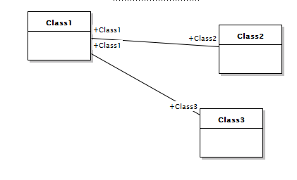

#  Section 6 - CIM UML Extension Rules and Recommendations

## 6.1 Overview

The CIM UML is an ever-evolving semantic information model. It is extended periodically based on work performed by the IEC TC57 working groups 13, 14, 16 and 21, and work performed by the CIMug through its various focus communities, projects, and working groups. CIM extensions originating from IEC TC57 working group are classified as “Standard” CIM extensions. CIM extensions originating from the CIMug are classified as “User-Defined” CIM extensions.

### 6.1.1 Application of CIM UML Extension Rules and Recommendations

Work on Standard CIM extensions is started with the full understanding that the extensions are intended to become part of the standard CIM and ultimately to be used to as the basis of new standard CIM profiles. Whereas work on User-Defined extensions is started because the CIM needs to be extended to address the needs and constraints of a particular user’s instance of the CIM. All User-Defined CIM extensions will not become part of the standard CIM. User-Defined CIM extensions must be evaluated to see if they can also be applied in the broader CIM user community as is or with some modifications.

For the reasons presented above, some extension rules and recommendations apply only to Standard CIM extensions; some only to User-Defined CIM extensions; and some to all CIM extensions. The language of the rules and recommendations is intended to be unambiguous so the users of this document will know to which class of CIM extensions each rule and recommendation applies.

### 6.1.2 Custom CIM Extensions

The objective of these recommendations is to allow for clear modularization of extensions such that they can be readily identified as extensions and migrated more easily to updated versions of the standard CIM,

Extensions to the CIM model should be included in the extension package just as any other CIM modeling except for the differences noted in this clause. The extension package should have the &lt;&lt;CIMExtension&gt;&gt; stereotype to identify all its contents as extensions to the CIM information model. The extension package should also introduce a new namespace.

The subpackage structure of the extensions may pattern after that of standard CIM packages, but the package structure should reflect the needs for individually managing and organising parts of the extensions.

It is recommended to utilize existing data types and CIM classes where possible. New classes can be created where new business objects concepts are introduced with their own lifecycle.

The typical case of adding a new extension class and associating with existing standard classes is can be modeled in a diagram within the extension package as shown in Figure 10 Example UML model for extension class with association to standard class. This situation does not require multiple inheritance.

Figure Example UML model for extension class with association to standard class

Note that the introduction of an association from a new extension class to an existing standard CIM class requires nothing special, just make the association as it is implicitly owned by the depending extension class’s package. It is more clear to put both ends of the association into the extension package as the namespace for both association ends will follow CIM package containment rules which rely upon package dependency.

In the case of a new association with both ends referencing existing classes or new attributes on existing classes, a method of using multiple inheritance is allowed and discussed below.

Name the new extension class with the same name as the standard CIM class. Give the new class a generalization relationship from the standard CIM class such that the standard CIM class is a specialisation of the extension class. Generally the extension class will have no base class and the standard CIM class will now have multiple inheritance. The generalisation relationship should have the &lt;&lt;CIMExtension&gt;&gt; stereotype.

\[Should we also add a CIMExtension stereotype to the extension class to make it easily distinquished without having to look at the package containment?\]

The new attributes or associations can be added to the new extension class and they will be inherited by the standard CIM class and in effect appearing as new properties of the standard class.

A new attribute is effectively added to an existing CIM class within the new extension package using a diagram within the extension package as shown in Figure 11 Example UML model for attribute extensions to standard CIM classes.

Figure Example UML model for attribute extensions to standard CIM classes.

A new association can be effectively between two standard CIM classes by introducing one of the classes as an extension class in the extension package then making the association to the other class. There is no guidance on which end to chose as the extension class and it may be driven by having already added one of the extension classes to the extension package for other purposes. A diagram in the extension package can be used as shown in Figure 12 Example UML model for association extensions to standard CIM classes. If both classes are already extension classes, the association should be added between the two extension classes for better modularity.

Figure Example UML model for association extensions to standard CIM classes

An extension class should be used only one time within a namespace. The extension class should have the &lt;&lt;CIMExtension&gt;&gt; generalization pointing to a standard CIM class of the same name. A particular extension is an extension to the one and only standard CIM class. A standard CIM class may have any number of &lt;&lt;CIMExtension&gt;&gt; generalization relationships where each should be from an extension class of the same name but with unique namespaces. The possiblity exists for extension classes extending other extension classes, though it is preferred to extend the standard CIM class if it exits.

## 6.2 General Extension Rules

General rules for IEC TC57, available in “TC57 CIM Naming_Rules_Draft_R00_2008-05-16v3.doc”, give the overall guidelines for naming conventions of UML models at any abstraction level. The rules defined in this technical report, dedicated to CIM UML information model, take precedence over the rules in the above document in case the rules differ.

Use English language for names.

Names shall describe the problem domain so it aids human understanding.

Words in concatenated names use camel notation (UpperCamelCase or lowerCamelCase rule).

Names contain alphanumeric characters only, i.e. \[0..9, A..Z\]. Space or special characters are not allowed, e.g.\< \> & \_ - “ ‘ ( ) \[ \] { } ? ! ; : . , \* etc.

Names always start with a letter, a numeric value is not allowed.

Make sure a new name for a package or class is unique within its package scope and preferably in the whole model to avoid any ambiguity.

Make sure to reuse an existing attribute name for a new attribute (e.g. sequenceNumber instead of sequence or seqNum or seqNumber).

It is discouraged to distinguished names by upper and lower case changes alone. We have a few examples of this, but the practice is discouraged.

| **RuleID** | **Description**                                                                                                                                                                                                  |
|------------|------------------------------------------------------------------------------------------------------------------------------------------------------------------------------------------------------------------|
| Rule163    | CIM extensions shall be based on at least one business use case that describes a business need that will be satisfied by the extension.                                                                          |
| Rule164    | CIM extensions should be a specific as possible based on the business use case(s) it satisfies. Specific CIM extensions will give less room for interpretation which will result in better interoperability.     |
| Rule165    | Existing standard CIM shall not be changed for simply violating any CIM extension rules.                                                                                                                         |
| Rule166    | A cost/benefit analysis must be submitted with CIM extensions that are not backwards compatible with the current standard CIM. The analysis must include an impact assessment for standardized message profiles. |
| Rule167    | During development of Standard CIM extensions, custom rules may be temporarily used.                                                                                                                             |
| Rule168    | Custom rules must no longer be in effect or enforced before merging Standard CIM extensions with the CIM.                                                                                                        |
| Rule169    | UML packages shall be used to structure CIM extensions into manageable and logical model parts.                                                                                                                  |
| Rule170    | Before creating a new model element, the CIM should be searched to see if an element similar to the intended extension element already exists. If it does exist, it may influence the extension to the model.    |

## 6.3 Package Extension Rules

Package names start with upper case (UpperCamelCase rule). Package names must be unique across the whole CIM.

<table>
<colgroup>
<col style="width: 15%" />
<col style="width: 84%" />
</colgroup>
<thead>
<tr class="header">
<th><strong>RuleID</strong></th>
<th><strong>Description</strong></th>
</tr>
</thead>
<tbody>
<tr class="odd">
<td>Rule171</td>
<td>Standard CIM extensions shall exist within the TC57CIM package.</td>
</tr>
<tr class="even">
<td>Rule172</td>
<td>A single top-level package for User-Defined CIM extensions that exist outside of the TC57CIM package shall be created at the root level of the CIM.</td>
</tr>
<tr class="odd">
<td>Rule173</td>
<td>The top-level User-Defined CIM extension package should have the stereotype &lt;&lt;CIMExtension&gt;&gt; to identify all its contents as extension to the standard CIM.</td>
</tr>
<tr class="even">
<td>Rule174</td>
<td>The top-level User-Defined CIM extension package should introduce a new namespace.</td>
</tr>
<tr class="odd">
<td>Rule175</td>
<td>
User-Defined CIM extensions shall exist either within a sub-package within the top-level User-Defined CIM extension package or within the TC57CIM package.

NOTE: The preferred approach is to have User-Defined CIM extensions contained within a sub-package within the top-level User-Defined CIM extension package. However, there are known instances where implementation constraints make it necessary to place some User-Defined CIM extensions within the TC57CIM package.
</td>
</tr>
<tr class="even">
<td>Rule176</td>
<td>Before creating a CIM extension sub-package, the model should be searched to ensure no existing CIM package has the intended name of the CIM extension package.</td>
</tr>
<tr class="odd">
<td>Rule177</td>
<td>
In instances where an existing CIM package has the intended name of the CIM extension package, the intended name of the CIM extension package shall be changed.

NOTE: Consider using another name or adding a prefix to the name of the new package.
</td>
</tr>
<tr class="even">
<td>Rule178</td>
<td>CIM extension package names shall use the Upper Camel Case naming convention.</td>
</tr>
<tr class="odd">
<td>Rule179</td>
<td>The sub-package structure of the extensions should be patterned after the Standard CIM sub-package structure as applicable.</td>
</tr>
<tr class="even">
<td>Rule180</td>
<td>The “Inf” and “Doc” name prefix rules specified in section 5.3 shall apply to CIM extension packages.</td>
</tr>
<tr class="odd">
<td>Rule181</td>
<td>The “DetailedDiagram” rules specified in section 5.3 shall apply to CIM extension packages.</td>
</tr>
<tr class="even">
<td>Rule182</td>
<td>The Informative packages rules specified in section 5.3 shall apply to CIM extension packages.</td>
</tr>
<tr class="odd">
<td>Rule183</td>
<td>The sub-package structure of the extensions should take into consideration how the extensions will be managed.</td>
</tr>
</tbody>
</table>

## 6.4 Class Extension Rules

Class names start with upper case (UpperCamelCase rule). Class names should use singular form. Class names must be unique across the whole CIM. Be aware there is a potential conflict of profile names and class names that may occur from the 62361-100 NDR standard for XSD naming rules, so the choice of profile names and class names should be made with this consideration.

| **RuleID** | **Description**                                                                                                                                                                                                     |
|------------|---------------------------------------------------------------------------------------------------------------------------------------------------------------------------------------------------------------------|
| Rule184    | Before creating a new extension class to represent a utility domain concept, the CIM should be searched to make sure the concept Is not already present in the CIM.                                                 |
| Rule185    | The creation of new primitive data types should be avoided. As a semantic data model, the CIM is intended to represent utility domain concepts, not extensive data typing available in implementation technologies. |
| Rule186    | The creation of CIM extension classes that represent synthesized utility domain concepts and not real domain objects should be avoided.                                                                             |
| Rule187    | Class rules specified in section 5.4 shall apply to CIM extension classes.                                                                                                                                          |
| Rule188    | The choice of new CIM extension class names should be made in consideration of potential conflicts with profile names. This conflict may occur based on the IEC62321-100 standard for XSD naming rules.             |
| Rule189    | User-Defined CIM extension classes should use a class name prefix, suffix, or a stereotype to facilitate model searches for the class.                                                                              |
| Rule190    | User-Defined CIM extension class names may include an underscore character.                                                                                                                                         |
| Rule191    | Relationships between User-Defined CIM extension classes and standard CIM classes should be generalisations whenever possible.                                                                                      |

## 6.5 Attribute Extension Rules

Attribute names start with lower case (lowerCamelCase rule). Attribute names should use singular form. Attribute names are unique within a classifier. Inherited attribute names should be unique

| **RuleID** | **Description**                                                                                                     |
|------------|---------------------------------------------------------------------------------------------------------------------|
| Rule192    | Attribute rules specified in 5.5 shall apply to CIM extension attributes.                                           |
| Rule193    | Standard CIM extension attributes shall not be stereotyped.                                                         |
| Rule194    | User-Defined CIM extension attributes that are part of a User-Defined CIM extension class shall not be stereotyped. |
| Rule195    | User-Defined CIM extension attributes that are part of a standard CIM class shall be stereotyped.                   |

## 6.6 Association Extension Rules

### 6.6.1 Association names

Association names are not used and should be left empty.

### 6.6.2 Association end names

Association end names are mandatory at both sides for an association.

Association end names start with upper case (UpperCamelCase rule).Historically, if association end had a multiplicity greater than 1, its name would end with an “s”. (Note that given that this has historically been the convention over the years, and many profiles actually use those association end names, it would be hard to change the convention and not include the “s” now for existing classes). However, for all new associations the singular form should be used independent of the cardinality at a role end.

In case the role is clear from the referenced class the class name can be used as association end name. However, a role may have a specific meaning that does not correspond to the class name. In that case the meaning shall be captured in the association end name.

In case there are multiple associations between two classes, it is essential to give different names to association ends of those associations. As a further generalisation of the previous sentence, it is also essential to give unique association end names for the opposite end class. Additionally, association end names should not duplicate attribute names on the opposite end class, though the likelihood of this is small given our other naming conventions.

Inherited association ends should have unique names.

| **RuleID** | **Description**                                                                                                                                                                                                                                                             |
|------------|-----------------------------------------------------------------------------------------------------------------------------------------------------------------------------------------------------------------------------------------------------------------------------|
| Rule196    | CIM extension associations shall comply with association rules specified in section 5.6.                                                                                                                                                                                    |
| Rule197    | In instances where a CIM extension association role has multiplicity greater than 1, its role name may be plural. This is allowed as a concession for backwards compatibility. For all new associations it is recommended that end role names be expressed in the singular. |
| Rule198    | In instances where there are multiple associations between two classes, all role names shall be different (see Figure 6‑1).                                                                                                                                                 |
| Rule199    | In instances where there is self-association, the two role names shall be different (see Figure 6‑2).                                                                                                                                                                       |
| Rule200    | In instances where the role of a class in an association is clear from the referenced class, the class name may be used as the association role name.                                                                                                                       |
| Rule201    | In instances where the role of a class in an association does not correspond to the class name, the role of the class in the association shall be contained in its association role name.                                                                                   |
| Rule202    | In instances where a class is in associations with multiple classes, the association role names may be duplicated if the role names on the other end of the associations are different (see Figure 6‑3).                                                                    |
| Rule203    | Inherited association ends shall have unique role names.                                                                                                                                                                                                                    |
| Rule204    | Associations between CIM extension classes and high-level standard CIM classes should be minimized.                                                                                                                                                                         |

Figure 6‑1. Example of two associations between two classes

Figure 6‑2. Example of self-association

Figure 6‑3. Allowed duplication of association end names

## 6.7 Enumeration Extension Rules

Enumeration literal names should follow the same rules as attribute names (5.4.7), except in case some established conventions exist, e.g. SI unit symbols or currencies.

<table>
<colgroup>
<col style="width: 15%" />
<col style="width: 84%" />
</colgroup>
<thead>
<tr class="header">
<th><strong>RuleID</strong></th>
<th><strong>Description</strong></th>
</tr>
</thead>
<tbody>
<tr class="odd">
<td>Rule205</td>
<td>
CIM extension enumerations names shall comply with class extension rules specified in section 6.4 and shall end with the suffix “Kind”.

NOTE: There are several standard CIM classes that do not comply with this naming convention. This is an instance where backwards compatibility supersedes a modeling rule.
</td>
</tr>
<tr class="even">
<td>Rule206</td>
<td>CIM extension enumerations shall comply with enumeration rules specified in section 5.7with the exception in cases where established conventions exist (e.g. SI unit symbols or currencies).</td>
</tr>
</tbody>
</table>
